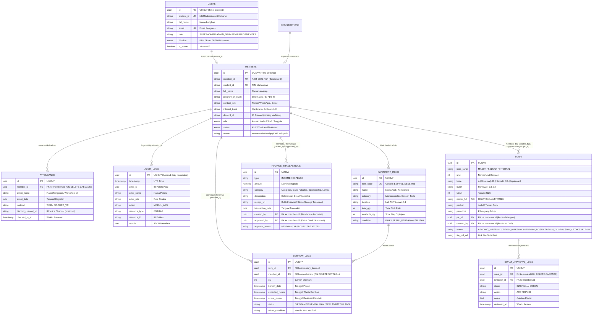

# ORION — Architecture Handoff & Succession Guide
**KSM AIoT (Organizational Resource & Integrated Operations Network)**  
*Disinkronkan dengan Grand Design Sistem Manajemen KSM AIoT & ADR Database*

Dokumen ini ditujukan khusus bagi **Technical Lead & Developer Penerus** yang akan melanjutkan pengembangan modul-modul ORION (**Presensi**, **Inventaris Hardware & Lab**, **Kas & Keuangan**, **Arsip Surat & LPJ Generator**, serta **Integrasi Nexo Bot & Google Calendar**).

---

## 1. Konsep & Grand Design Sistem ORION

Sistem Manajemen KSM AIoT (**ORION**) mengadopsi arsitektur *Single Source of Identity & Truth* untuk seluruh operasional internal dan etalase publik organisasi.

### A. Organization Profile (Landing Page & Portofolio Anggota)
- **Wajah Publik & Statistik Dinamis**: Menampilkan visi-misi, statistik live (total anggota aktif dari tabel `MEMBERS`, total alat di inventaris), kepengurusan aktif, serta portal CTA (Pendaftaran & Login).
- **Showcase Riset & Portofolio**: Katalog proyek (*Smart Hydroponic*, *Nexo Core*, dll) dengan deskripsi, tech stack, dokumentasi, link repository GitHub, dan menautkan kontributor sebagai portofolio digital mahasiswa (CV/magang).

---

## 2. Peta Arsitektur & Relasi Data Lintas Modul (Schema: `management`)

ORION berjalan di atas PostgreSQL/TimescaleDB bersama (*Shared Instance*, Schema `management`, mengacu ke **ADR-001**).

---

## 3. Matriks Otorisasi & Hak Akses (Role-Based Access Control)

| Role Sistem | Registrasi & Anggota | Presensi | Arsip Surat & LPJ | Inventaris Lab | Finansial & Kas |
|---|---|---|---|---|---|
| **SUPERADMIN** | Full CRUD + Manage User | Full CRUD | Full CRUD + Force Approve | Full CRUD + Audit Log | Full CRUD + Approval |
| **ADMIN_BPH (Ketua/Wakil)** | Review & Approve Seleksi | View Rekap & Input Manual | Review & ACC Internal | Review & Konfirmasi Alat | Approval Pengeluaran Besar |
| **ADMIN_BPH (Sekretaris)** | View Data Anggota | Input / Tarik Presensi | Full CRUD Surat & LPJ | View Stok | View Rekap Kas |
| **ADMIN_BPH (Bendahara)** | View Data Anggota | View Presensi | View Surat | View Stok | Full CRUD Kas & Bukti |
| **KADIV & PENGURUS** | View Directory Anggota | Self / VC Check-in | Buat Draf Surat Divisi | Request Pinjam Alat | Ajukan Reimbursement |
| **MEMBER (Anggota)** | Profil Mandiri | Self Check-in | View Surat Terbuka | Request Pinjam Alat | View Rekap Saldo Kas |
| **GUEST (Publik)** | Submit Pendaftaran | — | — | View Katalog Lab (Read) | — |

---

## 4. Keputusan Desain yang Telah Dikunci (Locked Design Decisions)

| Keputusan Desain | Pilihan yang Dikunci | Alasan & Rasional Teknis |
|---|---|---|
| **Primary Key ID** | **UUIDv7 (Time-Ordered)** | Menggabungkan keunikan UUID universal (keamanan dari enumerasi IDOR) dengan urutan kronologis berbasis timestamp milidetik yang menjaga performa B-Tree index PostgreSQL / TimescaleDB. |
| **Penghapusan User vs Integritas Data** | **Pola Anonimisasi (`[DELETED USER]`) ketimbang Hard Delete Penuh** | Sesuai UU PDP (Hak Penghapusan/Right to Erasure), PII dibersihkan. Namun, row `id` tetap dipertahankan dengan `ON DELETE SET NULL` agar catatan pembukuan kas dan riwayat peminjaman hardware tidak menjadi *orphan* atau merusak saldo audit keuangan. |
| **Audit Trail** | **Append-Only Database-Enforced Table** | Tabel `audit_logs` dilindungi trigger database PostgreSQL yang menolak `UPDATE` dan `DELETE`. Hal ini menjamin bukti forensik jika terjadi sengketa keuangan atau kebocoran data. |
| **Media Storage** | **Isolated Storage + UUIDv4 + WebP Strip EXIF + Magic Bytes** | File tidak ditaruh di public web root melainkan di-stream melalui endpoint controller terproteksi. Seluruh metadata perangkat/GPS dihapus demi kepatuhan privasi data, dan signature header diverifikasi. |
| **Query Database** | **Raw Parameterized SQL (`text()`) + Type Enums** | Memberikan performa maksimal, kompatibilitas penuh dengan TimescaleDB hypertable, dan pencegahan SQL Injection mutlak melalui binding parameter. |
| **Session Lifetime** | **Access Token 30 Menit + 7 Hari Refresh** | Mencegah penyalahgunaan token yang dicuri sekaligus memberikan UX yang nyaman bagi pengurus harian. |

---

## 5. Roadmap Implementasi untuk Developer Penerus (To-Do List)

Gunakan utilitas yang sudah tersedia di `orion-backend/utils/` (`auth_deps.py`, `rate_limiter.py`, `sanitizer.py`, `audit_log_service.py`):

### 1. Modul Presensi & Discord Voice Sync (Fase 2)
- [ ] **Web Check-in**: Endpoint presensi berbasis sesi kegiatan aktif.
- [ ] **Discord Voice Channel Integration**: Endpoint webhook yang dipanggil Nexo Bot (`/hadir_vc`) untuk mencocokkan `discord_id` di Voice Channel dengan `member_id` di database.

### 2. Modul Arsip Surat, Template LPJ & ChatBot RAG (Fase 3 & 5)
- [ ] **Standar Tipografi Naskah Dinas (Times New Roman)**:
  - Seluruh generator surat dan previewer resmi **WAJIB** menggunakan font **Times New Roman (12pt, line spacing 1.15–1.5)** dan Kop Surat resmi UPNVJ, sesuai Pedoman Tata Naskah Dinas & Standar Surat Akademik Kampus (bukan font monospace/JetBrains Mono).
  - Menyediakan tombol **Unduh PDF** instan (format A4 potret dengan margin resmi: Top 2cm, Left 2.5cm, Right 2cm, Bottom 2cm).
- [ ] **Penomoran Otomatis Bebas Tabrakan**:
  - Format deterministik: `{urut:03d}/{kode}/KSM-AIoT/{bulan_romawi}/{tahun}`.
  - Gunakan database transaction lock (`SELECT ... FOR UPDATE`) saat mengenerate nomor.
- [ ] **Multi-Stage Approval Flow**:
  - `PENDING_INTERNAL` (Draf dibuat Sekretaris) -> `PENDING_DOSEN` (di-ACC Ketua/Wakil) -> `SIAP_CETAK` (di-ACC Dosen Pembina via notifikasi) -> `SELESAI/ARSIP`.
- [ ] **Generator PDF & RAG Semantic Search**:
  - Gunakan Jinja2 `autoescape=True` + `sanitize_text()`.
  - Simpan dokumen final ke knowledge base pgvector (`schema: nexo`) agar bisa dicari secara semantik oleh Nexo Bot.

### 3. Modul Inventaris Hardware & Lab (Fase 3)
- [ ] **Tracking Stok Real-Time**:
  - Kurangi `available_qty` saat status `DIPINJAM` dan tambahkan kembali saat `DIKEMBALIKAN`.
  - Pasang validasi anti-IDOR `verify_resource_owner(current_user, borrow_log.member_id)`.
- [ ] **Log Insiden Alat**:
  - Jika barang kembali dalam status `RUSAK/HILANG`, catat ke log insiden dan trigger audit log.

### 4. Modul Kas, Keuangan & Rekap Finansial (Fase 4)
- [ ] **Approval Threshold Pengeluaran Besar**:
  - Pengeluaran di atas batas nominal tertentu (misal: > Rp 500.000) masuk status `PENDING` dan memerlukan konfirmasi Ketua/Wakil (`approved_by`).
- [ ] **Upload Bukti Struk/Kwitansi**:
  - Terapkan pipeline upload aman (Magic Bytes JPEG/PNG/PDF).
- [ ] **Rate Limiting Export**: Pasang `@rate_limit(max_requests=5, window_seconds=60, scope="finance_export")`.

---

## 6. Milestone & Timeline Pengembangan

| Fase | Target Waktu | Fokus | Deliverable / Target Belajar |
|---|---|---|---|
| **Fase 0** | Bulan 1 | **Prototyping & Scaffold** | Belajar *routing* dasar Vue.js / Vite, integrasi Git, endpoint FastAPI. *(Selesai)* |
| **Fase 1** | Bulan 2 | **Foundation & Auth** | Setup Database schema `management`, JWT Auth 30m + Refresh, RBAC, Audit Log, Magic Bytes Storage. *(Selesai)* |
| **Fase 2** | Bulan 3 | **Core Features** | Sistem Registrasi & Seleksi Anggota *(Selesai)*, Modul Presensi Web + Discord Nexo `/hadir_vc`. |
| **Fase 3** | Bulan 4-5 | **Operational Modules** | Sistem Arsip Surat (Multi-Stage Approval, Upload PDF) + Sistem Inventaris Hardware & Lab. |
| **Fase 4** | Bulan 6-7 | **Financial & Polish** | Sistem Kas & Finansial (Approval Flow, Bukti Nota), Security Audit Review. |
| **Fase 5** | Ongoing | **AI Enhancement** | Integrasi RAG Pencarian Semantik Surat/Arsip via Nexo Bot (pgvector). |

---

## 7. Jalur Konsultasi & Kontak Suksesi

Lead developer sebelumnya siap mendampingi dalam kapasitas sebagai konsultan arsitektur:

- **Nama Lead**: Dzulfikri Adjmal
- **Afiliasi**: KSM AIoT Fasilkom UPNVJ
- **Kontak Resmi / Konsultasi**: 
  - Email: `lead-orion@ksm-aiot.or.id` / Discord KSM AIoT Server (#dev-orion channel)
  - GitHub: Repository Issues / Pull Requests review tagging `@orion-core`
