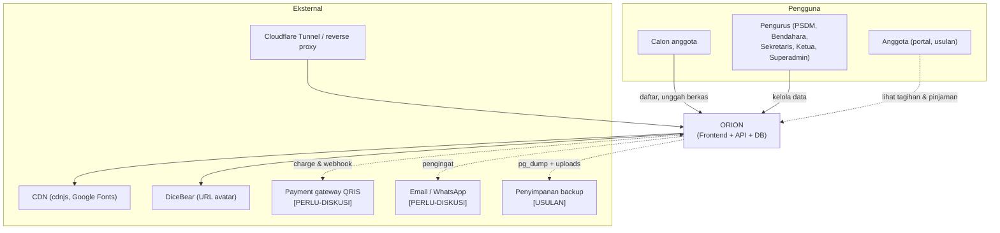
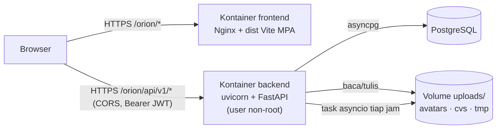
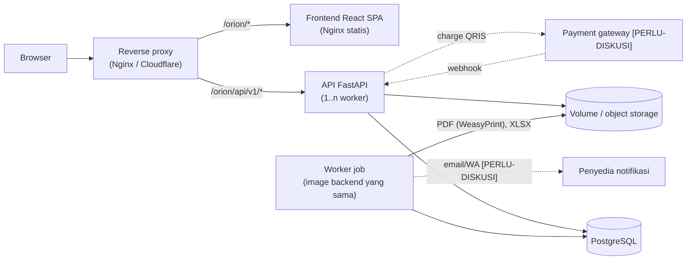
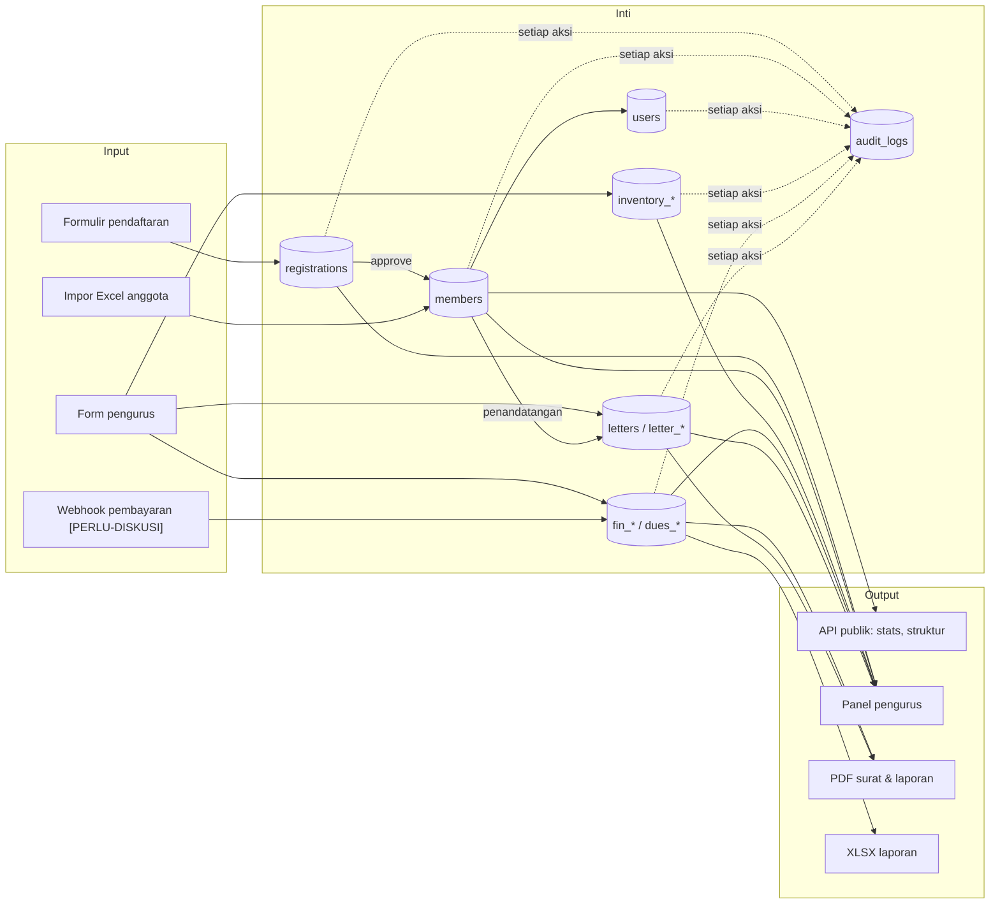

# ARCHITECTURE — Arsitektur Sistem ORION

| Atribut | Nilai |
|---|---|
| Versi | 1.0 |
| Tanggal | 29 September 2026 |
| Penulis | Tim Pengembang ORION (disusun dengan bantuan asisten AI) |

Dokumen terkait: [SKPL](SKPL.md) · [API](API.md) · [SCHEMA](SCHEMA.md) · [WORKFLOW](WORKFLOW.md) · [README](../README.md) · [SECURITY_AUDIT](../SECURITY_AUDIT.md) · [ARCHITECTURE-HANDOFF](../ARCHITECTURE-HANDOFF.md) · [SECURITY-PATTERNS](../SECURITY-PATTERNS.md)

## Daftar Isi

1. [Ringkasan](#1-ringkasan)
2. [Diagram konteks](#2-diagram-konteks)
3. [Kontainer: saat ini vs target](#3-kontainer-saat-ini-vs-target)
4. [Komponen backend dan struktur folder](#4-komponen-backend-dan-struktur-folder)
5. [Alur data](#5-alur-data)
6. [Autentikasi dan RBAC](#6-autentikasi-dan-rbac)
7. [Berkas, dokumen, job, dan antrian](#7-berkas-dokumen-job-dan-antrian)
8. [Logging dan observability](#8-logging-dan-observability)
9. [Deployment, CI/CD, dan Backup](#9-deployment-cicd-dan-backup)
10. [Rencana Migrasi Frontend ke React](#10-rencana-migrasi-frontend-ke-react)
11. [Keputusan Arsitektur (ADR)](#11-keputusan-arsitektur-adr)
12. [Risiko teknis](#12-risiko-teknis)
13. [Riwayat revisi](#13-riwayat-revisi)

---

## 1. Ringkasan

| Aspek | Saat ini [ADA-BACKEND]/[MVP-HTML] | Target [USULAN] |
|---|---|---|
| Frontend | Vite 6 MPA, HTML + vanilla JS modular, Tailwind 3, Nginx; 9 halaman | SPA **React + TypeScript** (Vite), React Router, TanStack Query; dilayani Nginx yang sama |
| Backend | FastAPI (Python 3.14) monolit modular: routes → services → raw SQL | Sama + modul inventaris, keuangan, arsip, laporan; worker job terpisah (proses kedua dari image yang sama) |
| Data | PostgreSQL (ENUM, ARRAY), 6 tabel aplikasi (+ `alembic_version`) | + ± 20 tabel usulan ([SCHEMA §4](SCHEMA.md#4-skema-usulan)) |
| Berkas | Disk lokal `uploads/` (avatars, cvs, tmp) | Disk lokal + backup; opsi object storage S3-compatible (D-09) |
| Dokumen | html2pdf di browser (gambar) & ekspor LaTeX statis | PDF server WeasyPrint + template Jinja2 (ADR-05) |
| Job | Task asyncio pembersih staging tiap jam (`orion-backend/main.py:29`) | Antrian berbasis PostgreSQL (`FOR UPDATE SKIP LOCKED`) + worker |
| Deploy | Dockerfile backend & frontend; tanpa CI | GitHub Actions (lint, test, build), image tag per rilis |

## 2. Diagram konteks



## 3. Kontainer: saat ini vs target

### 3.1 Saat ini



Frontend dan API adalah origin terpisah (CORS berbasis `CORS_ORIGINS`). `entrypoint.sh` menunggu DB, membuat skema (DB baru) atau menjalankan `alembic upgrade head`, menurunkan hak ke user `orion`, lalu menjalankan uvicorn.

### 3.2 Target



Dengan satu reverse proxy, SPA dan API dapat berada di origin yang sama (CORS tidak diperlukan, dan cookie HttpOnly FR-AUTH-09 menjadi sederhana).

## 4. Komponen backend dan struktur folder

```text
orion-backend/
├── main.py                 # app FastAPI, middleware (header keamanan, strip prefix), error handler, lifespan & task pembersih
├── config/                 # config.py (Settings dari env, validasi produksi), db.py (engine async, enum, create_all)
├── routes/                 # auth, registration, member, upload, log, legacy (redirect URL lama)
├── services/               # auth, registration, member, member_id, storage, audit_log — logika bisnis + raw SQL
├── schemas/                # Pydantic request/response (validasi input)
├── models/                 # model SQLAlchemy (skema tabel) + enums.py
├── utils/                  # auth_deps (RBAC), security (JWT, bcrypt), rate_limiter, client_ip, sanitizer, excel_importer, seed
├── migrations/             # Alembic (env.py, versions/)
├── templates/              # index.html landing API (Jinja2)
├── scripts/                # cleanup_orphan_uploads.py, cleanup_test_noise.py
├── tests/                  # pytest (butuh PostgreSQL)
├── docs/                   # dokumen ini
├── Dockerfile, entrypoint.sh, pyproject.toml, uv.lock, alembic.ini
orion-frontend/
├── index.html, pages/*.html        # 9 halaman MPA
├── src/modules/                    # api.js (URL tunggal), auth.js, crm-layout.js, ui.js, data.js (data tiruan)
├── src/scripts/                    # satu skrip per halaman
├── public/                         # logo & gambar
├── nginx.conf, vite.config.js, Dockerfile, package.json, pnpm-lock.yaml
```

**Pola yang dipakai [ADA-BACKEND]:**

| Pola | Implementasi | Catatan |
|---|---|---|
| Layered (route → service → SQL) | Route tipis memanggil `*Service(session)` | Konsisten; tambahkan modul baru dengan pola sama |
| Raw SQL berparameter | `sqlalchemy.text()` + bind param | Model ORM hanya untuk DDL/`create_all` |
| Dependency injection | `Depends(get_db)`, `Depends(can_manage_*)` | RBAC deklaratif per route |
| Staging → promote berkas | `StorageService.commit_upload_field` | Reusable untuk lampiran surat, bukti transaksi, foto aset |
| Audit sebagai efek samping | `log_audit_event` setelah commit | Gagal audit tidak menggagalkan operasi (rollback session) |
| Fail-closed config | `validate_production_security`, intake 503 | — |
| URL kompatibel mundur | `routes/legacy_routes.py` | 301/308 |

**Komponen usulan:** `routes/inventory_routes.py`, `routes/finance_routes.py`, `routes/letter_routes.py`, `routes/report_routes.py`, `routes/webhook_routes.py`; service padanannya; `services/document_renderer.py` (Jinja2 sandbox + WeasyPrint); `services/numbering.py` (counter surat, transaksi, peminjaman — satu implementasi `INSERT … ON CONFLICT … RETURNING`); `worker.py` (loop job).

## 5. Alur data



Tabel **pengurus** (`members` dengan jabatan & divisi) adalah sumber tunggal penandatangan surat dan pengesah laporan; tabel **keuangan** (`fin_*`) adalah sumber tunggal laporan keuangan — tidak ada salinan manual.

## 6. Autentikasi dan RBAC

| Lapisan | Mekanisme | Status |
|---|---|---|
| Identitas | `users` (akun ERP) terhubung ke `members` (jabatan) | [ADA-BACKEND] |
| Token | JWT HS256 access 30 menit + refresh 7 hari (rotasi); klaim `sub`, `type`, `exp`, `role`, `division` | [ADA-BACKEND] |
| Otorisasi | Dependency FastAPI; peran efektif dimuat ulang dari DB per request (klaim role di token tidak dipercaya) | [ADA-BACKEND] |
| Aturan anti-eskalasi | Hanya superadmin memberi SUPERADMIN / mengubah akun superadmin; larangan ubah hak diri | [ADA-BACKEND] |
| Rate limit | In-memory per proses, IP dari proxy tepercaya | [ADA-BACKEND] — pindah ke Redis/PG bila > 1 worker |
| Pencabutan token | `users.token_version` | [USULAN] |
| Sesi browser | Token di `localStorage` → cookie HttpOnly + token di memori (bersama migrasi React) | [USULAN] |
| Peran baru | `can_manage_inventory`/`finance`/`archive` sudah tersedia untuk modul baru | [ADA-BACKEND] (helper) |

## 7. Berkas, dokumen, job, dan antrian

| Topik | Rancangan |
|---|---|
| Berkas | Semua unggahan (foto, CV, lampiran surat, bukti transaksi, foto aset) melewati staging `tmp/<jenis>/` → promosi saat formulir disimpan → pelepasan bila tak dirujuk. Validasi MIME + magic bytes per jenis. Nama file UUIDv4. |
| PDF | WeasyPrint di server (ADR-05); template Jinja2 `SandboxedEnvironment` + autoescape; CSS `@page` A4. Dipanggil sinkron untuk pratinjau surat (< 3 dtk) dan asinkron untuk laporan. |
| XLSX | openpyxl (sudah dependensi); sel yang diawali `= + - @` diberi prefiks `'` (anti formula injection). |
| Antrian | Tabel `jobs(id, type, payload, status, run_at, attempts, locked_until)`; worker mengambil `FOR UPDATE SKIP LOCKED`; retry eksponensial maks 5; tanpa infrastruktur tambahan (ADR-06). Dipakai untuk: laporan, pengingat (D-02), rekonsiliasi pembayaran, pembersihan staging (memindahkan task asyncio saat > 1 worker API). |
| Jadwal | Worker memiliki penjadwal sederhana (cron-like) untuk job harian (rekonsiliasi 02.00 WIB, pengingat 08.00 WIB). |

## 8. Logging dan observability

| Aspek | Saat ini | Usulan |
|---|---|---|
| Log aplikasi | `logging` standar (logger `orion.*`), log akses uvicorn | Format JSON, field `request_id`, `user_id`, `path`, `status`, `latency_ms`; tanpa data pribadi/token |
| Request ID | — | Middleware membuat/menerima `X-Request-ID`, dikembalikan di header & body error |
| Audit | Tabel `audit_logs` | Append-only (FR-LOG-05); retensi 3 tahun |
| Health | `GET /health`, `GET /health/db`, Docker HEALTHCHECK | Uptime monitor eksternal (mis. UptimeRobot gratis) + notifikasi |
| Metrik | — | Endpoint `/metrics` (Prometheus) opsional; minimal hitung 5xx & latensi di log |
| Error tracking | — | Sentry (tier gratis) opsional [PERLU-DISKUSI biaya/privasi] |

## 9. Deployment, CI/CD, dan Backup

**Saat ini:** `orion-backend/Dockerfile` (multi-stage, uv terpin, non-root via `setpriv`, HEALTHCHECK) dan `orion-frontend/Dockerfile` (pnpm terpin → Nginx). Tidak ada docker-compose maupun CI di repositori; topologi produksi (Cloudflare Tunnel/VPS) tidak terdokumentasi di kode — **asumsi AS-07**.

**Usulan CI (GitHub Actions):**

| Job | Langkah |
|---|---|
| backend | `uv sync --frozen` → `ruff check .` → PostgreSQL service → `pytest` → `pip-audit` → build image |
| frontend | `pnpm install --frozen-lockfile` → lint → `vite build` → `pnpm audit` → build image |
| docs | validasi `docs/openapi.yaml` (openapi-spec-validator / redocly lint) |
| release | tag `vX.Y.Z` → push image ke registry → deploy manual dengan persetujuan |

**Usulan deployment:** satu VPS/kampus server dengan Docker Compose (`proxy`, `frontend`, `api`, `worker`, `postgres`), volume `uploads` dan `pgdata`, secret via file `.env` yang tidak di-commit, TLS di reverse proxy.

**Backup (NFR-BAK-01):**

| Item | Frekuensi | Retensi | Catatan |
|---|---|---|---|
| `pg_dump -Fc` | Harian 02.00 WIB | 30 harian + 12 bulanan | Enkripsi (age/gpg) sebelum dikirim ke lokasi terpisah |
| `uploads/` (tanpa `tmp/`) | Harian (rsync/rclone inkremental) | Sama | — |
| Uji pemulihan | Tiap pergantian kepengurusan / 6 bulan | — | Restore ke DB kosong + jalankan `pytest` smoke |

## 10. Rencana Migrasi Frontend ke React

Status: **[USULAN]** (FR-SYS-05). Tidak ada perubahan kode pada tahap dokumentasi ini.

### 10.1 Stack target

| Kebutuhan | Pilihan | Alasan |
|---|---|---|
| Framework | React 19 + TypeScript | Ekosistem luas, mudah dicari kontributor mahasiswa |
| Build | Vite (sudah dipakai) | Konfigurasi `base: '/orion/'` dan proxy dev dipertahankan |
| Routing | React Router (data router) | URL bersih yang sudah ada (`/orion/<halaman>`) dipetakan 1:1 |
| Data server | TanStack Query | Cache, retry, invalidasi setelah mutasi |
| Form & validasi | React Hook Form + Zod | Skema Zod dapat digenerate dari `openapi.yaml` |
| Klien API | Dihasilkan dari `openapi.yaml` (mis. `openapi-typescript` + `openapi-fetch`) | Kontrak tunggal; menggantikan `src/modules/api.js` |
| Styling | Tailwind (sudah dipakai) + komponen headless (mis. Radix) | Menjaga tampilan MVP |
| Test | Vitest + Testing Library; Playwright untuk alur utama | — |

### 10.2 Pemetaan halaman → rute & komponen

| MVP | Rute React | Komponen utama | Data |
|---|---|---|---|
| `index.html` + `main.js` | `/` | `HomePage`, `OrgTree`, `StatsCounter`, `ProjectShowcase`, `LoginDialog` | `useMemberStats`, `usePublicMembers` |
| `pages/registration.html` | `/registration` | `RegistrationWizard`, `FileUploadField` (staging), `MemberCardPreview` | `useIntakeStatus`, `useCreateRegistration` |
| `pages/selection.html` | `/selection` | `RegistrationTable`, `ReviewDialog`, `IntakeDialog`, `BulkDeleteBar` | `useRegistrations`, mutasi approve/reject |
| `pages/members.html` | `/members`, `/members/:id` | `MemberTable`, `MemberForm`, `ErpAccessDialog`, `ImportDialog`, `AlumniTab` | `useMembers`, mutasi |
| `pages/profile.html` | `/profile` | `ProfileForm`, `PasswordForm`, `AvatarPicker` | `useMe` |
| `pages/log.html` | `/log` | `AuditLogTable`, `AuditLogDetail` | `useAuditLogs` (filter server FR-LOG-04) |
| `pages/inventory.html` | `/inventory`, `/inventory/loans` | `ItemTable`, `ItemForm`, `LoanForm`, `ReturnDialog`, `OverdueReport` | API usulan |
| `pages/finance.html` | `/finance`, `/finance/ledgers`, `/finance/dues` | `SummaryCards`, `TransactionForm`, `LedgerView`, `DuesBoard`, `ReportDialog` | API usulan |
| `pages/archive.html` | `/archive/incoming`, `/archive/outgoing`, `/archive/outgoing/:id` | `LetterList`, `LetterEditor` (rich text terbatas), `PdfPreview`, `ApprovalTimeline` | API usulan |
| `crm-layout.js` | layout rute `/(crm)` | `CrmLayout`, `RequireRole` | `useMe` (peran dari server, bukan daftar statis — IC-16) |

### 10.3 Strategi migrasi (strangler, bertahap)

1. **Fondasi:** repo frontend baru di folder `orion-frontend` (branch), klien API tergenerate, `AuthProvider` (refresh otomatis setara `initSessionWatcher`), `RequireRole`.
2. **Per halaman:** port satu halaman per rilis; Nginx mengarahkan rute yang sudah dipindah ke `index.html` SPA, sisanya tetap ke halaman MPA (`try_files` per rute). URL publik tidak berubah.
3. **Paritas:** checklist perilaku dari [FSD §4](FSD.md#4-spesifikasi-per-layar) menjadi test Playwright sebelum halaman lama dihapus.
4. **Modul baru** (inventaris, keuangan, arsip) langsung dibangun di React begitu API-nya tersedia — tidak diperbarui di MPA.
5. **Penutupan:** hapus `pages/*.html`, `src/scripts/*`, redirect legacy tetap di Nginx.

## 11. Keputusan Arsitektur (ADR)

| ADR | Keputusan | Alternatif yang dipertimbangkan | Alasan | Status |
|---|---|---|---|---|
| ADR-01 | Monolit modular FastAPI | Microservice per modul | Tim kecil, domain terkait erat, satu DB | Diterapkan |
| ADR-02 | Raw SQL berparameter di service | ORM penuh SQLAlchemy | Sudah konsisten di kode; kontrol query eksplisit | Diterapkan (evaluasi ulang bila query dinamis bertambah) |
| ADR-03 | JWT bearer access+refresh | Sesi server + cookie | Sudah diterapkan; migrasi ke cookie HttpOnly bersama React | Diterapkan → revisi diusulkan |
| ADR-04 | Disk lokal dengan staging untuk berkas | Object storage sejak awal | Biaya nol, volume kecil | Diterapkan; D-09 |
| ADR-05 | PDF server via HTML/CSS + WeasyPrint | DOCX+LibreOffice, LaTeX/Typst, konversi otomatis | Lihat [SKPL §3.12.2](SKPL.md#3122-pendekatan-template-dan-pembuatan-dokumen-usulan) | Diusulkan |
| ADR-06 | Antrian job di PostgreSQL | Redis + RQ/Celery/arq | Tanpa infrastruktur tambahan; beban rendah | Diusulkan |
| ADR-07 | Double-entry immutable untuk keuangan | Tabel transaksi tunggal yang dapat diedit | Konsistensi dua ledger, jejak koreksi | Diusulkan |
| ADR-08 | Nomor surat diberikan saat TERBIT via counter terkunci | Sequence PostgreSQL; nomor saat draf | Sequence tidak reset per tahun & bisa berlubang; nomor saat draf memboroskan nomor | Diusulkan |
| ADR-09 | Frontend React bertahap (strangler) | Big-bang rewrite; tetap vanilla | Risiko rendah, fitur berjalan tetap tersedia | Diusulkan |

## 12. Risiko teknis

| Risiko | Dampak | Mitigasi |
|---|---|---|
| Skema dasar tidak dibuat Alembic (IC-15) | DB berbeda antar lingkungan | Migrasi baseline (SCHEMA §6) |
| Rate limit & task pembersih in-process | Tidak konsisten bila > 1 worker | Tetap 1 worker atau pindah ke job PG/Redis |
| WeasyPrint butuh pustaka sistem (Pango) | Image bertambah ± 50–80 MB | Stage runner memasang paket minimal; uji di CI |
| Webhook publik | Permukaan serangan | Signature, idempotensi, allow-list IP, batas ukuran |
| Token di localStorage | Pencurian via XSS | CSP frontend + cookie HttpOnly (fase React) |
| Ketergantungan CDN tanpa SRI | Kompromi skrip pihak ketiga | Bundel lokal atau SRI (SECURITY_AUDIT A08-01) |

## 13. Riwayat revisi

| Versi | Tanggal | Penulis | Perubahan |
|---|---|---|---|
| 1.0 | 2026-09-29 | Tim Pengembang (dibantu asisten AI) | Dokumen awal: arsitektur saat ini vs target, C4 konteks/kontainer, pola, job, observability, deployment, CI/CD, backup, migrasi React, ADR, risiko |
