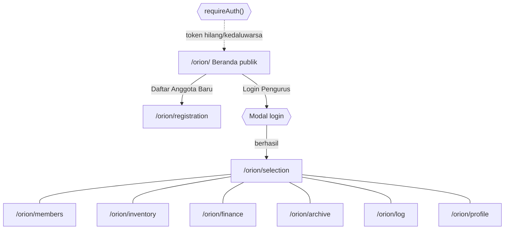

# FSD — Spesifikasi Fungsional ORION

| Atribut | Nilai |
|---|---|
| Versi | 1.0 |
| Tanggal | 29 September 2026 |
| Penulis | Tim Pengembang ORION (disusun dengan bantuan asisten AI) |
| Sumber | Halaman MVP `orion-frontend/pages/*.html`, skrip `orion-frontend/src/scripts/*.js`, backend `orion-backend/` |

Dokumen terkait: [SKPL](SKPL.md) (ID kebutuhan FR-*) · [API](API.md) · [WORKFLOW](WORKFLOW.md) · [SCHEMA](SCHEMA.md) · [PRD](PRD.md) · [ARCHITECTURE §10](ARCHITECTURE.md#10-rencana-migrasi-frontend-ke-react)

## Daftar Isi

1. [Pendahuluan](#1-pendahuluan)
2. [Peta layar dan navigasi](#2-peta-layar-dan-navigasi)
3. [Matriks RBAC](#3-matriks-rbac)
4. [Spesifikasi per layar](#4-spesifikasi-per-layar)
5. [Perhitungan dan aturan turunan](#5-perhitungan-dan-aturan-turunan)
6. [Notifikasi](#6-notifikasi)
7. [Kasus tepi lintas modul](#7-kasus-tepi-lintas-modul)
8. [Riwayat revisi](#8-riwayat-revisi)

---

## 1. Pendahuluan

FSD menerjemahkan kebutuhan [SKPL](SKPL.md) menjadi perilaku layar yang dapat diuji. Setiap layar mencantumkan label status ([ADA-BACKEND], [MVP-HTML], [USULAN], [PERLU-DISKUSI]), field, validasi di **frontend (FE)** dan **backend (BE)**, pesan error, hak akses, dan endpoint.

Konvensi tabel field: **Wajib** = ✓; validasi "FE" hanya di browser (dapat dilewati), "BE" ditegakkan server. Pesan error dikutip dari kode bila ada.

Semua layar CRM memakai tata letak bersama (`orion-frontend/src/modules/crm-layout.js`): topbar, menu Seleksi · Anggota & Alumni · Inventaris Hardware · Kas & Keuangan · Arsip & Surat Resmi · Log Aktivitas, menu akun (Profil, Beranda, Formulir Pendaftaran, Keluar), pemantau sesi, dan penjaga rute.

## 2. Peta layar dan navigasi

| URL | Layar | Status data |
|---|---|---|
| `/orion/` | Beranda + modal login | API (statistik, struktur) + data statis (proyek) |
| `/orion/registration` | Formulir pendaftaran | API |
| `/orion/selection` | Seleksi calon anggota | API |
| `/orion/members` | Anggota & alumni | API |
| `/orion/profile` | Profil akun | API |
| `/orion/log` | Log aktivitas | API |
| `/orion/inventory` | Inventaris | **Tiruan** [MVP-HTML] |
| `/orion/finance` | Kas & keuangan | **Tiruan** [MVP-HTML] |
| `/orion/archive` | Arsip & persuratan | **Tiruan** [MVP-HTML] |

---

## 3. Matriks RBAC

Keterangan: **K** = kelola (buat/ubah/hapus), **B** = baca, **–** = tidak ada akses, **P** = publik. Kolom "Ketua/Wakil" mencakup Superadmin (Superadmin selalu K untuk semua baris).

| Fitur | Publik | Anggota | Pengurus umum¹ | PSDM | Akademik Riset | Bendahara | Sekretaris | Ketua/Wakil | Status |
|---|---|---|---|---|---|---|---|---|---|
| Statistik & struktur publik, status intake | P | P | P | P | P | P | P | P | [ADA-BACKEND] |
| Kirim pendaftaran, unggah foto/CV | P | P | P | P | P | P | P | P | [ADA-BACKEND] |
| Profil & password sendiri | – | –² | K | K | K | K | K | K | [ADA-BACKEND] |
| Lihat pendaftar | – | – | B | B | B | B | B | B | [ADA-BACKEND] |
| Atur intake, approve/reject/hapus pendaftar | – | – | – | K | – | – | – | K | [ADA-BACKEND] |
| Lihat anggota & profil alumni | – | – | B | B | B | B | B | B | [ADA-BACKEND] |
| Tambah/ubah/anonimisasi/hapus/impor anggota, profil alumni | – | – | – | K³ | – | – | – | K³ | [ADA-BACKEND] |
| Beri/cabut akses ERP, reset password anggota | – | – | – | K⁴ | – | – | – | K⁴ | [ADA-BACKEND] |
| Hapus file avatar/CV langsung | – | – | – | – | – | K⁵ | K⁵ | K | [ADA-BACKEND] |
| Lihat log audit | – | – | B | B | B | B | B | B | [ADA-BACKEND] |
| Inventaris: kelola aset & peminjaman | – | – | B | B | K | B | B | K | [USULAN] (helper `can_manage_inventory`) |
| Keuangan: transaksi, iuran, laporan | – | –⁶ | B⁷ | B⁷ | B⁷ | K | B⁷ | K | [USULAN] (helper `can_manage_finance`) |
| Arsip: surat masuk/keluar, template | – | – | B⁸ | B⁸ | B⁸ | B⁸ | K | K | [USULAN] (helper `can_manage_archive`) |
| Menyetujui surat (tahap akhir) | – | – | – | – | – | – | – | K | [PERLU-DISKUSI] |

¹ Kepala Divisi, Staff, dan akun ERP ber-role PENGURUS/KADIV/ADMIN_BPH (backend); frontend saat ini hanya mengenal peran organisasi (IC-16).
² Anggota biasa tidak dapat login ke panel (403); portal anggota [USULAN].
³ Tidak boleh mengubah jabatan/divisi/status dirinya sendiri (kecuali Superadmin).
⁴ Tidak boleh memberi SUPERADMIN, mengubah akun superadmin, atau akun sendiri (kecuali Superadmin).
⁵ Melalui `ADMIN_BPH` (Ketua, Wakil, Sekretaris, Bendahara, atau divisi BPH).
⁶ Portal anggota untuk melihat tagihan sendiri [USULAN].
⁷ Usulan: pengurus umum hanya melihat rekap, bukan detail per anggota (usulan keputusan pengurus).
⁸ Sesuai klasifikasi surat (BIASA semua pengurus; TERBATAS BPH + disposisi; RAHASIA Ketua/Sekretaris).

---

## 4. Spesifikasi per layar

### 4.1 Beranda dan login — `/orion/` [ADA-BACKEND] + [MVP-HTML]

**Kebutuhan:** FR-PUB-01..04, FR-AUTH-01. **Endpoint:** `GET /members/stats`, `GET /members/public`, `POST /auth/login`. **Kode:** `orion-frontend/index.html`, `src/scripts/main.js`.

| Elemen | Perilaku |
|---|---|
| Kartu statistik | Angka anggota & proyek beranimasi; data `GET /members/stats` |
| Pohon kepengurusan | Dari `GET /members/public` dikelompokkan per divisi/jabatan; galat → pesan "Tree render error" di konsol, bagian tetap tampil |
| Showcase proyek | Data statis `data.js`, filter kategori & pencarian stack |
| Modal login | Field **NIM atau email** (teks, wajib) + **Password** (wajib); tombol masuk |

| Situasi | Pesan / hasil |
|---|---|
| Kredensial salah | `NIM / Email atau Password salah. Silakan coba lagi.` (401) |
| > 5 percobaan/menit | Pesan 429 dari server dengan sisa detik |
| API tidak terjangkau | `Gagal terhubung ke server autentikasi backend.` |
| Berhasil | Toast selamat datang, redirect `/orion/selection` |
| `?login_required=1` / `&expired=1` | Modal login terbuka otomatis dengan pesan sesi berakhir |

### 4.2 Formulir pendaftaran — `/orion/registration` [ADA-BACKEND]

**Kebutuhan:** FR-REG-01..05, FR-PUB-04. **Endpoint:** `GET /registrations/intake-status`, `POST /uploads/avatars`, `POST /uploads/cvs`, `GET /uploads/tmp/avatars/{f}`, `POST /registrations`. **Kode:** `pages/registration.html`, `src/scripts/registration.js`.

| Field | Tipe | Wajib | Validasi | Pesan error | Field API |
|---|---|---|---|---|---|
| Nama lengkap | teks | ✓ | FE required; BE escape | — | `full_name` |
| NIM | teks, maxlength 10 | ✓ | FE: tepat 10 digit, 2 digit awal = angkatan dalam `[tahun−3, tahun]`; BE: unik | `NIM Mahasiswa harus terdiri dari tepat 10 digit angka!`; `Pendaftaran hanya dibuka untuk mahasiswa angkatan …`; BE 400 `NIM … sudah terdaftar dalam sistem seleksi!` | `student_id` |
| Program studi | select (4 prodi) | ✓ | BE enum | 422 | `program_of_study` |
| Angkatan | select (4 tahun terakhir) | ✓ | FE rentang | `Pilihan tahun angkatan harus berada dalam rentang …` | `intake_period` |
| Email | email | ✓ | FE type=email | — | `email` |
| No. WhatsApp | tel | ✓ | FE required | — | `contact_info` |
| Peminatan riset | select 3 opsi | ✓ | BE normalisasi enum (IC-03) | — | `interest_track` |
| Motivasi | textarea + penghitung kata | ✓ | FE & BE ≤ 150 kata | `Teks motivasi maksimal 150 kata.` / 422 | `motivation` |
| Portofolio/GitHub | url | — | BE hanya http(s)/tanpa skema | 422 `Tautan harus berupa URL http:// atau https://.` | `portfolio_url` |
| Foto profil | file PNG/JPG/WebP | — (IC-05) | FE ≤ 2 MB; BE MIME + magic bytes, ≤ 2 MB | `Ukuran foto maksimal 2MB!`; `Gagal mengunggah foto: …` | `photo` (path staging) |
| CV | file PDF | — | FE ≤ 5 MB & `.pdf`; BE `%PDF-`, ≤ 5 MB | `Ukuran berkas CV maksimal 5MB!`; `Format berkas CV harus PDF!` | `cv_url` (path staging) |
| Persetujuan data | checkbox | ✓ | Tombol kirim nonaktif sampai dicentang | `Anda harus menyetujui pernyataan dan persetujuan pengolahan data untuk melanjutkan!` | `consent_given` |

**Aturan:** kartu anggota pratinjau diperbarui langsung (nama, NIM, prodi, peminatan, foto); kirim ditahan saat unggah CV berjalan (`Tunggu sampai upload CV selesai sebelum mengirim formulir.`); intake `CLOSED` atau lewat deadline → formulir dinonaktifkan (FE) dan ditolak server (403); konfigurasi rusak → 503. Sukses → stepper langkah 3 "Terima kasih" berisi ringkasan.
**Kasus tepi:** unggah foto lalu tidak submit → file staging dihapus otomatis setelah 24 jam; submit gagal (NIM ganda) → file kembali ke staging, pengguna dapat memperbaiki dan mengirim ulang tanpa unggah ulang.

### 4.3 Seleksi calon anggota — `/orion/selection` [ADA-BACKEND]

**Kebutuhan:** FR-SEL-01..07. **Endpoint:** `GET/PUT /registrations/intake-status`, `GET /registrations`, `PATCH .../approve`, `PATCH .../reject`, `DELETE /registrations/{identifier}`, `POST /registrations/bulk-delete`. **Kode:** `pages/selection.html`, `src/scripts/selection.js`.

| Area | Elemen | Perilaku |
|---|---|---|
| Header | Pill status intake + tombol "Kelola Periode (BPH)" | Status & deadline dari API |
| Kartu | Total, Menunggu, Diterima, Ditolak | Hitung dari data dimuat |
| Tabel | Cari (nama/NIM), filter status (default Pending), kolom calon, NIM, prodi, peminatan, WA, tanggal submit, status, aksi; checkbox massal | Data `GET /registrations` |
| Modal review | Foto, identitas, motivasi, CV (pratinjau/unduh), portofolio (link aman), WA, **Catatan Evaluator (opsional)**, tombol Hapus / Tolak / Setujui | Setujui → `PATCH approve` body `{status:"Accepted", role:"Anggota", review_note}`; Tolak → `PATCH reject` |
| Modal intake | Status OPEN/CLOSED, Nama gelombang, Tanggal deadline (date), Target kuota (angka) | `PUT /registrations/intake-status` |
| Hapus massal | Pilih baris → konfirmasi → `POST /registrations/bulk-delete` | Pesan: jumlah terhapus; file yang masih dipakai anggota dipertahankan |

| Situasi | Hasil |
|---|---|
| Peran non-PSDM/Ketua/Wakil menekan aksi tulis | 403 `Akses Ditolak: Modifikasi seleksi hanya diizinkan untuk Divisi PSDM, Ketua, atau Wakil Ketua. …` |
| Catatan evaluator diisi | **Diabaikan server** — catatan otomatis "Disetujui/Ditolak oleh …" (IC-06, FR-SEL-06) |
| Approve kandidat yang NIM-nya sudah anggota | Member ID lama dipakai |
| Deadline tidak valid di modal intake | 422 |

### 4.4 Anggota dan alumni — `/orion/members` [ADA-BACKEND]

**Kebutuhan:** FR-MEM-01..09, FR-ERP-01..03. **Endpoint:** `GET /members`, `GET /members?status=Alumni`, `POST /members`, `PUT/DELETE /members/{identifier}`, `POST /members/imports`, `POST/DELETE /members/{identifier}/access`, `PUT /members/{identifier}/password`, `POST /uploads/avatars`. **Kode:** `pages/members.html`, `src/scripts/members.js`.

**Daftar:** tab anggota aktif (cari, filter divisi, filter peminatan, ekspor CSV) dan tab alumni (cari). Badge "ERP: <role> (Aktif)" untuk anggota berakses login.

**Form tambah/ubah anggota:**

| Field | Tipe | Wajib | Validasi | API |
|---|---|---|---|---|
| NIM | teks | ✓ | BE unik (upsert berdasarkan NIM) | `student_id` |
| Nama lengkap | teks | ✓ | BE escape | `full_name` |
| Program studi | select | ✓ | enum | `program_of_study` |
| Semester | angka | — | integer | `semester` |
| Email | email | ✓ | — | `email` |
| No WhatsApp / Kontak | teks | — | — | `contact_info` |
| Foto profil | file | — | seperti §4.2; pratinjau | `avatar` (staging) |
| Divisi kepengurusan | select (kosong = tanpa divisi) | — | enum | `division` |
| Jabatan | select 7 role | ✓ | enum; **tidak boleh diubah untuk diri sendiri** | `role` |
| Status | select Aktif/Tidak Aktif/Alumni | ✓ | Alumni/Tidak Aktif menonaktifkan login | `status` |
| Tahun angkatan KSM | teks | ✓ | default 2026 | `intake_period` |
| Bidang riset (multi) | checkbox | — | enum | `interest_track` |
| Bahasa pemrograman, Tools | teks | — | — | `programming_languages`, `tools_frameworks` |
| Link portofolio | teks | — | http(s)/tanpa skema | `portfolio_url` |
| Discord | teks | — | — | `discord_id` |
| Aktifkan akses ERP | toggle | — | — | `create_erp_account` |
| Password ERP | password | kondisional | FE ≥ 8; BE 8–72 byte | `erp_password` |
| Role ERP | select PENGURUS/SUPERADMIN | kondisional | BE: SUPERADMIN hanya oleh superadmin | `erp_role` |

**Aksi lain:** modal profil detail; "Jadikan Alumni" (ubah status); hapus permanen (konfirmasi); modal **Kelola Akses ERP** (aktifkan dengan password + role, reset password bila sudah punya akses, cabut akses); modal **Impor Excel** (file `.xlsx` ≤ 5 MB, nama sheet default `Database Anggota`).

| Situasi | Pesan / hasil |
|---|---|
| Password ERP < 8 | FE: toast minimal 8 karakter; BE 422 |
| PSDM memberi SUPERADMIN / mengubah akun superadmin / akun sendiri | 403 `Akses Ditolak: …` |
| Mengubah jabatan sendiri | 403 `Akses Ditolak: Anda tidak dapat mengubah jabatan, divisi, atau status keanggotaan Anda sendiri.` |
| Impor file > 5 MB | 413 `Ukuran file Excel maksimal 5MB.` |
| Impor sheet tidak ada | 400 berisi daftar sheet tersedia |
| Ekspor CSV | Unduhan `data_anggota_ksm_aiot_<tanggal>.csv` (FE; belum di-escape, IC-11) |

### 4.5 Profil akun — `/orion/profile` [ADA-BACKEND]

**Kebutuhan:** FR-AUTH-03, FR-AUTH-04. **Endpoint:** `GET/PUT /auth/me`, `PUT /auth/me/password`, `POST /uploads/avatars`.

| Field | Tipe | Wajib | Validasi | Pesan |
|---|---|---|---|---|
| NIM | teks (nonaktif) | — | — | — |
| Nama lengkap | teks | ✓ | BE 1–150 | `Nama Lengkap dan Email wajib diisi!` |
| Email | email | ✓ | BE format valid, unik | 409 `Email sudah digunakan oleh akun lain.` |
| URL avatar / generator seed / unggah foto | teks / tombol / file | — | BE http(s) atau staging | — |
| Password saat ini | password | ✓ | BE cocok | 400 `Password saat ini (lama) tidak sesuai` |
| Password baru + konfirmasi | password | ✓ | FE ≥ 8 & sama; BE 8–72 byte | `Kata sandi baru minimal 8 karakter!` |

### 4.6 Log aktivitas — `/orion/log` [ADA-BACKEND] + [MVP-HTML]

**Kebutuhan:** FR-LOG-02..04. **Endpoint:** `GET /audit-logs?limit=&offset=`.

| Elemen | Perilaku |
|---|---|
| Kartu statistik | total, sukses, gagal, aksi admin (dari `stats`) |
| Tabel | waktu (WIB), aktor (+ badge superadmin), aksi, resource (`resource_label`), IP, status |
| Filter | Cari teks, kategori aksi, status — **di browser** pada halaman aktif saja (IC-07) |
| Paginasi | Ukuran halaman 25/50/100/200 (default 50), Sebelumnya/Berikutnya (offset) |
| Modal detail | Semua kolom + JSON detail; salin; ekspor JSON `orion-audit-logs-<tanggal>.json` |

### 4.7 Inventaris — `/orion/inventory` [MVP-HTML] → [USULAN]

**Kebutuhan:** FR-INV-01..10. **Endpoint usulan:** lihat [API §6.2](API.md#62-endpoint-usulan-56-operasi).

**MVP saat ini:** kartu Total/Tersedia/Dipinjam; cari; filter kategori (7 opsi; IC-08); tabel nama, kategori, total, tersedia, dipinjam, kondisi; tombol Pinjam (−1 tersedia, +1 dipinjam; `Stok … di Lab sedang kosong!` bila 0) dan Kembalikan (`Tidak ada unit … yang sedang dalam peminjaman.`). Data hilang saat muat ulang.

**Layar usulan:**

| Layar | Field / kolom | Validasi & aturan | Endpoint |
|---|---|---|---|
| Daftar aset | kode aset, nama, kategori, lokasi, total, tersedia, dipinjam, rusak, kondisi, foto | Filter & paginasi server | `GET /inventory/items` |
| Form aset | kode aset (unik, ≤ 30), nama (≤ 150), kategori (pilih/isi), lokasi, total (≥ 0), kondisi (PRIMA/BAIK/PERLU_SERVIS), foto, catatan | Total ≥ dipinjam + rusak (409); hapus ditolak bila ada pinjaman aktif | `POST/PATCH/DELETE /inventory/items...` |
| Form peminjaman | barang, peminjam (cari anggota NIM/nama), jumlah (≥ 1), tanggal pinjam, tenggat (≥ tanggal pinjam), status awal (Diajukan/Dipinjam), catatan | Jumlah ≤ tersedia (409 `Stok tidak mencukupi`); petugas = pengguna login | `POST /inventory/loans` |
| Pengembalian | tanggal kembali, kondisi (Baik/Rusak), catatan | Hanya dari DIPINJAM | `POST .../return` |
| Riwayat | per barang & per anggota | Urut terbaru | `GET .../loans` |
| Keterlambatan | peminjam, barang, tenggat, lama terlambat (hari WIB), kontak | Hanya DIPINJAM dengan tenggat lewat | `GET /inventory/reports/overdue` |

### 4.8 Kas dan keuangan — `/orion/finance` [MVP-HTML] → [USULAN] / [PERLU-DISKUSI]

**Kebutuhan:** FR-FIN-01..12. Konsep dua ledger: [SKPL §3.11.1](SKPL.md#3111-dua-buku-besar-ledger--definisi-dan-hubungan).

**MVP saat ini:** kartu Saldo Aktif, Total Pemasukan, Total Pengeluaran (format `Rp 1.000.000`); cari (keterangan/PIC/kategori); filter jenis & kategori (IC-09); tabel tanggal, keterangan, kategori, jenis (badge), nominal (+/−), PIC, status; modal tambah transaksi:

| Field MVP | Tipe | Wajib | Catatan |
|---|---|---|---|
| Keterangan transaksi | teks | ✓ | — |
| Jenis arus | select INCOME/EXPENSE | ✓ | — |
| Nominal (Rp) | angka | ✓ | tidak ada validasi > 0 |
| Kategori | select 5 opsi | ✓ | Hibah Riset Fakultas, Iuran Kas Anggota, Pengadaan Alat Lab, Konsumsi & Operasional, Sponsorship & Kemitraan |
| PIC | teks | ✓ | nama bebas (usulan: pilih anggota) |

**Layar usulan (Opsi A):**

| Layar | Isi | Aturan | Endpoint |
|---|---|---|---|
| Ringkasan | saldo per akun kas, pemasukan/pengeluaran bulan berjalan, grafik 12 bulan, tunggakan iuran | Dari ledger | `GET /finance/summaries/monthly` |
| Transaksi | form: tanggal, keterangan, jenis (Pemasukan/Pengeluaran/Transfer), nominal (> 0, rupiah bulat), akun kas, kategori (bukan untuk transfer), akun tujuan (transfer), kegiatan, PIC (anggota), bukti | Tanggal ≤ hari ini; periode tertutup → 409; tidak ada tombol edit/hapus, hanya **Koreksi** (pembalik + alasan) | `POST /finance/transactions`, `POST .../reversal` |
| Ledger arus kas | pilih akun + rentang: saldo awal, mutasi, saldo berjalan | — | `GET /finance/ledgers/cash` |
| Ledger pemasukan-pengeluaran | pilih kategori/kegiatan + rentang | — | `GET /finance/ledgers/income-expense` |
| Iuran | buat periode (YYYY-MM, nominal, jatuh tempo) → tabel anggota aktif: status Belum/Lunas/Dibebaskan; tombol Tandai Lunas (akun penerima, tanggal, bukti) | Lunas otomatis membuat transaksi; lunas ganda → 409; Dibebaskan wajib alasan | `/finance/dues-periods...`, `POST /finance/dues-invoices/{invoice_id}/payments` |
| Tutup buku | pilih bulan → konfirmasi | Hanya Bendahara/Ketua | `POST /finance/periods/{period}/close` |
| Laporan | jenis, periode, format PDF/XLSX → status → unduh | Async | `POST /reports` |
| QRIS & pengingat [PERLU-DISKUSI] | tombol "Buat QRIS" per tagihan, "Kirim ulang pengingat" | Batas frekuensi, opt-out | `POST .../qris`, `POST .../reminders` |

**Perhitungan:** lihat §5.

### 4.9 Arsip dan persuratan — `/orion/archive` [MVP-HTML] → [USULAN] / [PERLU-DISKUSI]

**Kebutuhan:** FR-ARC-01..11.

**MVP saat ini — tab Buku Arsip:** cari (nomor, perihal, tujuan, penandatangan), filter sifat (A/B/SK), tabel nomor, sifat, perihal, tujuan, tanggal, penandatangan, tombol "Lihat Kop".
**MVP saat ini — tab Generator:**

| Field | Tipe | Wajib | Default MVP |
|---|---|---|---|
| Sifat surat | select B — Eksternal / A — Internal / SK — Surat Keputusan | ✓ | B |
| Nomor urut | angka 1–999 | ✓ | 1 (manual, +1 setelah simpan) |
| Tanggal surat | date | ✓ | 2026-03-06 |
| Lampiran | teks | ✓ | "-" |
| Perihal | teks | ✓ | contoh permohonan izin riset |
| Tujuan | teks | ✓ | contoh dekan |
| Isi paragraf | textarea | ✓ | — |

Aksi: pratinjau langsung (kop, nomor, lampiran, perihal, tujuan, isi, "Jakarta, <tanggal>"), Simpan ke Arsip (memori), Ekspor PDF (html2pdf), Ekspor LaTeX (IC-12). Nomor pratinjau salah karena argumen tertukar (IC-02).

**Layar usulan:**

| Layar | Isi | Aturan | Endpoint |
|---|---|---|---|
| Surat masuk | form: nomor pengirim, pengirim, perihal, tanggal surat, tanggal diterima, klasifikasi, disposisi, lampiran; daftar + cari | Nomor agenda `SM-YYYY-NNNN` otomatis | `/letters/incoming`, `/letters/incoming/{letter_id}/attachments` |
| Editor surat keluar | jenis (A/B/SK) → template aktif; tanggal, perihal (≤ 200), tujuan (≤ 200), lokasi tujuan, lampiran (≤ 50), dengan/tanpa judul (+judul; SK wajib), isi rich text (toolbar terbatas), khusus SK: Menimbang/Mengingat/Memutuskan; penandatangan (pilih dari pengurus aktif); klasifikasi | Nomor tampil "(diberikan saat terbit)"; sanitasi HTML allow-list; pratinjau PDF wajib sebelum ajukan/terbit | `/letters/outgoing`, `GET .../preview` |
| Kotak persetujuan [PERLU-DISKUSI] | daftar surat menunggu tinjauan/persetujuan peran pengguna; aksi Setujui/Tolak/Minta revisi + catatan | Pembuat tidak dapat menyetujui sendiri | `POST .../{review,approve,reject,request-revision}` |
| Detail surat | metadata, status, riwayat transisi, versi, lampiran, PDF final, QR verifikasi [PERLU-DISKUSI] | TERBIT = read-only; Batalkan (alasan) → nomor tetap tercatat "BATAL" | `GET .../versions`, `POST .../cancel` |
| Template | daftar per jenis & versi, aktifkan versi, unggah HTML/CSS + skema variabel | Hanya Sekretaris/Superadmin; satu template aktif per jenis | `/letter-templates` |

---

## 5. Perhitungan dan aturan turunan

| Perhitungan | Rumus / aturan | Status |
|---|---|---|
| Member ID | `AIOT-<Y>-<NNN>`; `Y` = intake 4 digit → `20`+intake 2 digit → `20`+2 digit awal NIM → tahun berjalan; `NNN` = maks nomor tahun `Y` + 1, 3 digit | [ADA-BACKEND] `services/member_id.py` |
| Batas angkatan pendaftaran | `[tahun_ini − 3, tahun_ini]`, tahun NIM = `20` + 2 digit awal | [MVP-HTML] `src/scripts/registration.js:88-89` |
| Deadline intake | Tutup bila `tanggal_hari_ini_WIB > deadline` | [ADA-BACKEND] |
| Saldo MVP | Σ pemasukan − Σ pengeluaran seluruh data | [MVP-HTML] |
| Saldo akun kas | Σ debit − Σ kredit pada akun ASSET (s.d. tanggal) | [USULAN] |
| Total kategori | Pemasukan: Σ kredit − Σ debit akun INCOME; Pengeluaran: Σ debit − Σ kredit akun EXPENSE | [USULAN] |
| Stok | `available + borrowed + damaged = total`; pinjam: `available −= q, borrowed += q`; kembali baik: `borrowed −= q, available += q`; kembali rusak: `borrowed −= q, damaged += q`; hilang: `borrowed −= q, total −= q` | [USULAN] |
| Terlambat | `status = DIPINJAM ∧ due_at < now()`; lama = selisih hari kalender WIB | [USULAN] |
| Nomor surat | `LPAD(seq,3,'0')/KSM-AIoT/FIK-UPNVJ/<JENIS>/<BULAN_ROMAWI(tanggal)>/<TAHUN(tanggal)>`; `seq` dari counter `(scope, tahun)` saat TERBIT | [USULAN] (format MVP `src/modules/ui.js:182-188`) |
| Nomor agenda surat masuk | `SM-<TAHUN>-<NNNN>` counter terpisah | [USULAN] |
| Nomor transaksi | `FIN-<TAHUN>-<NNNNN>` | [USULAN] |

## 6. Notifikasi

| Kanal | Peristiwa | Status |
|---|---|---|
| Toast UI | Semua keberhasilan/kegagalan aksi | [MVP-HTML] `src/modules/ui.js:17` |
| Peringatan sesi | Sesi akan berakhir / berakhir → redirect login | [MVP-HTML] `src/modules/auth.js:325` |
| Email/WA pengingat iuran | H-3, H0, H+7; maks 3 per tagihan; jeda ≥ 48 jam; opt-out; tidak 21.00–07.00 WIB | [PERLU-DISKUSI] FR-FIN-11 |
| Pengingat jatuh tempo pinjaman | H-1 dan hari H | [PERLU-DISKUSI] FR-INV-09 |
| Surat menunggu persetujuan | Notifikasi ke peninjau | [PERLU-DISKUSI] FR-ARC-06 |

## 7. Kasus tepi lintas modul

| Kasus | Perilaku yang diharapkan | Status |
|---|---|---|
| Dua admin menyetujui pendaftar yang sama bersamaan | Satu menghasilkan anggota; lainnya mengembalikan data yang sama atau 500 karena unique `members.student_id` (disarankan: kunci baris registrasi `FOR UPDATE`) | [ADA-BACKEND] sebagian / [USULAN] perbaikan |
| Anggota yang punya pinjaman/transaksi dihapus | Ditolak (FK RESTRICT); gunakan anonimisasi | [USULAN] |
| Pengguna membuka dua tab, satu logout | Tab lain tetap memakai token sampai kedaluwarsa (JWT tanpa pencabutan) | [ADA-BACKEND] / FR-AUTH-08 |
| Token kedaluwarsa saat mengisi form panjang | Refresh otomatis di latar; bila gagal, form tetap di halaman tetapi aksi berikutnya diarahkan ke login (usulan: simpan draf lokal) | [MVP-HTML] |
| Karakter HTML pada nama (`<`, `&`) | Disimpan ter-escape (`&amp;`), tampil benar di UI | [ADA-BACKEND] |
| File unggahan tidak pernah disimpan | Dihapus setelah 24 jam | [ADA-BACKEND] |
| Pergantian tahun saat penomoran | Tahun diambil dari tanggal surat; counter tahun baru dimulai dari 001 | [USULAN] |
| Transaksi bertanggal pada bulan yang ditutup | 409; koreksi di bulan berjalan | [USULAN] |
| Webhook datang dua kali / terlambat setelah kedaluwarsa | Idempoten; pembayaran sah setelah `EXPIRED` tetap dicatat PAID dengan tinjauan Bendahara | [PERLU-DISKUSI] |

## 8. Riwayat revisi

| Versi | Tanggal | Penulis | Perubahan |
|---|---|---|---|
| 1.0 | 2026-09-29 | Tim Pengembang (dibantu asisten AI) | Dokumen awal: peta layar, matriks RBAC, spesifikasi 9 layar MVP + layar usulan, perhitungan, notifikasi, kasus tepi |
