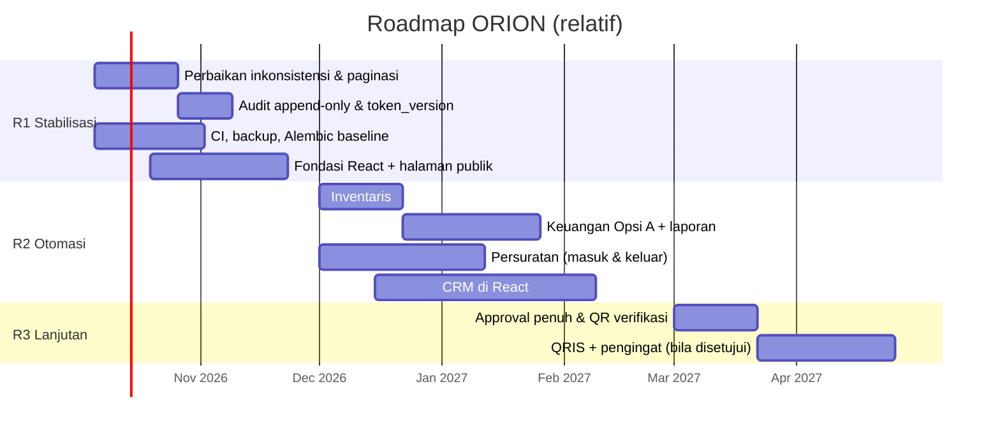

# PRD — Product Requirements Document ORION

| Atribut | Nilai |
|---|---|
| Versi | 1.0 |
| Tanggal | 29 September 2026 |
| Penulis | Tim Pengembang ORION (disusun dengan bantuan asisten AI) |
| Pemilik produk | Ketua KSM AIoT (didelegasikan ke koordinator pengembang) |

Dokumen terkait: [BRD](BRD.md) · [SKPL](SKPL.md) · [FSD](FSD.md) · [API](API.md) · [ARCHITECTURE](ARCHITECTURE.md)

## Daftar Isi

1. [Visi produk](#1-visi-produk)
2. [Persona](#2-persona)
3. [Prinsip produk](#3-prinsip-produk)
4. [User story](#4-user-story)
5. [Daftar fitur per modul](#5-daftar-fitur-per-modul)
6. [Metrik produk](#6-metrik-produk)
7. [Rilis dan roadmap](#7-rilis-dan-roadmap)
8. [Non-goals](#8-non-goals)
9. [Dependensi](#9-dependensi)
10. [Pertanyaan terbuka dan daftar diskusi](#10-pertanyaan-terbuka-dan-daftar-diskusi)
11. [Riwayat revisi](#11-riwayat-revisi)

---

## 1. Visi produk

> **ORION menjadi satu tempat kerja pengurus KSM AIoT** — dari menerima anggota baru, mengelola alat lab, mencatat uang organisasi, hingga menerbitkan surat resmi — sehingga setiap data dicatat sekali, dapat dipertanggungjawabkan, dan diwariskan utuh ke kepengurusan berikutnya.

## 2. Persona

| Persona | Peran | Tujuan | Frustrasi saat ini | Perangkat |
|---|---|---|---|---|
| **Rani, calon anggota** | Mahasiswa baru | Mendaftar cepat, tahu status | Formulir panjang, tidak ada konfirmasi | Ponsel |
| **Dimas, staf PSDM** | Pengelola rekrutmen & anggota | Menyeleksi ratusan pendaftar, data anggota rapi | Menyalin spreadsheet, data ganda | Laptop |
| **Sari, Bendahara** | Pengelola kas & iuran | Saldo selalu cocok, LPJ cepat | Mencatat di buku + spreadsheet + chat | Laptop & ponsel |
| **Fajar, Sekretaris** | Persuratan & arsip | Surat seragam, nomor tidak bentrok, arsip mudah dicari | Menomori manual, template Word berbeda-beda | Laptop |
| **Ayu, Kepala Lab (Akademik Riset)** | Pengelola inventaris | Tahu alat di mana & dipinjam siapa | Alat hilang, tidak ada tenggat | Laptop / ponsel di lab |
| **Bima, Ketua** | Pengambil keputusan | Menyetujui surat & laporan, melihat ringkasan | Harus bertanya ke tiap divisi | Ponsel |
| **Andi, Superadmin/pengembang** | Pemelihara sistem | Deploy aman, mudah diserahterimakan | Pengetahuan hanya di kepala satu orang | Laptop |

## 3. Prinsip produk

1. **Catat sekali** — tidak ada input ganda; laporan diturunkan dari data transaksi.
2. **Minimal dulu** — fitur besar mulai dari versi minimal; perluasan lewat keputusan pengurus.
3. **Aman & patuh** — hak akses sesuai jabatan, data pribadi diminimalkan, semua aksi tercatat.
4. **Jujur soal status** — UI menandai fitur prototipe; dokumen memisahkan yang ada dan yang diusulkan.

## 4. User story

Prioritas MoSCoW; status mengikuti label [SKPL §1.3](SKPL.md#13-label-status-wajib-dibaca). Detail kriteria penerimaan ada pada FR yang ditautkan.

| ID | User story | Prioritas | Status | BR | FR |
|---|---|---|---|---|---|
| US-01 | Sebagai **pengurus**, saya ingin login dengan NIM/email dan tetap masuk selama bekerja, agar tidak login berulang namun akun tetap aman | Must | [ADA-BACKEND] | BR-03 | FR-AUTH-01..05, 07..09 |
| US-02 | Sebagai **Superadmin/PSDM**, saya ingin memberi, mencabut, dan mereset akses login anggota sesuai kewenangan, agar hanya pengurus yang berhak dapat masuk | Must | [ADA-BACKEND] | BR-03 | FR-AUTH-06, FR-ERP-01..03 |
| US-03 | Sebagai **pengunjung**, saya ingin melihat statistik, struktur kepengurusan, dan proyek, agar mengenal KSM AIoT | Should | [ADA-BACKEND] + [MVP-HTML] | BR-02 | FR-PUB-01..03 |
| US-04 | Sebagai **calon anggota**, saya ingin mendaftar daring beserta foto/CV selama periode dibuka, agar lamaran saya diproses | Must | [ADA-BACKEND] | BR-01, BR-04 | FR-PUB-04, FR-REG-01..06 |
| US-05 | Sebagai **staf PSDM**, saya ingin mengatur periode intake dan menyetujui/menolak pendaftar dengan catatan, agar seleksi cepat dan terdokumentasi | Must | [ADA-BACKEND] (catatan: [USULAN]) | BR-01 | FR-SEL-01..07 |
| US-06 | Sebagai **staf PSDM**, saya ingin mengelola dan mengimpor data anggota, agar direktori selalu mutakhir | Must | [ADA-BACKEND] | BR-02 | FR-MEM-01..04, 07, 09 |
| US-07 | Sebagai **pengurus berwenang**, saya ingin menganonimkan atau menghapus data seseorang atas permintaan, agar memenuhi hak hapus UU PDP | Must | [ADA-BACKEND] | BR-04 | FR-MEM-05, 06, FR-SEL-05, FR-FILE-04 |
| US-08 | Sebagai **pengurus**, saya ingin menyimpan profil karier alumni dengan persetujuan tampil, agar jejaring alumni terjaga | Could | [ADA-BACKEND] | BR-02 | FR-MEM-08 |
| US-09 | Sebagai **Ketua**, saya ingin melihat log aktivitas dengan filter, agar dapat menelusuri siapa melakukan apa | Must | [ADA-BACKEND] (filter server: [USULAN]) | BR-05 | FR-LOG-01..05 |
| US-10 | Sebagai **pengguna**, saya ingin unggahan yang tidak jadi dipakai tidak menumpuk, agar data pribadi tidak tersimpan tanpa alasan | Must | [ADA-BACKEND] | BR-04 | FR-FILE-01..03 |
| US-11 | Sebagai **Kepala Lab**, saya ingin mencatat aset lab (kode, kategori, lokasi, stok, kondisi, foto), agar stok selalu diketahui | Must | [MVP-HTML] → [USULAN] | BR-06 | FR-INV-01, 03, 08 |
| US-12 | Sebagai **petugas lab**, saya ingin mencatat peminjaman dan pengembalian beserta peminjam dan tenggat, agar alat dapat dilacak | Must | [MVP-HTML] → [USULAN] | BR-06 | FR-INV-02, 04..06, 09, 10 |
| US-13 | Sebagai **pengurus**, saya ingin melihat daftar peminjaman terlambat, agar dapat menagih pengembalian | Should | [USULAN] | BR-06 | FR-INV-07 |
| US-14 | Sebagai **Bendahara**, saya ingin mencatat setiap transaksi sekali dan otomatis tercermin di buku kas dan buku pemasukan-pengeluaran, agar tidak ada input ganda | Must | [MVP-HTML] → [USULAN] | BR-07 | FR-FIN-01..06 |
| US-15 | Sebagai **Bendahara**, saya ingin rekap bulanan, tutup buku, dan LPJ PDF/XLSX otomatis, agar pertanggungjawaban cepat | Should | [USULAN] | BR-07 | FR-FIN-07, 12 |
| US-16 | Sebagai **Bendahara**, saya ingin membuat periode iuran dan menandai lunas sehingga otomatis tercatat di kas, agar tahu siapa yang belum bayar | Should | [USULAN] | BR-08 | FR-FIN-08, 09 |
| US-17 | Sebagai **anggota**, saya ingin membayar iuran lewat QRIS dan menerima pengingat, agar tidak lupa | Could | [PERLU-DISKUSI] | BR-08 | FR-FIN-10, 11 |
| US-18 | Sebagai **Sekretaris**, saya ingin mencatat surat masuk beserta lampiran dan klasifikasi, agar arsip lengkap dan terbatas aksesnya | Should | [USULAN] | BR-09 | FR-ARC-04, 10 |
| US-19 | Sebagai **Sekretaris**, saya ingin membuat surat keluar dari template per jenis (A/B/SK) dengan nomor otomatis yang tidak bentrok, agar surat seragam | Must | [MVP-HTML] → [USULAN] | BR-09 | FR-ARC-01..03, 05, 07..09 |
| US-20 | Sebagai **Ketua**, saya ingin menyetujui surat sebelum terbit dan (opsional) menyediakan QR verifikasi, agar surat sah dan tidak dapat dipalsukan | Should | [PERLU-DISKUSI] | BR-09 | FR-ARC-06, 11 |
| US-21 | Sebagai **Superadmin**, saya ingin deployment yang aman dengan health check dan URL lama tetap berfungsi, agar operasi stabil | Must | [ADA-BACKEND] | BR-03, BR-10 | FR-SYS-01..03 |
| US-22 | Sebagai **pengembang penerus**, saya ingin frontend React bertipe dengan klien API dari OpenAPI, agar mudah dirawat | Should | [USULAN] | BR-10 | FR-SYS-04, 05 |

## 5. Daftar fitur per modul

| Modul | Fitur | Status | Rilis |
|---|---|---|---|
| Autentikasi | Login, refresh rotasi, profil, ganti password, logout, RBAC anti-eskalasi | [ADA-BACKEND] | Sudah |
| | Pencabutan token, cookie HttpOnly | [USULAN] | R1 / R2 |
| Publik | Statistik, struktur organisasi, status intake | [ADA-BACKEND] | Sudah |
| | Showcase proyek & alumni statis | [MVP-HTML] | Sudah |
| Pendaftaran | Formulir + foto/CV staging, deadline WIB fail-closed | [ADA-BACKEND] | Sudah |
| | Validasi NIM & angkatan di server, kuota ditegakkan | [USULAN] / [PERLU-DISKUSI] | R1 |
| Seleksi | Intake, daftar, approve (Member ID per tahun), reject, hapus massal | [ADA-BACKEND] | Sudah |
| | Simpan catatan evaluator | [USULAN] | R1 |
| Anggota | CRUD, impor Excel aman, anonimisasi, alumni, akses ERP | [ADA-BACKEND] | Sudah |
| | Ekspor CSV | [MVP-HTML] (perlu escaping) | R1 |
| Log | Audit log + UI filter lokal | [ADA-BACKEND] + [MVP-HTML] | Sudah |
| | Filter server, append-only | [USULAN] | R1 |
| Inventaris | Daftar & simulasi pinjam | [MVP-HTML] | Prototipe |
| | Aset, peminjaman, pengembalian, riwayat, keterlambatan | [USULAN] | R2 |
| | QR aset, pengingat, denda | [PERLU-DISKUSI] | R3 |
| Keuangan | Ringkasan & transaksi tiruan | [MVP-HTML] | Prototipe |
| | Double-entry, dua ledger, akun, rekap, tutup buku, iuran manual, laporan | [USULAN] | R2 |
| | QRIS/payment gateway, pengingat | [PERLU-DISKUSI] | R3 |
| Arsip | Buku arsip & generator kop tiruan, ekspor PDF/LaTeX | [MVP-HTML] | Prototipe |
| | Surat masuk, surat keluar dari template, penomoran anti-tabrakan, PDF server | [USULAN] | R2 |
| | Approval multi-tahap, QR verifikasi, tanda tangan digital | [PERLU-DISKUSI] | R3 |
| Platform | Health, redirect URL lama, header keamanan | [ADA-BACKEND] | Sudah |
| | CI, backup, observability, React | [USULAN] | R1–R2 |

## 6. Metrik produk

| Metrik | Definisi | Target | Sumber |
|---|---|---|---|
| Aktivasi pengurus | % pengurus aktif yang login ≥ 1× per bulan | ≥ 80% | audit `AUTH_LOGIN_SUCCESS` |
| Waktu keputusan seleksi | Median hari submit → approve/reject | ≤ 7 | registrations + audit |
| Kelengkapan data anggota | % anggota aktif dengan email & prodi valid | ≥ 95% | members |
| Pencatatan peminjaman | % pinjaman dengan tenggat | 100% | inventory_loans [USULAN] |
| Tingkat keterlambatan | % pinjaman terlambat > 7 hari | < 5% | inventory_loans [USULAN] |
| Kepatuhan iuran | % tagihan PAID per periode | ≥ 80% | dues_invoices [USULAN] |
| Waktu LPJ | Menit dari permintaan hingga PDF | ≤ 5 | reports [USULAN] |
| Nomor surat ganda | Jumlah insiden | 0 | letters [USULAN] |
| Error server | % respons 5xx | < 0,5% | log [USULAN] |

## 7. Rilis dan roadmap

| Rilis | Waktu (relatif) | Isi | Kriteria keluar |
|---|---|---|---|
| **R0 — Saat ini** | — | Portal, pendaftaran, seleksi, anggota, ERP, log, keamanan (audit 29-09-2026) | 120 test lulus |
| **R1 — Stabilisasi** | Bulan 1–2 | Catatan evaluator, validasi NIM server, paginasi & filter server, log append-only, pencabutan token, Alembic baseline, tanggal terstruktur, CI, backup, fondasi React + halaman publik & pendaftaran di React | CI hijau; restore teruji; paritas halaman React |
| **R2 — Otomasi** | Bulan 3–5 | Inventaris lengkap; keuangan Opsi A + laporan; surat masuk & keluar (penomoran, template WeasyPrint, approval minimal); CRM di React | UAT Bendahara, Sekretaris, Kepala Lab |
| **R3 — Lanjutan** | Bulan 6+ (bergantung keputusan) | Approval penuh, QR verifikasi, QRIS + webhook, pengingat, QR aset, portal anggota | Keputusan D-01..D-05 disetujui |

Tanggal pada Gantt adalah **ilustrasi** untuk menunjukkan urutan dan paralelisme; jadwal nyata ditetapkan setelah rapat pengurus.

## 8. Non-goals

- Tidak menggantikan sistem akademik kampus (SIAKAD) atau sistem keuangan fakultas.
- Tidak menyediakan akuntansi lengkap (neraca, pajak, penyusutan aset).
- Tidak membangun aplikasi mobile native; web responsif cukup.
- Tidak menyimpan data kartu/rekening pembayaran (bila Opsi B, data dikelola gateway).
- Tidak mengirim notifikasi massal di luar pengingat yang disetujui (tidak ada broadcast pemasaran).

## 9. Dependensi

| Dependensi | Untuk | Jenis |
|---|---|---|
| Keputusan pengurus D-01..D-15 | Cakupan R2/R3 | Keputusan |
| Data master: kategori inventaris & keuangan, akun kas, template kop resmi | Inventaris, keuangan, arsip | Data |
| Server dengan Docker + PostgreSQL + penyimpanan backup | Semua | Infrastruktur |
| Akun merchant/payment gateway + KYC | Opsi B | Eksternal |
| Kanal email/WA | Pengingat | Eksternal |
| Pustaka WeasyPrint (Pango) di image | PDF server | Teknis |

## 10. Pertanyaan terbuka dan daftar diskusi

Daftar lengkap (opsi, dampak, rekomendasi, dampak bila ditunda) ada di [SKPL §11](SKPL.md#11-daftar-diskusi-dengan-pengurus). Ringkasan siap rapat:

| ID | Pertanyaan untuk rapat pengurus | Rekomendasi tim | Tenggat keputusan |
|---|---|---|---|
| D-01 ★ | Otomasi keuangan: Opsi A (manual + rekap otomatis) atau Opsi B (QRIS/payment gateway)? | Opsi A dulu | Sebelum R2 |
| D-02 ★ | Perlukah pengingat pembayaran otomatis? Kanal apa? | Daftar tunggakan dulu; email bila Opsi B | Sebelum R2 |
| D-04 ★ | Alur persetujuan surat: minimal (langsung terbit) atau multi-tahap? | Minimal + audit | Sebelum R2 |
| D-05 ★ | Tanda tangan digital: tidak / QR verifikasi / PSrE tersertifikasi? | QR verifikasi (R3) | Sebelum R3 |
| D-06 ★ | Format nomor surat & urutan (bersama vs per jenis)? | Format generator MVP, urutan bersama per tahun | Sebelum R2 |
| D-07 ★ | Pendekatan template surat? | HTML/CSS → PDF (WeasyPrint) | Sebelum R2 |
| D-08 | Migrasi React bertahap atau big-bang? | Bertahap | Sebelum R1 |
| D-09 | Disk lokal atau object storage? | Disk lokal + backup | Sebelum R2 |
| D-10..D-15 | Kuota intake, saldo negatif, QR aset, pengembalian parsial/denda, foto wajib, retensi data pendaftar | Lihat SKPL §11 | Bertahap |

Pertanyaan terbuka lain:

1. Siapa pemilik dan penanggung jawab server produksi setelah periode ini?
2. Apakah laporan keuangan perlu format baku dari fakultas (template LPJ tertentu)?
3. Apakah surat keluar ke pihak kampus wajib memakai kode `UN61` (seperti data tiruan) atau cukup `FIK-UPNVJ`?
4. Apakah anggota biasa perlu login (portal anggota) pada periode ini?

## 11. Riwayat revisi

| Versi | Tanggal | Penulis | Perubahan |
|---|---|---|---|
| 1.0 | 2026-09-29 | Tim Pengembang (dibantu asisten AI) | Dokumen awal |
