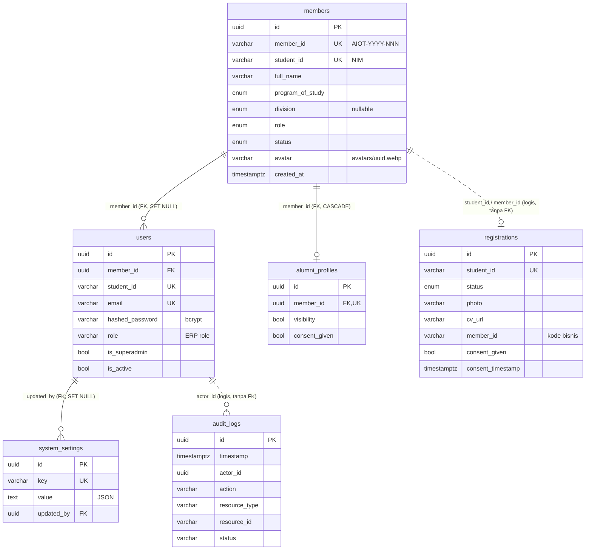
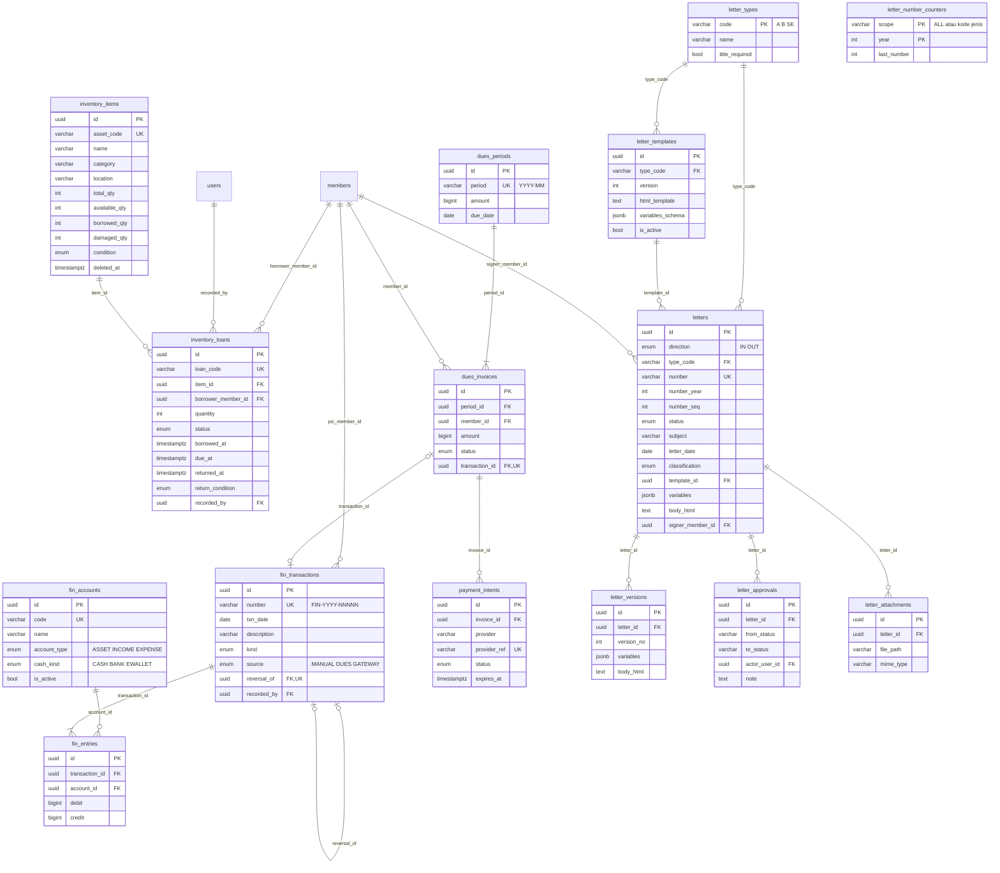

# SCHEMA — Skema Basis Data ORION

| Atribut | Nilai |
|---|---|
| Versi | 1.0 |
| Tanggal | 29 September 2026 |
| Penulis | Tim Pengembang ORION (disusun dengan bantuan asisten AI) |
| DBMS | PostgreSQL (≥ 14; tipe ENUM, ARRAY, `timestamptz`) |
| Sumber kebenaran | Model SQLAlchemy `orion-backend/models/*.py`, migrasi `orion-backend/migrations/versions/*.py`, DDL hasil `pg_dump --schema-only` dari DB yang dibuat oleh kode (29-09-2026) |

Dokumen terkait: [SKPL](SKPL.md) · [API](API.md) · [ARCHITECTURE](ARCHITECTURE.md) · [FSD](FSD.md)

## Daftar Isi

1. [Konvensi](#1-konvensi)
2. [ERD](#2-erd)
3. [Skema saat ini [ADA-BACKEND]](#3-skema-saat-ini-ada-backend)
4. [Skema usulan](#4-skema-usulan)
5. [Kebijakan data](#5-kebijakan-data)
6. [Strategi migrasi](#6-strategi-migrasi)
7. [Riwayat revisi](#7-riwayat-revisi)

---

## 1. Konvensi

| Aspek | Konvensi | Status |
|---|---|---|
| Primary key | `id UUID` UUIDv7 (terurut waktu) dari `utils/uuid_utils.py:4` | [ADA-BACKEND] |
| Nama constraint | `pk_<tabel>`, `uq_<tabel>_<kolom>`, `fk_<tabel>_<kolom>_<tabel_rujukan>`, `ix_<label>` (`config/db.py` `NAMING`) | [ADA-BACKEND] |
| Waktu | `timestamptz`, diisi UTC oleh aplikasi | [ADA-BACKEND] (kecuali IC-14) |
| Nilai kategori | Tipe `ENUM` PostgreSQL dengan nilai berbahasa Indonesia/Inggris sesuai `models/enums.py` | [ADA-BACKEND] |
| Nominal uang | `BIGINT` rupiah bulat, tidak pernah `float` | [USULAN] |
| Hapus | Hard delete untuk data pribadi (hak hapus); soft delete (`deleted_at`) untuk master operasional | [USULAN] (soft delete) |
| Akses SQL | Raw SQL berparameter (`sqlalchemy.text`) di layer service | [ADA-BACKEND] |

Enum yang ada (`config/db.py` `ENUM_DEFINITIONS_SQL`, `models/enums.py`):

| Tipe | Nilai |
|---|---|
| `division_enum` | BPH, Akademik Riset, PSDM, Humas Multimedia |
| `member_status_enum` | Aktif, Tidak Aktif, Alumni |
| `research_field_enum` | IoT Embedded, AI, Software Engineer & Cloud |
| `role_enum` | Ketua, Wakil Ketua, Sekretaris, Bendahara, Kepala Divisi, Staff, Anggota |
| `selection_status_enum` | Accepted, Pending, Rejected |
| `study_program_enum` | S1 Informatika, S1 Sistem Informasi, S1 Sains Data, D3 Sistem Informasi |

---

## 2. ERD

### 2.1 Skema saat ini [ADA-BACKEND]



### 2.2 Skema usulan (Inventaris, Keuangan, Arsip) [USULAN]



---

## 3. Skema saat ini [ADA-BACKEND]

Semua tabel di bawah dibuat oleh `Base.metadata.create_all` (`config/db.py` `ensure_enums_and_tables`) pada DB baru, lalu Alembic di-*stamp* ke head (`entrypoint.sh`). DB lama diperbarui lewat `alembic upgrade head` (IC-15).

### 3.1 `members` — data anggota (`models/member_model.py`)

| Kolom | Tipe | Null | Constraint / catatan |
|---|---|---|---|
| id | uuid | NOT NULL | PK `pk_members` |
| member_id | varchar(50) | NOT NULL | UNIQUE `ix_members_member_id`; format `AIOT-YYYY-NNN` (`services/member_id.py`) |
| student_id | varchar(20) | NOT NULL | UNIQUE `ix_members_student_id` (NIM) |
| full_name | varchar(150) | NOT NULL | HTML-escaped |
| program_of_study | study_program_enum | NOT NULL | |
| semester | integer | NULL | |
| email | varchar(150) | NOT NULL | tidak unik (berbeda dengan `users.email`) |
| contact_info | varchar(50) | NULL | telepon (data pribadi) |
| domicile_city | varchar(100) | NULL | data pribadi |
| division | division_enum | NULL | opsional sejak migrasi `695c97a3fbd8` |
| role | role_enum | NOT NULL | jabatan organisasi — dasar RBAC |
| intake_period | varchar(20) | NOT NULL | angkatan KSM |
| interest_track | research_field_enum[] | NULL | |
| focus_expertise, exploration_field, field_reason, programming_languages, tools_frameworks, project_experience, other_activities | text | NULL | isian formulir Google (impor Excel) |
| hackathon_experience | varchar(100) | NULL | |
| portfolio_url | text | NULL | hanya http(s)/tanpa skema (validasi input) |
| routine_commitment, weekly_free_time | varchar(50) | NULL | |
| discord_id | varchar(100) | NULL | |
| registration_timestamp | varchar(50) | NULL | teks bebas dari spreadsheet (IC-14) |
| avatar | varchar(255) | NULL | path relatif `avatars/<uuid>.webp` atau URL http(s) |
| status | member_status_enum | NOT NULL | default Aktif |
| join_date | varchar(30) | NULL | teks `dd/mm/YYYY` (IC-14) |
| created_at | timestamptz | NOT NULL | |

Alasan desain: satu baris per NIM; `member_id` terpisah dari PK agar nomor bisnis dapat dicetak tanpa membocorkan UUID.

### 3.2 `users` — akun login ERP (`models/user_model.py:12-29`)

| Kolom | Tipe | Null | Constraint / catatan |
|---|---|---|---|
| id | uuid | NOT NULL | PK |
| member_id | uuid | NULL | FK → `members(id)` ON DELETE SET NULL, indeks `ix_users_member_id` |
| student_id | varchar(20) | NOT NULL | UNIQUE |
| full_name | varchar(150) | NOT NULL | |
| email | varchar(150) | NOT NULL | UNIQUE (dicek juga case-insensitive saat ubah profil) |
| hashed_password | varchar(255) | NOT NULL | bcrypt cost 12 — **rahasia** |
| role | varchar(50) | NOT NULL | default `PENGURUS`; nilai ERP (PENGURUS/SUPERADMIN) atau jabatan dari impor |
| division | division_enum | NULL | |
| avatar | varchar(255) | NULL | |
| is_superadmin | boolean | NOT NULL | default false |
| is_active | boolean | NOT NULL | login hanya bila true |
| created_at | timestamptz | NOT NULL | |

Catatan: role efektif saat login = `SUPERADMIN` bila `is_superadmin`, selain itu `COALESCE(members.role, users.role)` dengan join **berdasarkan `student_id`** (IC-13).

### 3.3 `registrations` — pendaftar (`models/registration_model.py`)

| Kolom | Tipe | Null | Constraint / catatan |
|---|---|---|---|
| id | uuid | NOT NULL | PK |
| student_id | varchar(20) | NOT NULL | UNIQUE — satu pendaftaran per NIM |
| full_name | varchar(150) | NOT NULL | |
| program_of_study | study_program_enum | NOT NULL | |
| email | varchar(150) | NOT NULL | |
| contact_info | varchar(50) | NULL | |
| intake_period | varchar(20) | NOT NULL | |
| interest_track | research_field_enum[] | NULL | |
| motivation | text | NULL | ≤ 150 kata (validasi schema) |
| photo | varchar(255) | NULL | `avatars/<uuid>.webp` |
| cv_url | varchar(255) | NULL | `cvs/<uuid>.pdf` (migrasi `4f8b9e1c2a3d`) |
| portfolio_url | varchar(500) | NULL | |
| status | selection_status_enum | NOT NULL | default Pending |
| member_id | varchar(50) | NULL | Member ID bisnis setelah approve (tanpa FK) |
| review_note | text | NULL | diisi otomatis "Disetujui/Ditolak oleh …" |
| submit_date | varchar(30) | NULL | teks `dd/mm/YYYY` (IC-14) |
| consent_given | boolean | NOT NULL | persetujuan UU PDP (migrasi `e4fda818a508`) |
| consent_timestamp | timestamptz | NULL | |
| created_at, updated_at | timestamptz | NOT NULL | |

### 3.4 `alumni_profiles` (`models/alumni_profile_model.py`, migrasi `3d1c8f6a2b7e`)

| Kolom | Tipe | Null | Constraint |
|---|---|---|---|
| id | uuid | NOT NULL | PK |
| member_id | uuid | NOT NULL | FK → `members(id)` ON DELETE CASCADE; UNIQUE `uq_alumni_profiles_member_id` |
| graduation_year | varchar(4) | NULL | pola `^\d{4}$` di schema |
| current_company, current_role | varchar(150) | NULL | |
| linkedin_url | text | NULL | `HttpUrl` |
| testimonial | text | NULL | |
| visibility | boolean | NOT NULL | default false (tidak tampil publik) |
| consent_given | boolean | NOT NULL | default false |
| created_at, updated_at | timestamptz | NOT NULL | |

### 3.5 `audit_logs` (`models/audit_log_model.py`, migrasi `e4fda818a508`)

| Kolom | Tipe | Null | Catatan |
|---|---|---|---|
| id | uuid | NOT NULL | PK |
| timestamp | timestamptz | NOT NULL | indeks |
| actor_id | uuid | NULL | indeks; tanpa FK (log bertahan walau user dihapus) |
| actor_name | varchar(150) | NULL | salinan nama saat kejadian |
| actor_role | varchar(50) | NULL | |
| action | varchar(100) | NOT NULL | indeks; mis. `AUTH_LOGIN_FAILED`, `MEMBER_UPDATED` |
| resource_type | varchar(50) | NOT NULL | indeks; USER, MEMBER, REGISTRATION |
| resource_id | varchar(100) | NULL | indeks |
| ip_address | varchar(45) | NULL | IP tervalidasi (`utils/client_ip.py`) |
| user_agent | varchar(255) | NULL | dipotong 255 |
| details | text | NULL | JSON |
| status | varchar(20) | NOT NULL | SUCCESS / FAILED / DENIED |

Belum append-only (IC-10) — lihat §4.5.

### 3.6 `system_settings` (`models/system_setting_model.py:12-20`, migrasi `207a6cc09ec3`)

| Kolom | Tipe | Null | Catatan |
|---|---|---|---|
| id | uuid | NOT NULL | PK |
| key | varchar(100) | NOT NULL | UNIQUE (`intake_config`) |
| value | text | NOT NULL | JSON: `{status, batch_name, deadline, quota}` |
| description | varchar(255) | NULL | |
| updated_at | timestamptz | NOT NULL | |
| updated_by | uuid | NULL | FK → `users(id)` ON DELETE SET NULL |

### 3.7 Data sensitif (saat ini)

| Kategori | Kolom | Perlakuan |
|---|---|---|
| Kredensial | `users.hashed_password` | bcrypt; tidak pernah dikembalikan API |
| Identitas | `student_id`, `full_name`, `email` (members/users/registrations) | Tidak ada di endpoint publik; anonimisasi/hapus tersedia |
| Kontak | `contact_info`, `domicile_city`, `discord_id` | Hanya pengurus |
| Dokumen | `photo`, `avatar`, `cv_url` (file) | Foto tanpa EXIF; CV `no-store`; file ikut dihapus |
| Jejak | `audit_logs.ip_address`, `user_agent` | Hanya pengurus; retensi usulan §5 |

---

## 4. Skema usulan

DDL berikut adalah **rancangan** [USULAN]; nama dan tipe dapat berubah saat implementasi. Tiap tabel baru dibuat lewat migrasi Alembic (bukan `create_all`).

### 4.1 Tambahan pada tabel yang sudah ada

| Tabel | Perubahan | Tujuan | Kebutuhan |
|---|---|---|---|
| `users` | `token_version INTEGER NOT NULL DEFAULT 0` | Pencabutan JWT | FR-AUTH-08 |
| `registrations` | `reviewer_note TEXT`, `submitted_at timestamptz` (ganti `submit_date` teks) | Catatan reviewer, tanggal terstruktur | FR-SEL-06, IC-14 |
| `members` | `joined_on DATE` (ganti `join_date` teks) | Tanggal terstruktur | IC-14 |
| `members`/`registrations` | `CHECK (student_id ~ '^[0-9]{10}$')` setelah data dibersihkan | Validasi NIM di DB | FR-REG-05, IC-04 |

### 4.2 Inventaris

```sql
CREATE TYPE item_condition_enum AS ENUM ('PRIMA', 'BAIK', 'PERLU_SERVIS');
CREATE TYPE loan_status_enum AS ENUM ('DIAJUKAN', 'DIPINJAM', 'DIKEMBALIKAN', 'HILANG', 'DIBATALKAN');
CREATE TYPE return_condition_enum AS ENUM ('BAIK', 'RUSAK');

CREATE TABLE inventory_items (
    id              uuid PRIMARY KEY,
    asset_code      varchar(30)  NOT NULL UNIQUE,          -- mis. INV-EAI-001
    name            varchar(150) NOT NULL,
    category        varchar(80)  NOT NULL,
    location        varchar(100),
    total_qty       integer NOT NULL CHECK (total_qty >= 0),
    available_qty   integer NOT NULL CHECK (available_qty >= 0),
    borrowed_qty    integer NOT NULL DEFAULT 0 CHECK (borrowed_qty >= 0),
    damaged_qty     integer NOT NULL DEFAULT 0 CHECK (damaged_qty >= 0),
    condition       item_condition_enum NOT NULL DEFAULT 'BAIK',
    photo           varchar(255),                          -- inventory/<uuid>.webp (pola staging)
    notes           text,
    created_at      timestamptz NOT NULL,
    updated_at      timestamptz NOT NULL,
    deleted_at      timestamptz,                           -- soft delete
    CONSTRAINT ck_inventory_items_qty_balance
        CHECK (available_qty + borrowed_qty + damaged_qty = total_qty)
);
CREATE INDEX ix_inventory_items_category ON inventory_items (category) WHERE deleted_at IS NULL;

CREATE TABLE inventory_loans (
    id                 uuid PRIMARY KEY,
    loan_code          varchar(30) NOT NULL UNIQUE,        -- PJM-YYYY-NNNN
    item_id            uuid NOT NULL REFERENCES inventory_items(id) ON DELETE RESTRICT,
    borrower_member_id uuid NOT NULL REFERENCES members(id) ON DELETE RESTRICT,
    quantity           integer NOT NULL CHECK (quantity > 0),
    status             loan_status_enum NOT NULL,
    requested_at       timestamptz NOT NULL,
    borrowed_at        timestamptz,
    due_at             timestamptz,
    returned_at        timestamptz,
    return_condition   return_condition_enum,
    notes              text,
    recorded_by        uuid NOT NULL REFERENCES users(id),
    handed_over_by     uuid REFERENCES users(id),
    received_by        uuid REFERENCES users(id),
    CONSTRAINT ck_inventory_loans_due CHECK (due_at IS NULL OR borrowed_at IS NULL OR due_at >= borrowed_at)
);
CREATE INDEX ix_inventory_loans_item ON inventory_loans (item_id, status);
CREATE INDEX ix_inventory_loans_borrower ON inventory_loans (borrower_member_id, status);
CREATE INDEX ix_inventory_loans_overdue ON inventory_loans (due_at) WHERE status = 'DIPINJAM';
```

Alasan desain: kuantitas per jenis (AS-04, sesuai MVP); `CHECK` menjamin stok tidak negatif dan seimbang; "terlambat" dihitung dari `due_at` (tidak perlu job pengubah status); `ON DELETE RESTRICT` menjaga riwayat — anggota yang pernah meminjam dianonimisasi, bukan dihapus. Pengurangan stok memakai *conditional update* atomik (FR-INV-04).

### 4.3 Kas dan keuangan

```sql
CREATE TYPE fin_account_type_enum AS ENUM ('ASSET', 'INCOME', 'EXPENSE');
CREATE TYPE fin_cash_kind_enum AS ENUM ('CASH', 'BANK', 'EWALLET');
CREATE TYPE fin_txn_kind_enum AS ENUM ('INCOME', 'EXPENSE', 'TRANSFER', 'REVERSAL');
CREATE TYPE fin_txn_source_enum AS ENUM ('MANUAL', 'DUES', 'GATEWAY');

CREATE TABLE fin_accounts (
    id           uuid PRIMARY KEY,
    code         varchar(20)  NOT NULL UNIQUE,   -- 1-100 Kas Tunai, 4-100 Pendapatan Iuran, 5-200 Pengadaan Alat
    name         varchar(100) NOT NULL,
    account_type fin_account_type_enum NOT NULL, -- ASSET = ledger arus kas; INCOME/EXPENSE = ledger pemasukan-pengeluaran
    cash_kind    fin_cash_kind_enum,             -- wajib untuk ASSET
    is_active    boolean NOT NULL DEFAULT true,
    CONSTRAINT ck_fin_accounts_cash_kind CHECK ((account_type = 'ASSET') = (cash_kind IS NOT NULL))
);

CREATE TABLE fin_transactions (                  -- header, immutable (tanpa UPDATE/DELETE)
    id            uuid PRIMARY KEY,
    number        varchar(20) NOT NULL UNIQUE,   -- FIN-YYYY-NNNNN
    txn_date      date NOT NULL,                 -- tanggal bisnis (WIB)
    description   varchar(255) NOT NULL,
    kind          fin_txn_kind_enum NOT NULL,
    source        fin_txn_source_enum NOT NULL DEFAULT 'MANUAL',
    source_ref    varchar(100),                  -- id tagihan / order_id gateway
    activity      varchar(100),                  -- kegiatan/anggaran (opsional)
    pic_member_id uuid REFERENCES members(id),
    evidence_path varchar(255),                  -- bukti (pola staging)
    reversal_of   uuid UNIQUE REFERENCES fin_transactions(id),
    recorded_by   uuid NOT NULL REFERENCES users(id),
    created_at    timestamptz NOT NULL
);

CREATE TABLE fin_entries (                       -- baris double-entry
    id             uuid PRIMARY KEY,
    transaction_id uuid NOT NULL REFERENCES fin_transactions(id),
    account_id     uuid NOT NULL REFERENCES fin_accounts(id),
    debit          bigint NOT NULL DEFAULT 0 CHECK (debit >= 0),
    credit         bigint NOT NULL DEFAULT 0 CHECK (credit >= 0),
    CONSTRAINT ck_fin_entries_one_side CHECK ((debit = 0) <> (credit = 0))
);
CREATE INDEX ix_fin_entries_account ON fin_entries (account_id);

-- Debit = kredit per transaksi, diperiksa saat commit
CREATE FUNCTION fin_check_balanced() RETURNS trigger AS $$
BEGIN
  IF (SELECT SUM(debit) - SUM(credit) FROM fin_entries WHERE transaction_id = NEW.transaction_id) <> 0 THEN
    RAISE EXCEPTION 'Transaksi % tidak seimbang', NEW.transaction_id;
  END IF;
  RETURN NULL;
END; $$ LANGUAGE plpgsql;
CREATE CONSTRAINT TRIGGER trg_fin_entries_balanced AFTER INSERT ON fin_entries
  DEFERRABLE INITIALLY DEFERRED FOR EACH ROW EXECUTE FUNCTION fin_check_balanced();
-- Immutability: trigger menolak UPDATE/DELETE pada fin_transactions & fin_entries (pola §4.5)

CREATE TABLE fin_periods (                       -- tutup buku bulanan
    period     char(7) PRIMARY KEY,              -- YYYY-MM
    closed_at  timestamptz,
    closed_by  uuid REFERENCES users(id)
);

CREATE TYPE dues_invoice_status_enum AS ENUM ('UNPAID', 'PAID', 'WAIVED', 'CANCELLED');
CREATE TABLE dues_periods (
    id        uuid PRIMARY KEY,
    period    char(7) NOT NULL UNIQUE,           -- YYYY-MM
    amount    bigint NOT NULL CHECK (amount > 0),
    due_date  date NOT NULL,
    created_by uuid NOT NULL REFERENCES users(id),
    created_at timestamptz NOT NULL
);
CREATE TABLE dues_invoices (
    id             uuid PRIMARY KEY,
    period_id      uuid NOT NULL REFERENCES dues_periods(id),
    member_id      uuid NOT NULL REFERENCES members(id),
    amount         bigint NOT NULL CHECK (amount > 0),
    status         dues_invoice_status_enum NOT NULL DEFAULT 'UNPAID',
    paid_at        timestamptz,
    transaction_id uuid UNIQUE REFERENCES fin_transactions(id),   -- pelunasan tepat sekali
    waive_reason   text,
    CONSTRAINT uq_dues_invoices_period_member UNIQUE (period_id, member_id),
    CONSTRAINT ck_dues_paid CHECK ((status = 'PAID') = (transaction_id IS NOT NULL))
);

-- [PERLU-DISKUSI] Opsi B: QRIS/payment gateway
CREATE TYPE payment_intent_status_enum AS ENUM ('PENDING', 'PAID', 'EXPIRED', 'FAILED');
CREATE TABLE payment_intents (
    id           uuid PRIMARY KEY,
    invoice_id   uuid NOT NULL REFERENCES dues_invoices(id),
    provider     varchar(30) NOT NULL,           -- midtrans | xendit | ...
    provider_ref varchar(100) NOT NULL UNIQUE,   -- order_id yang dikirim ke gateway
    qr_string    text,
    amount       bigint NOT NULL,
    status       payment_intent_status_enum NOT NULL DEFAULT 'PENDING',
    expires_at   timestamptz NOT NULL,
    created_at   timestamptz NOT NULL
);
CREATE TABLE webhook_events (
    id              uuid PRIMARY KEY,
    provider        varchar(30) NOT NULL,
    event_id        varchar(150) NOT NULL,       -- id unik event dari penyedia
    signature_valid boolean NOT NULL,
    payload         jsonb NOT NULL,              -- tanpa data kartu/rahasia
    received_at     timestamptz NOT NULL,
    processed_at    timestamptz,
    CONSTRAINT uq_webhook_events_provider_event UNIQUE (provider, event_id)   -- idempotensi
);
CREATE TABLE notification_outbox (              -- pengingat (D-02/D-03)
    id          uuid PRIMARY KEY,
    channel     varchar(20) NOT NULL,            -- EMAIL | WHATSAPP
    recipient_member_id uuid NOT NULL REFERENCES members(id),
    template    varchar(50) NOT NULL,
    payload     jsonb NOT NULL,
    status      varchar(20) NOT NULL DEFAULT 'PENDING',
    scheduled_at timestamptz NOT NULL,
    sent_at     timestamptz,
    attempts    integer NOT NULL DEFAULT 0
);

CREATE TABLE reports (                           -- laporan otomatis (PDF/XLSX)
    id           uuid PRIMARY KEY,
    report_type  varchar(40) NOT NULL,           -- FINANCE_PERIOD, INVENTORY_OVERDUE, ...
    params       jsonb NOT NULL,
    format       varchar(10) NOT NULL,           -- PDF | XLSX
    status       varchar(20) NOT NULL,           -- QUEUED | DONE | FAILED
    file_path    varchar(255),
    source_hash  varchar(64),                    -- hash data sumber (snapshot)
    generated_by uuid NOT NULL REFERENCES users(id),
    created_at   timestamptz NOT NULL
);
```

**Hubungan dua ledger:** ledger arus kas = `fin_entries` pada akun `account_type='ASSET'`; ledger pemasukan-pengeluaran = `fin_entries` pada akun `INCOME`/`EXPENSE`. Keduanya dari satu transaksi, sehingga tidak dapat tidak sinkron. Contoh dan aturan: [SKPL §3.11.1](SKPL.md#3111-dua-buku-besar-ledger--definisi-dan-hubungan). Saldo akun = Σ(debit − kredit) untuk ASSET dan EXPENSE, Σ(kredit − debit) untuk INCOME.

### 4.4 Arsip dan persuratan

```sql
CREATE TYPE letter_direction_enum AS ENUM ('IN', 'OUT');
CREATE TYPE letter_status_enum AS ENUM
  ('DRAF', 'DIAJUKAN', 'DITINJAU', 'REVISI', 'DISETUJUI', 'DITOLAK', 'TERBIT', 'DIARSIPKAN', 'DIBATALKAN', 'DITERIMA');
CREATE TYPE letter_classification_enum AS ENUM ('BIASA', 'TERBATAS', 'RAHASIA');

CREATE TABLE letter_types (
    code           varchar(5) PRIMARY KEY,       -- A, B, SK
    name           varchar(50) NOT NULL,         -- Internal, Eksternal, Surat Keputusan
    title_required boolean NOT NULL DEFAULT false,
    retention_years integer NOT NULL DEFAULT 5
);

CREATE TABLE letter_number_counters (
    scope       varchar(10) NOT NULL,            -- 'ALL' (urutan bersama) atau kode jenis (keputusan D-06)
    year        integer NOT NULL,
    last_number integer NOT NULL DEFAULT 0,
    PRIMARY KEY (scope, year)
);

CREATE TABLE letter_templates (
    id               uuid PRIMARY KEY,
    type_code        varchar(5) NOT NULL REFERENCES letter_types(code),
    name             varchar(100) NOT NULL,
    version          integer NOT NULL,
    html_template    text NOT NULL,              -- Jinja2 (sandbox, autoescape)
    css              text,
    variables_schema jsonb NOT NULL,             -- JSON Schema variabel (SKPL FR-ARC-08)
    is_active        boolean NOT NULL DEFAULT false,
    created_by       uuid NOT NULL REFERENCES users(id),
    created_at       timestamptz NOT NULL,
    CONSTRAINT uq_letter_templates_version UNIQUE (type_code, version)
);
CREATE UNIQUE INDEX uq_letter_templates_active ON letter_templates (type_code) WHERE is_active;

CREATE TABLE letters (
    id                uuid PRIMARY KEY,
    direction         letter_direction_enum NOT NULL,
    type_code         varchar(5) REFERENCES letter_types(code),     -- surat keluar
    number            varchar(80) UNIQUE,         -- nomor terbit (keluar) / nomor pengirim (masuk)
    number_year       integer,
    number_seq        integer,
    agenda_number     varchar(30) UNIQUE,         -- SM-YYYY-NNNN (masuk)
    status            letter_status_enum NOT NULL,
    subject           varchar(200) NOT NULL,      -- perihal
    recipient         varchar(200),               -- tujuan (keluar)
    sender            varchar(200),               -- pengirim (masuk)
    letter_date       date NOT NULL,
    received_date     date,
    attachment_label  varchar(50),                -- "Lampiran: 1 berkas"
    with_title        boolean NOT NULL DEFAULT false,
    title             varchar(200),
    template_id       uuid REFERENCES letter_templates(id),
    variables         jsonb,
    body_html         text,                       -- HTML tersanitasi
    classification    letter_classification_enum NOT NULL DEFAULT 'BIASA',
    signer_member_id  uuid REFERENCES members(id),
    final_pdf_path    varchar(255),
    verification_code varchar(40) UNIQUE,         -- [PERLU-DISKUSI] QR verifikasi
    retention_until   date,
    cancelled_reason  text,
    created_by        uuid NOT NULL REFERENCES users(id),
    created_at        timestamptz NOT NULL,
    updated_at        timestamptz NOT NULL,
    CONSTRAINT uq_letters_seq UNIQUE (direction, number_year, number_seq),
    CONSTRAINT ck_letters_published_numbered
        CHECK (direction = 'IN' OR status NOT IN ('TERBIT', 'DIARSIPKAN') OR number IS NOT NULL)
);
CREATE INDEX ix_letters_search ON letters USING gin (to_tsvector('simple', subject || ' ' || coalesce(recipient, '') || ' ' || coalesce(sender, '')));
CREATE INDEX ix_letters_status_date ON letters (direction, status, letter_date);

CREATE TABLE letter_versions (
    id          uuid PRIMARY KEY,
    letter_id   uuid NOT NULL REFERENCES letters(id),
    version_no  integer NOT NULL,
    variables   jsonb,
    body_html   text,
    created_by  uuid NOT NULL REFERENCES users(id),
    created_at  timestamptz NOT NULL,
    CONSTRAINT uq_letter_versions UNIQUE (letter_id, version_no)
);

CREATE TABLE letter_approvals (                 -- jejak transisi state machine
    id            uuid PRIMARY KEY,
    letter_id     uuid NOT NULL REFERENCES letters(id),
    from_status   letter_status_enum NOT NULL,
    to_status     letter_status_enum NOT NULL,
    actor_user_id uuid NOT NULL REFERENCES users(id),
    note          text,
    acted_at      timestamptz NOT NULL
);

CREATE TABLE letter_attachments (
    id          uuid PRIMARY KEY,
    letter_id   uuid NOT NULL REFERENCES letters(id),
    file_path   varchar(255) NOT NULL,            -- letters/<uuid>.<ext> (pola staging)
    mime_type   varchar(100) NOT NULL,
    size_bytes  integer NOT NULL,
    uploaded_by uuid NOT NULL REFERENCES users(id),
    uploaded_at timestamptz NOT NULL
);
```

**Penomoran anti-tabrakan** (dieksekusi dalam transaksi yang sama dengan perubahan status ke `TERBIT`):

```sql
INSERT INTO letter_number_counters (scope, year, last_number)
VALUES (:scope, :year, 1)
ON CONFLICT (scope, year) DO UPDATE SET last_number = letter_number_counters.last_number + 1
RETURNING last_number;          -- baris counter terkunci hingga COMMIT
```

`UNIQUE (number)` dan `UNIQUE (direction, number_year, number_seq)` menjadi jaring pengaman. Surat yang dibatalkan tetap menyimpan nomornya (status `DIBATALKAN`), sehingga nomor tidak dipakai ulang.

### 4.5 Audit log append-only

```sql
CREATE FUNCTION forbid_mutation() RETURNS trigger AS $$
BEGIN RAISE EXCEPTION '% bersifat append-only', TG_TABLE_NAME; END; $$ LANGUAGE plpgsql;
CREATE TRIGGER trg_audit_logs_append_only BEFORE UPDATE OR DELETE ON audit_logs
  FOR EACH ROW EXECUTE FUNCTION forbid_mutation();
-- Pola yang sama untuk fin_transactions, fin_entries, letter_approvals
```

Konsekuensi: `tests/conftest.py` dan `scripts/cleanup_test_noise.py` saat ini menghapus baris audit; keduanya perlu memakai DB uji yang dibuang atau role khusus pemeliharaan.

---

## 5. Kebijakan data

| Kebijakan | Aturan | Status |
|---|---|---|
| Hard delete data pribadi | Registrasi, anggota, dan file dapat dihapus permanen (hak hapus UU PDP) | [ADA-BACKEND] |
| Anonimisasi | Anggota yang punya relasi historis dianonimisasi, bukan dihapus | [ADA-BACKEND] |
| Soft delete master | `inventory_items`, `fin_accounts` (nonaktif), `letter_templates` (nonaktif) | [USULAN] |
| Immutable | `audit_logs`, `fin_transactions`, `fin_entries`, `letter_approvals`, surat `TERBIT` | [USULAN] |
| Retensi pendaftar ditolak | Hapus 6 bulan setelah intake ditutup (D-15) | [PERLU-DISKUSI] |
| Retensi audit log | 3 tahun, lalu diarsipkan ke cold storage | [USULAN] |
| Retensi surat | Default 5 tahun per jenis (`letter_types.retention_years`) | [USULAN] |
| Retensi dokumen keuangan | ≥ 5 tahun (akuntabilitas hibah) | [USULAN] |
| File staging | Dihapus otomatis > 24 jam | [ADA-BACKEND] |

---

## 6. Strategi migrasi

1. **Baseline Alembic** (Fase 1): buat migrasi yang dapat membangun seluruh skema dari DB kosong, sehingga `create_all` di `entrypoint.sh` tidak lagi diperlukan (IC-15). Uji: `alembic upgrade head` pada DB kosong menghasilkan DDL identik dengan §3.
2. **Satu migrasi per fitur**, dapat di-*downgrade*; data migration terpisah dari perubahan skema.
3. **Kolom tanggal teks** (IC-14): tambah kolom baru bertipe `date`/`timestamptz`, isi dari parsing teks (baris gagal parse dicatat), ubah kode membaca kolom baru, hapus kolom lama pada rilis berikutnya (expand → migrate → contract).
4. **Enum:** penambahan nilai memakai `ALTER TYPE ... ADD VALUE` (dependensi `alembic-postgresql-enum` sudah ada).
5. **Sebelum migrasi produksi:** backup `pg_dump`, jalankan di salinan data, ukur durasi, siapkan rollback.

---

## 7. Riwayat revisi

| Versi | Tanggal | Penulis | Perubahan |
|---|---|---|---|
| 1.0 | 2026-09-29 | Tim Pengembang (dibantu asisten AI) | Dokumen awal: skema aktual dari DDL, ERD, rancangan inventaris/keuangan/arsip, kebijakan data, strategi migrasi |
