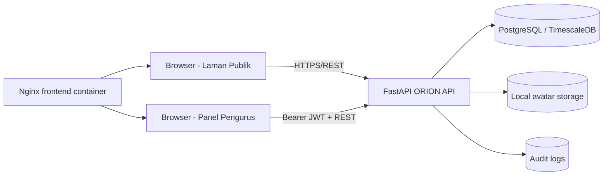
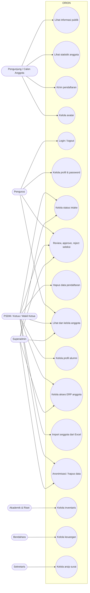
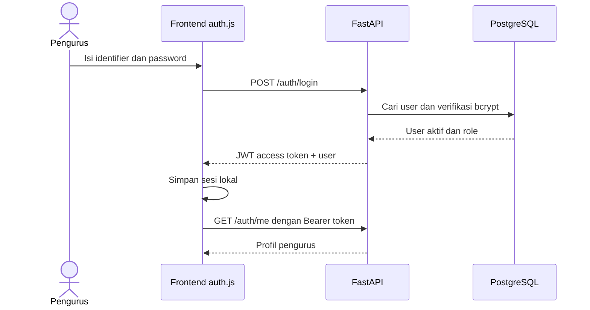
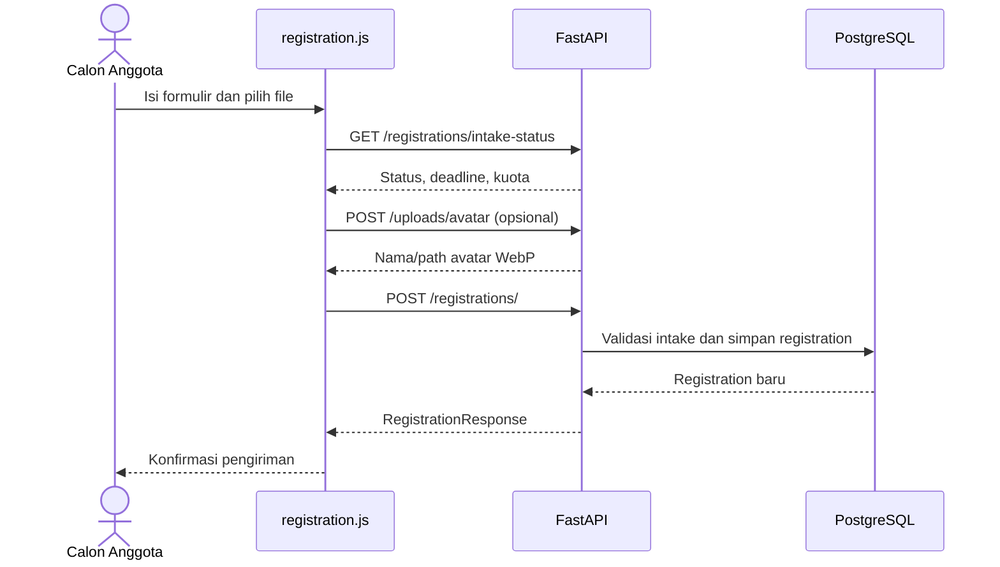

# SKPL / Software Requirements Specification
## ORION - KSM AIoT UPN "Veteran" Jakarta

**Status:** Baseline berbasis implementasi saat ini  
**Tanggal analisis:** 2026-09-16  
**Ruang lingkup:** `orion-backend` dan `orion-frontend`

## 1. Ringkasan Proyek

ORION (Organizational Resource & Integrated Operations Network) adalah portal operasional KSM AIoT. Sistem menyediakan laman publik untuk informasi organisasi, statistik anggota, dan pendaftaran calon anggota, serta panel CRM untuk pengurus yang mengelola seleksi, anggota, akses ERP, dan profil alumni.

Backend dibangun dengan FastAPI, SQLAlchemy async, PostgreSQL/TimescaleDB, Alembic, JWT, dan penyimpanan file lokal. Frontend adalah aplikasi multi-page Vite berbasis HTML, JavaScript modular, Tailwind/PostCSS, dan Nginx. Frontend memanggil REST API backend melalui `VITE_API_BASE_URL` (default `http://localhost:8000/orion/api/v1`) menggunakan Bearer JWT untuk area terlindungi.

### 1.1 Batasan ruang lingkup aktual

- API yang benar-benar tersedia mencakup health, autentikasi, registrasi/seleksi, anggota/alumni, dan avatar.
- Halaman inventory, finance, dan archive tersedia sebagai UI, tetapi saat analisis ini masih memakai data/mock state di browser dan belum memiliki router, model, atau persistence backend.
- Data showcase proyek dan sebagian data alumni masih statis/fallback frontend.
- Backend memasang router pada bentuk prefixed `/orion/api/v1` dan bentuk root untuk kompatibilitas. Integrasi frontend menggunakan bentuk prefixed.

## 2. Aktor Sistem

| Aktor | Dasar implementasi | Hak akses aktual |
|---|---|---|
| Pengunjung publik / calon anggota | `registration.html`, endpoint publik | Melihat laman, statistik publik, status intake, mengunggah avatar, dan mengirim pendaftaran selama intake terbuka. |
| Superadmin | `is_superadmin` atau role `SUPERADMIN` | Bypass pemeriksaan role pada operasi pengurus dan operasi tulis yang tersedia. |
| Ketua / Wakil Ketua | Role yang diperiksa pada dependency RBAC | Mengelola seleksi dan anggota; dapat menjadi pemilik operasi administratif yang diizinkan. |
| PSDM | `division == "PSDM"` | Mengelola intake, seleksi, anggota, alumni, dan akses ERP sesuai endpoint. |
| Pengurus umum / BPH / Kadiv | `require_pengurus` | Membaca area pengurus; implementasi `require_pengurus` menolak role `Anggota` atau role kosong, tetapi menerima role non-kosong lain. |
| Bendahara | Helper `can_manage_finance` | Helper tersedia untuk finance, tetapi belum dipakai router karena modul finance belum memiliki API. |
| Sekretaris | Helper `can_manage_archive` | Helper tersedia untuk archive, tetapi belum dipakai router karena modul archive belum memiliki API. |
| Akademik & Riset | Helper `can_manage_inventory` | Helper tersedia untuk inventory, tetapi belum dipakai router karena modul inventory belum memiliki API. |
| Anggota umum | Role `Anggota` / `MEMBER` | Tidak dapat mengakses endpoint pengurus; tidak ada alur self-service anggota yang terhubung penuh pada frontend saat ini. |

> Catatan: role bisnis seperti `Ketua`, `Wakil Ketua`, `Bendahara`, dan `Sekretaris` digunakan langsung dalam beberapa pemeriksaan, sedangkan konstanta sistem juga mendefinisikan `SUPERADMIN`, `ADMIN_BPH`, `KADIV`, `PENGURUS`, dan `MEMBER`. Pemetaan role perlu dikonsolidasikan sebelum ekspansi modul.

## 3. Diagram Use Case

## 4. Spesifikasi Fitur dan Use Case Agile

### UC-01 - Portal publik dan statistik organisasi

**Modul:** `orion-frontend/index.html`, `src/scripts/main.js`  
**User story:** As a pengunjung publik, I want to melihat informasi organisasi dan statistik anggota, so that saya memahami aktivitas serta skala KSM AIoT.

**Acceptance criteria:**

- Sistem menampilkan informasi visi, struktur, divisi, dan showcase proyek yang berasal dari data frontend.
- Sistem mengambil statistik anggota melalui `GET /members/count` tanpa login.
- Jika API statistik gagal, UI tetap dapat menampilkan halaman publik dan menangani kondisi error.
- Tombol akses pengurus mengarahkan pengguna ke alur login.

**API terkait:** `GET /members/count`.

### UC-02 - Autentikasi pengurus

**Modul:** `routes/auth_routes.py`, `services/auth_service.py`, `src/modules/auth.js`  
**User story:** As a pengurus, I want to login dengan NIM/email dan password, so that saya dapat mengakses panel operasional sesuai hak akses.

**Acceptance criteria:**

- Login menerima identifier NIM/email dan password melalui `POST /auth/login`.
- Percobaan login dibatasi 5 permintaan per menit per IP.
- Password diverifikasi dengan bcrypt dan respons sukses menerbitkan access token JWT.
- Token berlaku 30 menit secara default dan harus dikirim sebagai Bearer token pada endpoint terlindungi.
- Pengguna nonaktif, token invalid, token kedaluwarsa, role kosong, atau role `Anggota` ditolak pada area pengurus.
- Pengguna dapat memanggil `POST /auth/logout`; backend mencatat audit event, tetapi token JWT tidak diinvalidate secara server-side.

**Sequence:**

### UC-03 - Profil dan keamanan akun

**Modul:** `pages/profile.html`, `src/scripts/profile.js`  
**User story:** As a pengurus terautentikasi, I want to memperbarui profil dan password, so that data akun tetap akurat dan aman.

**Acceptance criteria:**

- `GET /auth/me` menampilkan profil sesi aktif.
- `PUT /auth/me` memperbarui nama lengkap, email, atau avatar sesuai schema.
- `POST /auth/change-password` hanya berhasil setelah password lama terverifikasi.
- Semua operasi memerlukan JWT dan hanya berlaku untuk akun aktif.

**API terkait:** `GET/PUT /auth/me`, `POST /auth/change-password`.

### UC-04 - Konfigurasi intake pendaftaran

**Modul:** `registration_routes.py`, `pages/registration.html`, `pages/selection.html`  
**User story:** As a PSDM atau pimpinan, I want to membuka/menutup intake serta menetapkan batch, deadline, dan kuota, so that pendaftaran berjalan sesuai periode resmi.

**Acceptance criteria:**

- Publik dapat membaca `GET /registrations/intake-status`.
- Pengguna berwenang dapat memperbarui status, nama batch, deadline, dan kuota melalui `PUT /registrations/intake-status`.
- Backend menolak perubahan oleh role/divisi yang tidak berwenang.
- Backend menolak pendaftaran saat status `CLOSED` atau tanggal deadline telah lewat.
- Konfigurasi tersimpan pada `system_settings` dengan key `intake_config`.

### UC-05 - Pendaftaran calon anggota

**Modul:** `pages/registration.html`, `src/scripts/registration.js`, `registration_service.py`  
**User story:** As a calon anggota, I want to mengirim data pendaftaran dan motivasi, so that saya dapat mengikuti proses rekrutmen KSM AIoT.

**Acceptance criteria:**

- Form melakukan validasi client-side dan backend melakukan validasi ulang.
- Pengiriman dilakukan ke `POST /registrations/` tanpa login.
- Endpoint dibatasi 10 permintaan per menit per IP.
- Backend memeriksa status intake dan deadline dari database sebelum membuat data.
- Data pendaftaran tersimpan dan dapat ditinjau pengurus.
- Avatar dapat diunggah melalui endpoint upload sebelum submission; file CV pada frontend belum memiliki endpoint persistence backend.
- Batas motivasi harus konsisten: backend membatasi 100 kata dan maksimal 3 kalimat, sedangkan validasi frontend saat ini mengizinkan hingga 150 kata. Ini adalah defect konsistensi yang perlu diperbaiki.

**Sequence:**

### UC-06 - Seleksi calon anggota

**Modul:** `pages/selection.html`, `src/scripts/selection.js`  
**User story:** As a reviewer PSDM/pimpinan, I want to meninjau dan memproses pendaftaran, so that hanya kandidat yang memenuhi kriteria menjadi anggota resmi.

**Acceptance criteria:**

- Pengurus dapat melihat daftar atau detail pendaftaran melalui `GET /registrations/` dan `GET /registrations/{identifier}`.
- PSDM, Ketua, Wakil Ketua, atau Superadmin dapat approve/reject.
- Approval membuat atau memperbarui member dan menerbitkan Member ID berurutan dengan pola `AIOT-YYYY-NNN`.
- Reviewer dapat menetapkan divisi dan role pada proses approval.
- Reject mengubah status sesuai service dan mencatat audit.
- Data pendaftaran pending/rejected dapat dihapus satuan atau bulk oleh pihak berwenang; penghapusan juga menghapus file foto lokal terkait.

### UC-07 - Direktori anggota, lifecycle, dan alumni

**Modul:** `pages/members.html`, `member_routes.py`, `member_service.py`  
**User story:** As a pengurus PSDM, I want to mengelola anggota aktif dan alumni, so that direktori serta lifecycle organisasi tetap akurat.

**Acceptance criteria:**

- Pengurus dapat memfilter daftar anggota berdasarkan division, intake period, dan status melalui `GET /members/`.
- Pengurus dapat mengambil anggota berdasarkan UUID, Member ID, atau NIM.
- PSDM/pimpinan/Superadmin dapat membuat, memperbarui, dan menghapus anggota.
- Sistem menyediakan anonimisasi yang menghapus PII/avatar, menonaktifkan akses ERP, dan mempertahankan integritas relasi.
- Pengguna berwenang dapat menghapus permanen anggota beserta user dan avatar.
- Profil alumni dapat dibaca pengurus dan di-upsert hanya untuk anggota berstatus `Alumni` melalui endpoint alumni-profile.
- Frontend saat ini masih memiliki fallback/dummy alumni data; data tersebut bukan bukti bahwa seluruh grid alumni sudah terhubung ke API.

**API terkait:** `GET /members/count`, CRUD `/members`, `POST /members/{identifier}/anonymize`, alumni-profile endpoints.

### UC-08 - Akses ERP dan import anggota

**Modul:** `pages/members.html`, `member_routes.py`  
**User story:** As a administrator PSDM, I want to memberi, mencabut, mereset akses ERP, dan mengimpor data anggota, so that onboarding serta pemeliharaan akun dapat dilakukan terpusat.

**Acceptance criteria:**

- `POST /members/{identifier}/access` membuat atau mengaktifkan akses ERP dengan role dan password.
- `DELETE /members/{identifier}/access` menonaktifkan akses ERP.
- `POST /members/{identifier}/reset-password` mengganti password ERP.
- `POST /members/import-excel` hanya menerima `.xlsx` atau `.xls`, menggunakan sheet default `Database Anggota`, lalu mengimpor data ke database.
- Operasi yang gagal mengembalikan error HTTP yang dapat ditangani UI.

### UC-09 - Avatar dan penyimpanan file

**Modul:** `upload_routes.py`, `storage_service.py`  
**User story:** As a pengguna portal atau administrator, I want to mengunggah dan menghapus avatar dengan aman, so that profil dapat memakai gambar yang tervalidasi.

**Acceptance criteria:**

- `POST /uploads/avatar` memvalidasi MIME dan magic bytes.
- Ukuran maksimum default adalah 2 MiB; gambar dibersihkan dari EXIF dan dikonversi ke WebP.
- Nama file menggunakan UUID dan akses file melindungi dari path traversal.
- `GET /uploads/avatars/{filename}` dan alias `/avatars/{filename}` melayani file yang disanitasi.
- Penghapusan avatar hanya untuk Superadmin atau Admin BPH.

### UC-10 - Inventory, finance, dan archive: UI saat ini

**Modul:** `pages/inventory.html`, `pages/finance.html`, `pages/archive.html`  
**User story:** As a pengurus, I want to melihat dan mengoperasikan UI inventaris, keuangan, dan arsip, so that kebutuhan operasional memiliki tempat kerja terpadu.

**Acceptance criteria kondisi aktual:**

- Inventory menyediakan tampilan stok serta simulasi pinjam/kembali berbasis in-memory state.
- Finance menyediakan input/filter transaksi berbasis in-memory state.
- Archive menyediakan preview surat serta download PDF/LaTeX dari browser.
- Tidak ada endpoint backend, model database, atau persistence server untuk ketiga modul tersebut.
- Helper authorization `can_manage_inventory`, `can_manage_finance`, dan `can_manage_archive` sudah ada, tetapi belum mengamankan router nyata.

**Requirement lanjutan yang disarankan:** definisikan kontrak API, model persistence, audit trail, ownership, dan aturan role sebelum modul dianggap production-ready.

## 5. Ringkasan API Aktual

Semua endpoint di bawah tersedia pada prefix utama `/orion/api/v1`; backend juga mendaftarkan bentuk root yang sama untuk kompatibilitas.

| Area | Method dan path | Auth |
|---|---|---|
| Health | `GET /health`, `GET /db-test` | Publik |
| Auth | `POST /auth/login` | Publik, rate limited |
| Auth | `GET/PUT /auth/me`, `POST /auth/change-password`, `POST /auth/logout` | JWT |
| Intake | `GET /registrations/intake-status` | Publik |
| Intake | `PUT /registrations/intake-status` | Selection manager |
| Registrasi | `POST /registrations/` | Publik, rate limited |
| Seleksi | `GET /registrations/`, `GET /registrations/{id}` | Pengurus |
| Seleksi | `PATCH /registrations/{id}/approve`, `PATCH /registrations/{id}/reject` | Selection manager |
| Seleksi | `POST /registrations/bulk-delete`, `DELETE /registrations/{id}` | Selection manager |
| Anggota | `GET /members/`, `GET /members/count`, `GET /members/{id}` | Pengurus / count publik |
| Anggota | `POST/PUT/DELETE /members...` | Member manager |
| Anggota | `POST /members/import-excel` | Member manager |
| ERP | `POST/DELETE /members/{id}/access`, `POST /members/{id}/reset-password` | Member manager |
| Alumni | `GET/PUT /members/{id}/alumni-profile` | Pengurus / member manager |
| File | `POST /uploads/avatar` | Publik, rate limited |
| File | `GET /uploads/avatars/{filename}`, `GET /avatars/{filename}` | Publik |
| File | `DELETE /uploads/avatars/{filename}` | Superadmin/Admin BPH |

## 6. Kebutuhan Non-Fungsional

### NFR-SEC - Keamanan

- Autentikasi menggunakan OAuth2 Bearer/JWT dengan algoritma default HS256 dan access token default 30 menit.
- Password disimpan/diproses menggunakan bcrypt; password tidak boleh dikirim atau disimpan dalam bentuk plaintext.
- Endpoint terlindungi memvalidasi token, keberadaan user, dan status aktif user melalui database.
- RBAC diterapkan melalui dependency FastAPI; operasi seleksi dan anggota memiliki pembatasan tambahan berdasarkan role/divisi.
- Rate limiting diterapkan pada login, submission registrasi, dan upload avatar.
- Upload avatar memvalidasi MIME/magic bytes, ukuran, EXIF, nama file, dan path traversal.
- CORS, Content Security Policy, HSTS, X-Content-Type-Options, X-Frame-Options, Referrer-Policy, dan Permissions-Policy dikonfigurasi pada backend.
- Operasi penting seperti login/logout, approve/reject, perubahan anggota, dan penghapusan dicatat pada audit log sesuai service.
- Nilai default secret JWT dan password database adalah konfigurasi development dan wajib diganti pada production.
- Logout saat ini hanya audit/logical client logout; token JWT belum memiliki revocation server-side.

### NFR-PERF - Performa dan reliability

- Backend menggunakan FastAPI async dan SQLAlchemy AsyncSession dengan PostgreSQL/TimescaleDB.
- Query list mendukung filter anggota dan registrasi berdasarkan parameter endpoint.
- Startup memastikan enum/tabel tersedia dan mode debug dapat menjalankan seed database.
- Global handler mengubah validation error dan error database menjadi respons JSON terstruktur.
- Tidak ada lapisan caching aplikasi yang terdeteksi; cache browser/Nginx tidak menjadi sumber kebenaran data.
- Batas upload avatar default 2 MiB dan rate limit mencegah beban berlebih pada endpoint publik.

### NFR-API - Integrasi

- Kontrak API berbasis REST dan schema Pydantic; dokumentasi Swagger tersedia di `/orion/api/v1/docs`.
- Frontend menggunakan `VITE_API_BASE_URL` untuk memilih endpoint backend.
- Integrasi database menggunakan URL PostgreSQL async (`postgresql+asyncpg`).
- Integrasi file menggunakan filesystem lokal pada `UPLOAD_DIR`; storage object eksternal belum terdeteksi.
- Third-party service wajib belum terdeteksi pada implementasi aktual.

### NFR-UX - Frontend

- Frontend harus tetap dapat memuat laman publik ketika endpoint statistik gagal.
- Area pengurus melakukan guard berbasis sesi/token di client dan tetap bergantung pada enforcement backend.
- Respons error API harus ditampilkan sebagai pesan yang dapat dipahami pengguna.
- Build frontend menghasilkan asset production melalui Vite dan disajikan oleh Nginx.

## 7. DevOps dan Infrastruktur

### 7.1 Konfigurasi environment backend

Variabel utama yang terdeteksi: `ENVIRONMENT`, `PROJECT_NAME`, `API_V1_STR`, `PGHOST`, `PGPORT`, `PGUSER`, `PGPASSWORD`, `PGDATABASE`, `DATABASE_URL`, `UPLOAD_DIR`, `MAX_UPLOAD_SIZE`, `JWT_SECRET`, `JWT_ALGORITHM`, `ACCESS_TOKEN_EXPIRE_MINUTES`, `REFRESH_TOKEN_EXPIRE_DAYS`, `CORS_ORIGIN_REGEX`, `DEBUG`, dan `LOG_LEVEL`.

### 7.2 Build dan deployment

- Backend memakai image Python 3.14, `uv`, Uvicorn, dan `entrypoint.sh` untuk menunggu database serta menjalankan migrasi.
- Frontend memakai Node 22/pnpm saat build, kemudian asset disajikan Nginx.
- `docker-compose.yml` mendefinisikan service `api` dan `client`, serta mengharapkan network eksternal dan service PostgreSQL/TimescaleDB bernama `timescaledb`.
- Nginx root configuration menyediakan reverse proxy dan SSL, tetapi konfigurasi tersebut belum dirangkai sebagai service dalam Compose.
- Migrasi database dikelola dengan Alembic. Deployment harus menjalankan `alembic upgrade head` sebelum traffic production diarahkan ke API.
- Pipeline CI/CD terkelola tidak terdeteksi dari file yang dianalisis; tambahkan pipeline build, test, migration check, image scan, dan deployment approval sebagai kebutuhan operasional berikutnya.

### 7.3 Kriteria operasional minimum

- Backend dan database harus sehat sebelum frontend menerima traffic.
- `JWT_SECRET`, credential database, dan CORS production harus berasal dari secret/environment manager.
- Upload directory harus persistent atau dipindahkan ke object storage sebelum deployment multi-replica.
- Backup dan restore PostgreSQL perlu diuji berkala.
- Log audit dan log aplikasi perlu dipusatkan serta dipantau.

## 8. Risiko, Gap, dan Backlog Agile

| ID | Temuan | Dampak | Prioritas |
|---|---|---|---|
| GAP-01 | Inventory, finance, archive belum memiliki API/persistence. | Data hilang saat reload dan tidak dapat diaudit lintas pengguna. | High |
| GAP-02 | Alumni grid masih dapat memakai dummy/fallback data. | Direktori publik/internal dapat tidak merepresentasikan database. | High |
| GAP-03 | Validasi motivation frontend dan backend berbeda. | Pengguna dapat lolos UI tetapi ditolak API. | High |
| GAP-04 | Frontend login memiliki fallback credential hard-coded dan berbeda dari seed/docs backend. | Risiko keamanan dan kebingungan environment. | Critical |
| GAP-05 | Logout frontend tidak memanggil endpoint logout backend. | Audit logout tidak lengkap dan token tetap valid sampai expired. | Medium |
| GAP-06 | Dashboard link direferensikan tetapi halaman `dashboard.html` tidak ditemukan. | Navigasi pengguna dapat menghasilkan 404. | Medium |
| GAP-07 | Helper role finance/inventory/archive belum digunakan router. | Klaim hak akses belum memiliki enforcement operasional. | High |
| GAP-08 | Tidak ada refresh-token endpoint walaupun konfigurasi refresh expiry tersedia. | Sesi hanya bergantung pada access token 30 menit. | Medium |

## 9. Definition of Done untuk Implementasi Lanjutan

Sebuah modul dianggap selesai apabila memiliki: kontrak endpoint dan schema, persistence database dan migrasi, dependency RBAC yang benar-benar dipasang pada router, audit event untuk operasi sensitif, validasi client/server yang konsisten, test backend, integrasi frontend, error state, dokumentasi API, serta verifikasi deployment melalui Docker Compose.

## 10. Referensi Source Utama

- `orion-backend/main.py`
- `orion-backend/routes/auth_routes.py`
- `orion-backend/routes/registration_routes.py`
- `orion-backend/routes/member_routes.py`
- `orion-backend/routes/upload_routes.py`
- `orion-backend/utils/auth_deps.py`
- `orion-backend/config/config.py`
- `orion-frontend/src/modules/auth.js`
- `orion-frontend/src/scripts/registration.js`
- `orion-frontend/src/scripts/selection.js`
- `orion-frontend/src/scripts/members.js`
- `orion-frontend/src/scripts/profile.js`
- `orion-frontend/src/scripts/inventory.js`
- `orion-frontend/src/scripts/finance.js`
- `orion-frontend/src/scripts/archive.js`
