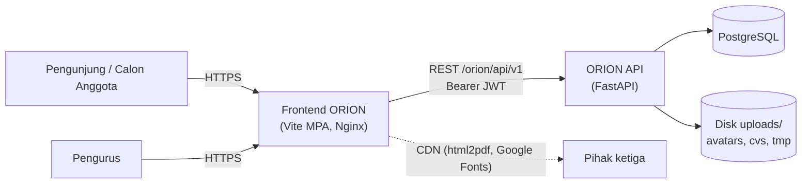

# SKPL — Spesifikasi Kebutuhan Perangkat Lunak ORION

| Atribut | Nilai |
|---|---|
| Sistem | ORION — *Organizational Resource & Integrated Operations Network*, KSM AIoT UPN "Veteran" Jakarta |
| Jenis dokumen | Software Requirements Specification (struktur IEEE 830 / ISO/IEC/IEEE 29148) + kontrak kebutuhan |
| Versi | 1.0 |
| Tanggal | 29 September 2026 |
| Penulis | Tim Pengembang ORION (disusun dengan bantuan asisten AI dari pembacaan kode) |
| Basis kode | `orion-backend` & `orion-frontend`, branch `security/owasp-2025-audit` |
| Status | Baseline — mencerminkan kode saat ini + usulan yang ditandai eksplisit |

Dokumen terkait: [BRD](BRD.md) · [PRD](PRD.md) · [FSD](FSD.md) · [WORKFLOW](WORKFLOW.md) · [ARCHITECTURE](ARCHITECTURE.md) · [API](API.md) · [openapi.yaml](openapi.yaml) · [SCHEMA](SCHEMA.md) · [README](../README.md) · [SECURITY_AUDIT](../SECURITY_AUDIT.md)

## Daftar Isi

1. [Pendahuluan](#1-pendahuluan)
2. [Deskripsi Umum](#2-deskripsi-umum)
3. [Kebutuhan Fungsional](#3-kebutuhan-fungsional)
4. [Kebutuhan Non-Fungsional](#4-kebutuhan-non-fungsional)
5. [Antarmuka Eksternal](#5-antarmuka-eksternal)
6. [Model Data dan Aturan Integritas](#6-model-data-dan-aturan-integritas)
7. [Kontrak API Ringkas](#7-kontrak-api-ringkas)
8. [Matriks Keterlacakan](#8-matriks-keterlacakan)
9. [Saran Pengembangan (Roadmap)](#9-saran-pengembangan-roadmap)
10. [Temuan Ketidakkonsistenan, Risiko, dan Keputusan](#10-temuan-ketidakkonsistenan-risiko-dan-keputusan)
11. [Daftar Diskusi dengan Pengurus](#11-daftar-diskusi-dengan-pengurus)
12. [Riwayat Revisi](#12-riwayat-revisi)

---

## 1. Pendahuluan

### 1.1 Tujuan

Dokumen ini menetapkan kebutuhan perangkat lunak ORION secara terukur dan dapat ditelusuri: apa yang **sudah** dibangun di backend, apa yang **baru ada** di prototipe HTML (MVP), dan apa yang **diusulkan**. Dokumen ini menjadi kontrak antara pengurus KSM AIoT (pemilik produk) dan tim pengembang, serta rujukan utama untuk dokumen turunan (FSD, API, SCHEMA).

### 1.2 Lingkup

ORION adalah portal operasional organisasi mahasiswa KSM AIoT yang terdiri atas:

- **Laman publik:** profil organisasi, statistik anggota, struktur kepengurusan, pendaftaran calon anggota.
- **Panel pengurus (CRM/ERP):** seleksi calon anggota, direktori anggota & alumni, akses login ERP, log audit, serta modul **Inventaris**, **Kas & Keuangan**, dan **Arsip & Persuratan**.

Tiga modul terakhir **saat ini hanya prototipe HTML** dengan data tiruan di browser; tidak ada tabel, route, atau persistensi di backend. Dokumen ini menurunkan kebutuhannya dari perilaku MVP dan menandai rancangan lanjutannya sebagai usulan.

Di luar lingkup: aplikasi seluler native, integrasi SIAKAD kampus, akuntansi pajak, dan penyimpanan dokumen pihak ketiga (kecuali disebut sebagai usulan).

### 1.3 Label status (wajib dibaca)

| Label | Arti | Bukti yang disyaratkan |
|---|---|---|
| **[ADA-BACKEND]** | Sudah terimplementasi dan dapat dipanggil di backend | Rujukan `path:baris` di `orion-backend` |
| **[MVP-HTML]** | Baru ada di prototipe HTML/JS; perilaku diturunkan dari kode frontend; data tidak persisten | Rujukan `path:baris` di `orion-frontend` |
| **[USULAN]** | Saran pengembangan, belum ada di kode | — |
| **[PERLU-DISKUSI]** | Membutuhkan keputusan pengurus sebelum dibangun (lihat [§11](#11-daftar-diskusi-dengan-pengurus)) | — |

Sebuah kebutuhan dapat berlabel ganda, mis. **[MVP-HTML] → [USULAN]** berarti tampilannya sudah ada di MVP tetapi logika server masih usulan.

### 1.4 Definisi dan singkatan

| Istilah | Definisi |
|---|---|
| KSM AIoT | Kelompok Studi Mahasiswa *Artificial Intelligence of Things*, FIK UPN "Veteran" Jakarta |
| Pengurus | Anggota dengan jabatan organisasi (Ketua, Wakil Ketua, Sekretaris, Bendahara, Kepala Divisi, Staff) |
| BPH | Badan Pengurus Harian (Ketua, Wakil, Sekretaris, Bendahara) |
| PSDM | Divisi Pengembangan Sumber Daya Manusia (pengelola rekrutmen & anggota) |
| Akses ERP | Akun login panel pengurus (`users`) yang terhubung ke data anggota (`members`) |
| NIM | Nomor Induk Mahasiswa (`student_id`), 10 digit |
| Member ID | Nomor anggota bisnis, format `AIOT-<TAHUN>-<NNN>` |
| Intake | Periode penerimaan calon anggota (status OPEN/CLOSED, deadline, kuota) |
| Staging upload | File unggahan sementara di `uploads/tmp/` sebelum formulir disimpan |
| Ledger arus kas | Buku besar perpindahan uang pada akun kas/bank/e-wallet |
| Ledger pemasukan-pengeluaran | Buku besar pemasukan dan pengeluaran per kategori/kegiatan |
| MDR | *Merchant Discount Rate*, biaya transaksi QRIS/payment gateway |
| RBAC | *Role-Based Access Control* |
| UU PDP | Undang-Undang No. 27 Tahun 2022 tentang Pelindungan Data Pribadi |
| MoSCoW | Prioritas Must / Should / Could / Won't (for now) |
| GWT | Format kriteria penerimaan Given–When–Then |

### 1.5 Referensi

- Kode sumber: `orion-backend/` (FastAPI) dan `orion-frontend/` (Vite MPA).
- [SECURITY_AUDIT.md](../SECURITY_AUDIT.md) — hasil audit OWASP Top 10:2025 (29 September 2026).
- IEEE Std 830-1998; ISO/IEC/IEEE 29148:2018.
- UU No. 27 Tahun 2022 (PDP).
- Panduan QRIS merchant GoPay: <https://gopay.co.id/bantuan-merchant/qris-merchant/cara-menampilkan-qris> (rujukan awal Opsi B keuangan).

### 1.6 Gambaran umum dokumen

§2 menjelaskan konteks produk dan pengguna; §3 merinci kebutuhan fungsional per modul; §4 kebutuhan kualitas; §5–§7 antarmuka, data, dan kontrak API ringkas; §8 matriks keterlacakan BR → US → FR → API → tabel → test; §9 roadmap; §10 ketidakkonsistenan MVP vs backend; §11 daftar keputusan untuk rapat pengurus.

---

## 2. Deskripsi Umum

### 2.1 Perspektif produk

ORION menggantikan pengelolaan manual (spreadsheet Google Form, catatan kas terpisah, penomoran surat manual) dengan satu sistem terpusat. Arsitektur saat ini: frontend statis (Nginx) memanggil REST API FastAPI yang menyimpan data di PostgreSQL dan file di disk lokal. Rincian: [ARCHITECTURE.md](ARCHITECTURE.md).

```mermaid
flowchart LR
    Publik["Pengunjung / Calon Anggota"] -->|HTTPS| FE["Frontend ORION<br/>(Vite MPA, Nginx)"]
    Pengurus["Pengurus"] -->|HTTPS| FE
    FE -->|"REST /orion/api/v1<br/>Bearer JWT"| API["ORION API<br/>(FastAPI)"]
    API --> DB[("PostgreSQL")]
    API --> FS[("Disk uploads/<br/>avatars, cvs, tmp")]
    FE -.->|"CDN (html2pdf, Google Fonts)"| CDN["Pihak ketiga"]
```

### 2.2 Fungsi produk (ringkas)

| Modul | Fungsi utama | Status dominan |
|---|---|---|
| AUTH | Login, refresh token, profil, ganti password, logout, RBAC | [ADA-BACKEND] |
| PUB | Statistik & struktur organisasi publik, status intake | [ADA-BACKEND] + [MVP-HTML] |
| REG | Pendaftaran calon anggota + unggah foto/CV | [ADA-BACKEND] |
| SEL | Kelola intake, review, approve/reject, hapus pendaftar | [ADA-BACKEND] |
| MEM | Direktori anggota & alumni, impor Excel, anonimisasi | [ADA-BACKEND] |
| ERP | Beri/cabut akses login, reset password anggota | [ADA-BACKEND] |
| FILE | Staging, promosi, penyajian, penghapusan file | [ADA-BACKEND] |
| LOG | Audit log dan penampil log | [ADA-BACKEND] |
| INV | Inventaris & peminjaman alat lab | [MVP-HTML] → [USULAN] |
| FIN | Kas, dua ledger, iuran, laporan keuangan | [MVP-HTML] → [USULAN]/[PERLU-DISKUSI] |
| ARC | Arsip surat masuk/keluar, penomoran, approval, template | [MVP-HTML] → [USULAN]/[PERLU-DISKUSI] |
| SYS | Health check, redirect URL lama, header keamanan, tema | [ADA-BACKEND] + [MVP-HTML] |

### 2.3 Karakteristik pengguna (per peran)

Peran diturunkan dari `models/enums.py` (`MemberRole`, `Division`) dan dependency RBAC di `orion-backend/utils/auth_deps.py:19-222`.

| Peran | Dasar teknis | Kemampuan saat ini | Karakteristik |
|---|---|---|---|
| Pengunjung / calon anggota | Tanpa login | Lihat laman publik, daftar, unggah foto/CV | Mahasiswa baru, akses via ponsel, sekali pakai |
| Superadmin | `users.is_superadmin=true` atau `role=SUPERADMIN` (`utils/auth_deps.py:35`) | Semua operasi, termasuk memberi SUPERADMIN | 1–2 orang (Ketua Umum/pengembang) |
| Ketua / Wakil Ketua | `members.role` (`utils/auth_deps.py:125,146`) | Kelola seleksi & anggota; kelola inventaris, keuangan, arsip (helper, modul belum ada) | Pengambil keputusan, pengesah surat |
| Sekretaris | `role=Sekretaris` (`utils/auth_deps.py:205`) | Baca area pengurus; calon pengelola arsip | Pencatat surat & notulensi |
| Bendahara | `role=Bendahara` (`utils/auth_deps.py:186`) | Baca area pengurus; calon pengelola keuangan | Pencatat kas & iuran |
| PSDM (divisi) | `division=PSDM` (`utils/auth_deps.py:125,146`) | Kelola intake, seleksi, anggota, akses ERP (bukan SUPERADMIN) | Staf rekrutmen |
| Akademik Riset (divisi) | `division=Akademik Riset` (`utils/auth_deps.py:166`) | Calon pengelola inventaris | Pengelola lab |
| Pengurus lain (Kepala Divisi, Staff, Humas) | Allow-list `PENGURUS_ROLES` (`utils/auth_deps.py:29`, dipakai `:107`) | Baca data pengurus (read-only) | Pengguna panel harian |
| Anggota biasa | `role=Anggota` | Ditolak di panel pengurus (403) | Tidak ada portal anggota [USULAN] |

### 2.4 Batasan

- **Teknologi:** Python ≥ 3.14, FastAPI 0.141, SQLAlchemy 2 (raw SQL `text()`), PostgreSQL (tipe ENUM & ARRAY), Alembic; frontend Vite 6 + Tailwind 3 tanpa framework. Rencana migrasi frontend ke React ([USULAN], lihat [ARCHITECTURE.md §10](ARCHITECTURE.md#10-rencana-migrasi-frontend-ke-react)).
- **Hosting:** container Docker tunggal per layanan; disk lokal untuk file; tidak ada job queue terpisah (hanya task asyncio pembersih staging, `orion-backend/main.py:29`).
- **Regulasi:** data pribadi mahasiswa (NIM, email, telepon, foto, CV) tunduk pada UU PDP — wajib persetujuan eksplisit, hak hapus, dan minimasi data publik.
- **Organisasi:** pengurus berganti tiap periode; sistem harus mudah diserahterimakan dan tidak bergantung pada satu orang.
- **Biaya:** anggaran organisasi mahasiswa terbatas; hindari layanan berbayar bulanan tanpa persetujuan.

### 2.5 Asumsi dan ketergantungan

| ID | Asumsi | Dampak bila salah |
|---|---|---|
| AS-01 | Satu organisasi (tidak multi-tenant) | Skema tanpa `tenant_id` perlu diubah |
| AS-02 | Mata uang tunggal Rupiah, nominal bulat (tanpa sen) | Kolom BIGINT rupiah perlu diganti NUMERIC |
| AS-03 | Zona waktu bisnis Asia/Jakarta (WIB); penyimpanan UTC | Laporan harian bergeser |
| AS-04 | Inventaris dilacak per **jenis barang dengan kuantitas** (sesuai MVP), bukan per unit fisik | Butuh tabel unit bila QR per unit diputuskan |
| AS-05 | Jenis surat A = Internal, B = Eksternal, SK = Surat Keputusan (sesuai MVP `pages/archive.html:129-131`) | Template & penomoran berubah |
| AS-06 | Format nomor surat kanonik mengikuti generator MVP `NNN/KSM-AIoT/FIK-UPNVJ/<JENIS>/<BULAN-ROMAWI>/<TAHUN>` (`src/modules/ui.js:182-188`) | Lihat keputusan D-06 |
| AS-07 | Deployment di balik satu reverse proxy (Cloudflare Tunnel/Nginx) → `TRUSTED_PROXY_HOPS=1` | Rate limit/IP audit salah |
| AS-08 | Pengurus menyetujui Opsi A (minimal) untuk keuangan sebagai fase awal | Roadmap fase 2 berubah |

Ketergantungan: PostgreSQL ≥ 14, PyPI (dependensi `uv.lock`), npm (dependensi `pnpm-lock.yaml`), CDN cdnjs & Google Fonts (frontend), serta calon penyedia pembayaran/notifikasi (usulan).

---

## 3. Kebutuhan Fungsional

Format tiap kebutuhan: **ID — Nama [LABEL] · Prioritas MoSCoW**, lalu aktor, pra-kondisi, alur utama (AU), alur alternatif (AA), pasca-kondisi, aturan bisnis (AB), kriteria penerimaan (GWT), bukti kode, dan test.
Path backend relatif terhadap `orion-backend/`; path frontend diawali `orion-frontend/`. Semua path API relatif terhadap basis `/orion/api/v1`.

### 3.1 Modul AUTH — Autentikasi, Sesi, dan RBAC

#### FR-AUTH-01 — Login pengurus [ADA-BACKEND] · Must
- **Aktor:** pengurus yang memiliki akun ERP aktif.
- **Pra-kondisi:** baris `users` dengan `is_active=true`.
- **AU:** (1) Pengguna mengirim NIM atau email + password ke `POST /auth/login`. (2) Sistem mencari user aktif berdasarkan `student_id` atau `email`, memverifikasi bcrypt. (3) Sistem menerbitkan access token (30 menit, `type=access`) dan refresh token (7 hari, `type=refresh`), mencatat `AUTH_LOGIN_SUCCESS`. (4) Respons memuat profil `UserOut`.
- **AA:** kredensial salah atau akun nonaktif → 401 dengan pesan seragam, audit `AUTH_LOGIN_FAILED`; > 5 percobaan/menit per IP → 429 + `Retry-After`.
- **Pasca-kondisi:** token tersimpan di klien (saat ini `localStorage`, lihat NFR-SEC-07).
- **AB:** role efektif = `SUPERADMIN` jika `is_superadmin`, selain itu `COALESCE(members.role, users.role)`; pesan error tidak membedakan "akun tidak ada" vs "password salah".
- **GWT:** *Given* akun aktif, *When* login dengan password benar, *Then* 200 berisi `access_token`, `refresh_token`, `user.role`. *Given* 5 login gagal dalam 60 detik dari IP sama, *When* percobaan ke-6, *Then* 429.
- **Bukti:** `routes/auth_routes.py:23-40`, `services/auth_service.py:59-138`, `utils/security.py:24-44`, `utils/rate_limiter.py:58`. **Test:** `tests/test_auth.py`, `tests/test_client_ip.py`.

#### FR-AUTH-02 — Perpanjangan sesi (refresh token) [ADA-BACKEND] · Must
- **Aktor:** frontend atas nama pengurus. **Pra-kondisi:** refresh token valid & user aktif.
- **AU:** `POST /auth/refresh` dengan `refresh_token` → sistem memverifikasi `type=refresh`, memuat ulang user dari DB, menerbitkan pasangan token baru (rotasi).
- **AA:** token kedaluwarsa/salah tipe/user nonaktif → 401; > 30 permintaan/menit → 429.
- **AB:** refresh token **tidak** diterima sebagai bearer token di endpoint lain.
- **GWT:** *Given* refresh token, *When* dipakai sebagai `Authorization: Bearer` ke `GET /auth/me`, *Then* 401.
- **Bukti:** `routes/auth_routes.py:43-57`, `services/auth_service.py:140-198`, `utils/security.py:46-79`. **Test:** `tests/test_token_security.py`.

#### FR-AUTH-03 — Lihat dan ubah profil sendiri [ADA-BACKEND] · Should
- **Aktor:** pengguna terautentikasi. **AU:** `GET /auth/me`; `PUT /auth/me` dengan `full_name`, `email`, `avatar` (opsional).
- **AA:** email tidak valid → 422; email dipakai akun lain → 409; avatar bukan path staging sah/URL http(s)/nilai lama → 400.
- **AB:** input teks di-HTML-escape; avatar baru dipromosikan dari `tmp/`, avatar lama dihapus bila tak dirujuk record lain (FR-FILE-01).
- **GWT:** *Given* email milik akun lain, *When* `PUT /auth/me`, *Then* 409 "Email sudah digunakan oleh akun lain."
- **Bukti:** `routes/auth_routes.py:60-76`, `services/auth_service.py:200-273`, `schemas/auth.py:29`. **Test:** `tests/test_auth.py`, `tests/test_password_policy.py`.

#### FR-AUTH-04 — Ganti password sendiri [ADA-BACKEND] · Must
- **AU:** `PUT /auth/me/password` dengan `current_password`, `new_password`; sistem verifikasi password lama, simpan hash bcrypt baru, audit `PASSWORD_CHANGED_SUCCESS`.
- **AA:** password lama salah → 400 + audit `PASSWORD_CHANGE_FAILED`; kebijakan tidak terpenuhi → 422.
- **AB:** kebijakan: minimal 8 karakter, maksimal 72 byte (batas bcrypt).
- **GWT:** *Given* password baru 100 karakter, *When* diganti, *Then* 422 (bukan 500).
- **Bukti:** `routes/auth_routes.py:78-89`, `services/auth_service.py:275`, `utils/security.py:82`. **Test:** `tests/test_password_policy.py`.

#### FR-AUTH-05 — Logout [ADA-BACKEND] · Must
- **AU:** `POST /auth/logout` mencatat `AUTH_LOGOUT`; frontend menghapus token lokal (`orion-frontend/src/modules/auth.js:256`).
- **AB/Keterbatasan:** JWT tidak dicabut di server — token tetap sah sampai kedaluwarsa (lihat FR-AUTH-08).
- **Bukti:** `routes/auth_routes.py:91-107`.

#### FR-AUTH-06 — Otorisasi berbasis peran (RBAC) [ADA-BACKEND] · Must
- **Deskripsi:** setiap endpoint pengurus memakai dependency: `require_pengurus` (allow-list peran pengurus), `can_manage_selection`, `can_manage_members` (Superadmin/Ketua/Wakil/PSDM), `require_roles("SUPERADMIN","ADMIN_BPH")`. Helper `can_manage_inventory`, `can_manage_finance`, `can_manage_archive` sudah ada tetapi **belum dipakai** karena modulnya belum ada.
- **AB:** fail-closed — peran tak dikenal ditolak 403; pengelola anggota tidak dapat memberi SUPERADMIN, mengubah akun superadmin, atau menaikkan hak dirinya sendiri (FR-ERP-01, FR-MEM-04).
- **GWT:** *Given* user ber-role `MEMBER`, *When* `GET /members`, *Then* 403.
- **Bukti:** `utils/auth_deps.py:29-222`. **Test:** `tests/test_security_access_control.py`, `tests/test_security_patterns.py`. Matriks lengkap: [FSD §3](FSD.md#3-matriks-rbac).

#### FR-AUTH-07 — Penjaga rute & pemantau sesi di frontend [MVP-HTML] · Must
- **Deskripsi:** halaman CRM memanggil `requireAuth()` (cek token, peran yang diizinkan, refresh otomatis) dan `initSessionWatcher()` (refresh proaktif sebelum kedaluwarsa, logout bila gagal).
- **Catatan:** kontrol UI saja; otorisasi sesungguhnya di backend (FR-AUTH-06).
- **Bukti:** `orion-frontend/src/modules/auth.js:111,168,269,325`, `orion-frontend/src/modules/crm-layout.js:11`.

#### FR-AUTH-08 — Pencabutan token saat logout/ganti password [USULAN] · Should
- **Deskripsi:** kolom `users.token_version` dimasukkan ke klaim JWT; logout, ganti/reset password, dan pencabutan akses menaikkan versi sehingga token lama ditolak.
- **GWT:** *Given* pengguna logout, *When* access token lamanya dipakai, *Then* 401.
- **Rancangan:** [SECURITY_AUDIT §4 A07-05](../SECURITY_AUDIT.md), [SCHEMA §4.1](SCHEMA.md#41-tambahan-pada-tabel-yang-sudah-ada).

#### FR-AUTH-09 — Sesi berbasis cookie HttpOnly [USULAN] · Could
- **Deskripsi:** refresh token di cookie `HttpOnly; Secure; SameSite=Strict`, access token di memori — dilakukan bersamaan dengan migrasi React (FR-SYS-05).

### 3.2 Modul PUB — Laman Publik

#### FR-PUB-01 — Statistik anggota publik [ADA-BACKEND] · Must
- **AU:** laman beranda memanggil `GET /members/stats` → `{total_members, active_members, alumni_count}` tanpa login.
- **AA:** API gagal → laman tetap tampil dengan angka default/animasi.
- **Bukti:** `routes/member_routes.py:86-94`, `services/member_service.py:150-167`, `orion-frontend/src/scripts/main.js` (`initLiveStats`). **Test:** `tests/test_public_members.py`.

#### FR-PUB-02 — Struktur kepengurusan publik [ADA-BACKEND] · Should
- **AU:** `GET /members/public` mengembalikan proyeksi aman (member_id, nama, prodi, divisi, jabatan, avatar) untuk anggota **Aktif** yang **bukan** berperan `Anggota`; frontend merender pohon organisasi.
- **AB:** tidak ada NIM, email, atau telepon di proyeksi publik (minimasi data UU PDP).
- **Bukti:** `routes/member_routes.py:97-104`, `services/member_service.py:169-184`, `schemas/member.py:119`.

#### FR-PUB-03 — Showcase proyek & alumni [MVP-HTML] · Could
- **Deskripsi:** kartu proyek dan alumni statis dari `orion-frontend/src/modules/data.js:94` (`initialProjectsData`) dan `:16` (`initialAlumniData`); halaman anggota menimpa data alumni dengan data backend bila tersedia (`orion-frontend/src/scripts/members.js:133-150`).

#### FR-PUB-04 — Informasi status intake publik [ADA-BACKEND] · Must
- **AU:** `GET /registrations/intake-status` → status, nama gelombang, deadline, kuota; formulir pendaftaran menonaktifkan diri bila `CLOSED` atau melewati deadline.
- **AB:** konfigurasi rusak dilaporkan sebagai `CLOSED`.
- **Bukti:** `routes/registration_routes.py:33-66`, `orion-frontend/src/scripts/registration.js:48-70`.

### 3.3 Modul REG — Pendaftaran Calon Anggota

#### FR-REG-01 — Kirim formulir pendaftaran [ADA-BACKEND] · Must
- **Aktor:** calon anggota (publik). **Pra-kondisi:** intake OPEN dan belum lewat deadline (FR-REG-02).
- **AU:** (1) Calon mengisi nama, NIM, prodi, angkatan, email, telepon, peminatan, motivasi, portofolio (opsional), foto & CV (opsional, FR-REG-03/04), dan mencentang persetujuan data. (2) `POST /registrations`. (3) Sistem menolak NIM ganda, mempromosikan file staging, menyimpan status `Pending`, `consent_timestamp`, dan audit `REGISTRATION_SUBMITTED`.
- **AA:** NIM sudah terdaftar → 400; motivasi > 150 kata → 422; portofolio berskema selain http(s) → 422; path file bukan staging sah → 400; kegagalan DB → file dikembalikan ke staging agar dapat dicoba ulang; > 10 kiriman/menit per IP → 429.
- **Pasca-kondisi:** baris `registrations` status `Pending`.
- **AB:** semua teks di-HTML-escape; `interest_track` dinormalisasi ke enum (`IoT Embedded`, `AI`, `Software Engineer & Cloud`) dengan pencocokan heuristik.
- **GWT:** *Given* intake OPEN, *When* data valid dikirim, *Then* 201 berstatus `Pending`. *Given* NIM yang sama dikirim ulang, *Then* 400.
- **Bukti:** `routes/registration_routes.py:114-156`, `services/registration_service.py:38-139`, `schemas/registration.py:11-60`. **Test:** `tests/test_registrations.py`, `tests/test_upload_lifecycle.py`, `tests/test_input_validation.py`.

#### FR-REG-02 — Penegakan status dan deadline intake [ADA-BACKEND] · Must
- **AB:** status `CLOSED` → 403; tanggal hari ini (WIB) > deadline → 403; konfigurasi tidak terbaca → 503 (fail-closed) dan dicatat di log.
- **Bukti:** `routes/registration_routes.py:30,120-156`. **Test:** `tests/test_intake_config.py`.

#### FR-REG-03 — Unggah foto profil calon [ADA-BACKEND] · Should
- **AU:** `POST /uploads/avatars` (multipart) → validasi MIME + *magic bytes* (JPEG/PNG/WebP), maks 2 MB, hapus EXIF, konversi WebP ≤ 1200 px, nama UUIDv4, simpan di `uploads/tmp/avatars/`; respons berisi `path` staging untuk dikirim bersama formulir.
- **AA:** format/ukuran salah → 400; > 10 unggahan/menit → 429.
- **Bukti:** `routes/upload_routes.py:15-40`, `services/storage_service.py:77-164`. **Test:** `tests/test_storage.py`.

#### FR-REG-04 — Unggah CV (PDF) [ADA-BACKEND] · Should
- **AU:** `POST /uploads/cvs` → validasi ekstensi/MIME + *magic bytes* `%PDF-`, maks 5 MB, simpan di `uploads/tmp/cvs/`.
- **Bukti:** `routes/upload_routes.py:131-153`, `services/storage_service.py:205-251`. **Test:** `tests/test_storage.py`.

#### FR-REG-05 — Validasi NIM dan angkatan [MVP-HTML] · Should
- **Deskripsi:** frontend mewajibkan NIM tepat 10 digit dan tahun angkatan (dari 2 digit awal NIM dan pilihan angkatan) dalam jendela 4 tahun terakhir.
- **Catatan:** backend **tidak** memvalidasi keduanya (Inkonsistensi IC-04).
- **Bukti:** `orion-frontend/src/scripts/registration.js:88-89,430-456`.

#### FR-REG-06 — Penegakan kuota intake [PERLU-DISKUSI] · Could
- **Deskripsi:** kuota disimpan dan ditampilkan tetapi tidak ditegakkan. Opsi: tolak saat jumlah pendaftar non-Rejected ≥ kuota, atau kuota hanya informatif. Lihat D-10.

### 3.4 Modul SEL — Seleksi Calon Anggota

#### FR-SEL-01 — Kelola konfigurasi intake [ADA-BACKEND] · Must
- **Aktor:** Superadmin, Ketua, Wakil Ketua, divisi PSDM.
- **AU:** `PUT /registrations/intake-status` dengan `status` (OPEN/CLOSED), `batch_name`, `deadline` (YYYY-MM-DD), `quota` (≥ 0) → disimpan di `system_settings` key `intake_config`.
- **AA:** nilai tidak valid → 422; peran lain → 403.
- **Bukti:** `routes/registration_routes.py:68-111`, `schemas/registration.py:69-85`, `orion-frontend/src/scripts/selection.js:123-160`. **Test:** `tests/test_intake_config.py`.

#### FR-SEL-02 — Daftar dan detail pendaftar [ADA-BACKEND] · Must
- **Aktor:** semua pengurus (read-only untuk non-PSDM).
- **AU:** `GET /registrations?status=pending|approved|accepted|rejected|all`; `GET /registrations/{identifier}` (UUID atau NIM). UI menampilkan tabel, filter status, pencarian, modal detail (foto, CV pratinjau, portofolio, motivasi).
- **Bukti:** `routes/registration_routes.py:159-182`, `services/registration_service.py:26-36,141-166`, `orion-frontend/src/scripts/selection.js:282,500-565`.

#### FR-SEL-03 — Setujui calon (approve) [ADA-BACKEND] · Must
- **Aktor:** Superadmin/Ketua/Wakil/PSDM.
- **AU:** `PATCH /registrations/{id}/approve` (body opsional `division`, `role`) → status `Accepted`, `review_note` otomatis "Disetujui oleh …", Member ID = nomor bebas berikutnya per tahun (`AIOT-<tahun>-<NNN>`), baris `members` dibuat (avatar = foto pendaftaran), audit `REGISTRATION_APPROVED`.
- **AA:** sudah Accepted dengan member_id → dikembalikan apa adanya (idempoten); NIM sudah menjadi anggota → Member ID lama dipakai ulang.
- **AB:** tahun = `intake_period` 4 digit / 2 digit / 2 digit awal NIM / tahun berjalan; nomor = maks nomor tahun itu + 1 (bukan COUNT).
- **GWT:** *Given* anggota AIOT-2031-001 dihapus dan AIOT-2031-002 ada, *When* calon angkatan 2031 disetujui, *Then* Member ID = AIOT-2031-003.
- **Bukti:** `routes/registration_routes.py:185-205`, `services/registration_service.py:168-265`, `services/member_id.py:7-31`. **Test:** `tests/test_member_id_generation.py`, `tests/test_upload_lifecycle.py`.

#### FR-SEL-04 — Tolak calon (reject) [ADA-BACKEND] · Must
- **AU:** `PATCH /registrations/{id}/reject` → status `Rejected`, `review_note` otomatis, audit `REGISTRATION_REJECTED`.
- **Bukti:** `routes/registration_routes.py:208-225`, `services/registration_service.py:267-313`.

#### FR-SEL-05 — Hapus data pendaftar (tunggal & massal) [ADA-BACKEND] · Must
- **AU:** `DELETE /registrations/{id}` atau `POST /registrations/bulk-delete` (`registration_ids`: UUID/NIM) → baris dihapus, lalu foto/CV dihapus **setelah commit** bila tidak dirujuk record lain (foto yang menjadi avatar anggota dipertahankan).
- **AB:** hak hapus data (UU PDP); audit `REGISTRATION_DELETED` / `REGISTRATIONS_BULK_DELETED`.
- **Bukti:** `routes/registration_routes.py:228-259`, `services/registration_service.py:315-400`, `services/storage_service.py:383-402`. **Test:** `tests/test_selection_bulk_delete.py`, `tests/test_upload_lifecycle.py`.

#### FR-SEL-06 — Simpan catatan reviewer [USULAN] · Should
- **Deskripsi:** UI mengirim `review_note` saat approve/reject (`orion-frontend/src/scripts/selection.js:670-674,711-714`), namun backend mengabaikannya dan menulis catatan otomatis (IC-06). Usulan: simpan catatan reviewer di `review_note` (atau kolom baru `reviewer_note`).

#### FR-SEL-07 — Hubungi calon via WhatsApp [MVP-HTML] · Could
- **Deskripsi:** tombol membuka tautan `wa.me` dari `contact_info` yang dinormalisasi ke kode 62.
- **Bukti:** `orion-frontend/src/scripts/selection.js:569-590`.

### 3.5 Modul MEM — Anggota dan Alumni

#### FR-MEM-01 — Daftar anggota dengan filter [ADA-BACKEND] · Must
- **AU:** `GET /members?division=&intake_period=&status=` (nilai `all`/`none` didukung untuk divisi) → daftar anggota + status akses ERP (`has_erp_access`, `user_role`, `user_is_active`).
- **Bukti:** `routes/member_routes.py:27-38`, `services/member_service.py:27-65`, `orion-frontend/src/scripts/members.js:83-130`. **Test:** `tests/test_public_members.py`.

#### FR-MEM-02 — Detail anggota [ADA-BACKEND] · Must
- **AU:** `GET /members/{identifier}` dengan UUID, Member ID, atau NIM.
- **Bukti:** `routes/member_routes.py:107-118`, `services/member_service.py:119-141`.

#### FR-MEM-03 — Tambah anggota manual [ADA-BACKEND] · Must
- **Aktor:** Superadmin/Ketua/Wakil/PSDM.
- **AU:** `POST /members` → Member ID otomatis (FR-SEL-03 AB) bila kosong; *upsert* berdasarkan NIM; avatar dari staging; opsional langsung membuat akun ERP (`create_erp_account`, `erp_password`, `erp_role`) melalui aturan FR-ERP-01.
- **AA:** hak tidak cukup untuk role ERP yang diminta → 403 sebelum data ditulis.
- **Bukti:** `routes/member_routes.py:71-83`, `services/member_service.py:186-342`. **Test:** `tests/test_member_erp_access.py`, `tests/test_security_access_control.py`.

#### FR-MEM-04 — Ubah data anggota [ADA-BACKEND] · Must
- **AU:** `PUT /members/{identifier}` (partial). Mengubah status ke `Alumni`/`Tidak Aktif` otomatis menonaktifkan login ERP; status `Alumni` membuat profil alumni kosong.
- **AB:** non-superadmin tidak boleh mengubah `role`, `division`, atau `status` **dirinya sendiri** (403); avatar diganti → file lama dilepas.
- **Bukti:** `routes/member_routes.py:121-136`, `services/member_service.py:344-468` (auto-nonaktif `:426-446`). **Test:** `tests/test_security_access_control.py`, `tests/test_upload_lifecycle.py`.

#### FR-MEM-05 — Anonimisasi anggota [ADA-BACKEND] · Must
- **AU:** `POST /members/{identifier}/anonymize` → nama `[DELETED USER]`, email acak `@anonymized.orion`, data kontak/opini dikosongkan, avatar dihapus, status `Tidak Aktif`, login dinonaktifkan; ID & relasi dipertahankan.
- **Bukti:** `routes/member_routes.py:139-153`, `services/member_service.py:643-701`.

#### FR-MEM-06 — Hapus anggota permanen [ADA-BACKEND] · Should
- **AU:** `DELETE /members/{identifier}` → hapus akun `users` terkait, baris `members`, dan avatar.
- **Bukti:** `routes/member_routes.py:156-170`, `services/member_service.py:703-733`.

#### FR-MEM-07 — Impor anggota dari Excel [ADA-BACKEND] · Should
- **AU:** `POST /members/imports?sheet_name=Database Anggota` (file `.xlsx`/`.xlsm` ≤ 5 MB) → parse kolom formulir Google (NIM, Nama Lengkap, Divisi, Jabatan, Program Studi, dst.), normalisasi enum, *upsert* anggota dan akun login.
- **AB:** sel di-HTML-escape; tautan non-http(s) dibuang; password awal akun baru dari `IMPORT_DEFAULT_PASSWORD` atau acak (harus di-reset admin); impor tidak pernah memberi superadmin; importer non-superadmin tidak dapat mengubah jabatan/divisi/status dirinya; XML diparse dengan `defusedxml`.
- **AA:** format salah → 400; > 5 MB → 413; sheet tidak ada → 400 dengan daftar sheet.
- **Bukti:** `routes/member_routes.py:173-199`, `utils/excel_importer.py:43-345`. **Test:** `tests/test_excel_import_security.py`.

#### FR-MEM-08 — Profil alumni [ADA-BACKEND] · Could
- **AU:** `GET/PUT /members/{identifier}/alumni-profile` (tahun lulus, perusahaan, jabatan, LinkedIn http(s), testimoni, `visibility`, `consent_given`); hanya untuk anggota berstatus Alumni (409 bila bukan).
- **Bukti:** `routes/member_routes.py:41-68`, `services/member_service.py:67-117`, `schemas/alumni_profile.py`.

#### FR-MEM-09 — Ekspor data anggota ke CSV [MVP-HTML] · Could
- **Deskripsi:** tombol ekspor membangun CSV di browser dari data yang dimuat.
- **Catatan:** nilai tidak di-escape terhadap tanda kutip maupun *formula injection* (`=`, `+`, `-`, `@`) — IC-11.
- **Bukti:** `orion-frontend/src/scripts/members.js:1234-1252`.

### 3.6 Modul ERP — Akses Login Pengurus

#### FR-ERP-01 — Beri/aktifkan akses ERP [ADA-BACKEND] · Must
- **AU:** `POST /members/{identifier}/access` (`password`, `role` ∈ {PENGURUS, SUPERADMIN}) → *upsert* `users` terhubung ke anggota, `is_active=true`, audit `ERP_ACCESS_GRANTED`.
- **AB:** hanya superadmin yang boleh memberi `SUPERADMIN` atau mengubah akun superadmin; tidak ada yang boleh mengubah akses ERP dirinya sendiri kecuali superadmin; kebijakan password FR-AUTH-04.
- **GWT:** *Given* staf PSDM, *When* memberi role SUPERADMIN, *Then* 403.
- **Bukti:** `routes/member_routes.py:202-219`, `services/member_service.py:470-558`. **Test:** `tests/test_security_access_control.py`.

#### FR-ERP-02 — Cabut akses ERP [ADA-BACKEND] · Must
- **AU:** `DELETE /members/{identifier}/access` → `users.is_active=false` (riwayat audit tetap utuh).
- **Bukti:** `routes/member_routes.py:222-233`, `services/member_service.py:560-597`.

#### FR-ERP-03 — Reset password akun anggota [ADA-BACKEND] · Must
- **AU:** `PUT /members/{identifier}/password` (`new_password`) → hash baru, akun diaktifkan, audit `ERP_PASSWORD_RESET`.
- **Bukti:** `routes/member_routes.py:236-252`, `services/member_service.py:599-641`.

### 3.7 Modul FILE — Pengelolaan Berkas

#### FR-FILE-01 — Staging dan promosi unggahan [ADA-BACKEND] · Must
- **Deskripsi:** unggahan disimpan di `tmp/<jenis>/<uuid>.<ext>`; saat formulir disimpan, server hanya menerima (a) path staging yang diterbitkannya, (b) nilai yang sudah melekat pada record, atau (c) URL http(s) untuk avatar. File dipindah atomik (`os.replace`) ke folder permanen; kegagalan DB mengembalikan file ke staging; file lama dilepas bila tak dirujuk `registrations`, `members`, atau `users`.
- **Bukti:** `services/storage_service.py:289-402`. **Test:** `tests/test_storage.py`, `tests/test_upload_lifecycle.py`.

#### FR-FILE-02 — Pembersihan staging otomatis [ADA-BACKEND] · Must
- **Deskripsi:** tugas latar setiap jam menghapus file staging berumur > `STAGED_UPLOAD_TTL_HOURS` (default 24). Skrip satu kali `scripts/cleanup_orphan_uploads.py` memindahkan file permanen yatim ke staging (mode *dry-run* default).
- **Bukti:** `main.py:29-41,53`, `services/storage_service.py:368-381`, `scripts/cleanup_orphan_uploads.py`.

#### FR-FILE-03 — Penyajian berkas [ADA-BACKEND] · Must
- **Deskripsi:** `GET /uploads/avatars/{f}` (cache publik 1 hari), `GET /uploads/cvs/{f}` (`private, no-store`, `noindex`), `GET /uploads/tmp/{avatars|cvs}/{f}` (pratinjau staging, `no-store`); nama file diverifikasi terhadap *path traversal*.
- **Bukti:** `routes/upload_routes.py:43-107,156-180`, `services/storage_service.py:166-180,253-265,289-295`.

#### FR-FILE-04 — Hapus berkas oleh admin [ADA-BACKEND] · Could
- **Deskripsi:** `DELETE /uploads/avatars/{f}` dan `/uploads/cvs/{f}` untuk `SUPERADMIN`/`ADMIN_BPH`.
- **Bukti:** `routes/upload_routes.py:109-129,182-201`.

### 3.8 Modul LOG — Audit Log

#### FR-LOG-01 — Pencatatan jejak audit [ADA-BACKEND] · Must
- **Deskripsi:** peristiwa login sukses/gagal, logout, perubahan profil/password, pendaftaran, approve/reject/hapus, CRUD anggota, akses ERP, anonimisasi dicatat dengan aktor, peran, IP (tervalidasi, FR-SYS-03), user-agent, detail JSON, status. Kegagalan tulis audit di-*rollback* agar tidak menggagalkan operasi utama.
- **Bukti:** `services/audit_log_service.py:24-103,184-205`, `utils/client_ip.py:17`. **Test:** `tests/test_audit_log_resilience.py`, `tests/test_security_patterns.py`.

#### FR-LOG-02 — Lihat audit log [ADA-BACKEND] · Must
- **AU:** `GET /audit-logs?limit=1..200&offset=` → `items` (dengan `resource_label` terbaca), `total`, `stats` (total/success/failed/admin_actions).
- **Bukti:** `routes/log_routes.py:11-28`, `services/audit_log_service.py:105-182`.

#### FR-LOG-03 — Filter, detail, dan ekspor log di UI [MVP-HTML] · Should
- **Deskripsi:** filter kategori aksi & status serta pencarian dilakukan **di browser** atas halaman yang dimuat; modal detail JSON, salin ke clipboard, ekspor JSON.
- **Bukti:** `orion-frontend/src/scripts/log.js:219-240,364-397`.

#### FR-LOG-04 — Filter log di server [USULAN] · Should
- **Deskripsi:** ekspos parameter `action`, `resource_type`, `actor_id`, `from`, `to` pada `GET /audit-logs` (service sudah mendukung tiga yang pertama: `services/audit_log_service.py:105-169`) — IC-07.

#### FR-LOG-05 — Log audit tidak dapat diubah [USULAN] · Should
- **Deskripsi:** trigger DB menolak UPDATE/DELETE pada `audit_logs` atau role DB aplikasi hanya INSERT/SELECT (IC-10). Rancangan: [SCHEMA §4.5](SCHEMA.md#45-audit-log-append-only).

### 3.9 Modul SYS — Sistem dan Platform

#### FR-SYS-01 — Health check [ADA-BACKEND] · Must
- **Deskripsi:** `GET /health` (status layanan & versi), `GET /health/db` (uji koneksi DB); dipakai `HEALTHCHECK` Docker.
- **Bukti:** `main.py:199-213`, `Dockerfile` (HEALTHCHECK).

#### FR-SYS-02 — Kompatibilitas URL lama [ADA-BACKEND] · Must
- **Deskripsi:** 13 URL API lama dijawab 301 (GET/HEAD) atau 308 (metode lain); URL halaman `/orion/pages/<nama>[.html]` di-301 ke `/orion/<nama>` (Nginx & server Vite).
- **Bukti:** `routes/legacy_routes.py:16-51`, `orion-frontend/nginx.conf`, `orion-frontend/vite.config.js`. **Test:** `tests/test_legacy_urls.py`.

#### FR-SYS-03 — Proteksi platform [ADA-BACKEND] · Must
- **Deskripsi:** header keamanan (CSP API, HSTS, X-Frame-Options, nosniff), CORS berbasis konfigurasi, penanganan error generik (tanpa *stack trace* bila `DEBUG=False`), penolakan start di produksi dengan secret JWT lemah, IP klien dari proxy tepercaya.
- **Bukti:** `main.py:84-176`, `config/config.py` (`validate_production_security`), `utils/client_ip.py:17-33`. **Test:** `tests/test_config_security.py`, `tests/test_client_ip.py`.

#### FR-SYS-04 — Tema terang/gelap/sistem [MVP-HTML] · Could
- **Bukti:** `orion-frontend/src/modules/ui.js:125-176`.

#### FR-SYS-05 — Migrasi frontend ke React [USULAN] · Should
- **Deskripsi:** mengganti MPA vanilla JS dengan SPA React + TypeScript, mempertahankan URL bersih dan kontrak API. Rencana: [ARCHITECTURE §10](ARCHITECTURE.md#10-rencana-migrasi-frontend-ke-react), [PRD §7](PRD.md#7-rilis-dan-roadmap).

### 3.10 Modul INV — Inventaris dan Peminjaman Alat Lab

**Kondisi saat ini:** halaman `orion-frontend/pages/inventory.html` + `src/scripts/inventory.js` menampilkan 8 jenis perangkat tiruan (`src/modules/data.js:69-78`) dengan kolom nama, kategori, total, tersedia, dipinjam, kondisi. Tombol **Pinjam/Kembalikan** hanya mengubah angka di memori browser (±1 unit), tanpa mencatat peminjam, tanggal, atau petugas. Backend belum memiliki tabel/route inventaris; hanya helper otorisasi `can_manage_inventory` (Superadmin, Ketua, Wakil, divisi Akademik Riset) di `utils/auth_deps.py:166`.

**Model yang diusulkan:** inventaris dilacak per **jenis barang dengan kuantitas** (AS-04). Status peminjaman:

| Status | Arti | Masuk dari |
|---|---|---|
| `DIAJUKAN` | Permintaan pinjam tercatat, stok **belum** dikurangi | pencatatan awal |
| `DIPINJAM` | Barang diserahkan; stok tersedia berkurang | `DIAJUKAN` (serah terima) atau pencatatan langsung oleh petugas |
| `DIKEMBALIKAN` | Barang kembali; stok tersedia/rusak disesuaikan menurut kondisi | `DIPINJAM` |
| `HILANG` | Dinyatakan hilang; stok total berkurang | `DIPINJAM` |
| `DIBATALKAN` | Pengajuan dibatalkan sebelum diserahkan | `DIAJUKAN` |
| *Terlambat* | **Turunan**, bukan status tersimpan: `DIPINJAM` dan `due_at < sekarang` | dihitung saat query |

Kondisi "rusak" dicatat pada pengembalian (`return_condition = RUSAK`) dan memindahkan unit ke stok rusak, sehingga tidak perlu status terpisah.

#### FR-INV-01 — Daftar inventaris dengan ringkasan stok [MVP-HTML] → [USULAN] · Must
- **Perilaku MVP:** tabel + kartu ringkasan total/tersedia/dipinjam, pencarian nama/kategori, filter kategori (`src/scripts/inventory.js:8-60`).
- **Usulan:** `GET /inventory/items` dengan paginasi, filter `q`, `category`, `location`, `condition`; ringkasan dari agregat DB.
- **GWT:** *Given* 3 barang dengan tersedia 3, 4, 11, *When* daftar dibuka, *Then* kartu "Tersedia" = 18.

#### FR-INV-02 — Simulasi pinjam/kembalikan satu unit [MVP-HTML] · —
- **Perilaku MVP:** pinjam menolak bila `available ≤ 0`; kembalikan menolak bila `borrowed ≤ 0` (`src/scripts/inventory.js:62-90`). Tidak persisten; digantikan FR-INV-04/05.

#### FR-INV-03 — CRUD aset inventaris [USULAN] · Must
- **Aktor:** pengelola inventaris (`can_manage_inventory`); pengurus lain baca saja.
- **Field:** kode aset (unik, mis. `INV-EAI-001`), nama, kategori, lokasi, stok total, kondisi umum (`PRIMA`/`BAIK`/`PERLU_SERVIS`), foto opsional (pola staging FR-FILE-01), catatan.
- **AB:** stok tersedia/dipinjam/rusak/hilang **dihitung sistem**, bukan diinput; mengurangi stok total tidak boleh membuat stok tersedia negatif; penghapusan = *soft delete* (`deleted_at`), ditolak bila masih ada pinjaman aktif.
- **GWT:** *Given* barang dengan 2 unit dipinjam, *When* dihapus, *Then* 409 "Masih ada peminjaman aktif".

#### FR-INV-04 — Catat peminjaman [USULAN] · Must
- **Aktor:** petugas inventaris (pencatat); peminjam = anggota terdaftar.
- **AU:** petugas memilih barang, peminjam, jumlah, tanggal pinjam, tenggat → status `DIPINJAM` langsung (serah terima di tempat) atau `DIAJUKAN` lalu `POST /inventory/loans/{id}/handover`. Sistem mencatat `recorded_by` (petugas) dan `handed_over_by`.
- **AB (stok & konkurensi):** pengurangan stok memakai *conditional update* atomik `UPDATE inventory_items SET available_qty = available_qty - :q, borrowed_qty = borrowed_qty + :q WHERE id = :id AND available_qty >= :q` dalam transaksi yang sama dengan insert pinjaman; 0 baris terpengaruh → 409 "Stok tidak mencukupi". Ditambah `CHECK (available_qty >= 0)`. Dua petugas yang meminjam unit terakhir bersamaan: tepat satu berhasil.
- **GWT:** *Given* stok tersedia 1, *When* dua permintaan pinjam 1 unit dikirim bersamaan, *Then* satu 201 dan satu 409, stok akhir 0.

#### FR-INV-05 — Catat pengembalian [USULAN] · Must
- **AU:** `POST /inventory/loans/{id}/return` dengan tanggal kembali, jumlah, kondisi (`BAIK`/`RUSAK`), catatan → status `DIKEMBALIKAN`; unit baik kembali ke tersedia, unit rusak ke stok rusak. `POST .../report-loss` → `HILANG`, stok total berkurang.
- **AB:** pengembalian parsial [PERLU-DISKUSI D-13] — versi minimal: pengembalian harus seluruh jumlah.

#### FR-INV-06 — Riwayat per barang dan per peminjam [USULAN] · Should
- **AU:** `GET /inventory/items/{id}/loans`, `GET /members/{identifier}/loans`.

#### FR-INV-07 — Laporan keterlambatan [USULAN] · Should
- **AU:** `GET /inventory/reports/overdue` → pinjaman `DIPINJAM` dengan `due_at` lewat, lama keterlambatan (hari, WIB), kontak peminjam (hanya untuk pengurus).

#### FR-INV-08 — Label QR/barcode per aset [PERLU-DISKUSI] · Could
- **Versi minimal:** QR berisi kode aset (per jenis) untuk mempercepat pencarian. **Versi penuh:** QR per unit fisik → butuh tabel `inventory_units` (mengubah AS-04). Lihat D-12.

#### FR-INV-09 — Pengingat jatuh tempo [PERLU-DISKUSI] · Could
- Bergantung pada kanal notifikasi (D-03); versi minimal: daftar keterlambatan di dasbor (FR-INV-07) tanpa notifikasi.

#### FR-INV-10 — Denda keterlambatan [PERLU-DISKUSI] · Won't (fase ini)
- Bila disetujui, denda menjadi tagihan keuangan (terhubung FR-FIN-08) — tidak dicatat terpisah agar tidak ada input ganda.

---

### 3.11 Modul FIN — Kas dan Keuangan

**Kondisi saat ini:** `orion-frontend/pages/finance.html` + `src/scripts/finance.js` menampilkan 5 transaksi tiruan (`src/modules/data.js:80-86`), kartu saldo aktif = Σ pemasukan − Σ pengeluaran, tabel dengan pencarian (keterangan/PIC/kategori), filter jenis (INCOME/EXPENSE) dan kategori, serta modal **Tambah Transaksi** (keterangan, jenis, nominal, kategori, PIC) yang hanya menambah ke memori browser. Tidak ada akun kas, iuran, atau laporan. Backend: hanya helper `can_manage_finance` (Superadmin, Ketua, Wakil, Bendahara) di `utils/auth_deps.py:186`.

#### 3.11.1 Dua buku besar (ledger) — definisi dan hubungan

| Aspek | a) Ledger arus kas | b) Ledger pemasukan-pengeluaran |
|---|---|---|
| Pertanyaan yang dijawab | "Di mana uangnya dan berapa saldonya?" | "Uang datang dari mana dan dipakai untuk apa?" |
| Dimensi | Akun penyimpanan: Kas Tunai, Rekening Bank, E-Wallet | Kategori/anggaran/kegiatan: Iuran, Hibah, Sponsor, Pengadaan Alat, Konsumsi, dll. |
| Isi entri | Uang masuk/keluar pada akun tertentu | Pendapatan atau beban pada kategori tertentu |
| Transfer kas → bank | **Tercatat** (keluar dari Kas, masuk ke Bank) | **Tidak tercatat** (bukan pemasukan/pengeluaran) |
| Pembelian alat Rp480.000 tunai | Kas −480.000 | Pengeluaran "Pengadaan Alat" +480.000 |
| Total yang harus cocok | Saldo akhir akun = saldo fisik/rekening (rekonsiliasi) | Σ pemasukan − Σ pengeluaran = perubahan kekayaan bersih |

**Hubungan (usulan, double-entry sederhana):** setiap transaksi (header, **immutable**) menghasilkan ≥ 2 baris entri yang total debitnya = total kreditnya. Akun dibagi dua kelompok: *akun kas* (ASSET: kas, bank, e-wallet) dan *akun nominal* (INCOME/EXPENSE per kategori). Ledger (a) = entri pada akun kas; ledger (b) = entri pada akun nominal. Dengan demikian **satu input menghasilkan kedua ledger** dan keduanya tidak bisa tidak sinkron.

| Contoh transaksi | Entri | Ledger (a) | Ledger (b) |
|---|---|---|---|
| Iuran Rp20.000 diterima via e-wallet | Debit E-Wallet 20.000 / Kredit Pendapatan Iuran 20.000 | E-Wallet +20.000 | Iuran +20.000 |
| Beli komponen Rp480.000 tunai | Debit Beban Pengadaan Alat 480.000 / Kredit Kas 480.000 | Kas −480.000 | Pengadaan Alat +480.000 |
| Setor kas ke bank Rp1.000.000 | Debit Bank / Kredit Kas | Kas −1jt, Bank +1jt | — |
| Koreksi salah input | Transaksi **pembalik** (entri kebalikan) + transaksi benar | Tercatat keduanya | Tercatat keduanya |

**Aturan integritas:** transaksi tidak pernah diedit/dihapus; koreksi hanya dengan transaksi pembalik yang merujuk transaksi asal (`reversal_of`, unik); nominal disimpan BIGINT rupiah (AS-02); keseimbangan debit=kredit dijamin trigger DB (rancangan: [SCHEMA §4.3](SCHEMA.md#43-kas-dan-keuangan)).

#### FR-FIN-01 — Ringkasan saldo, pemasukan, pengeluaran [MVP-HTML] → [USULAN] · Must
- **Perilaku MVP:** saldo = Σ pemasukan − Σ pengeluaran dari seluruh data, format `Rp` lokal id-ID (`src/scripts/finance.js:8-28`).
- **Usulan:** saldo per akun kas dari ledger (a), total pemasukan/pengeluaran per periode dari ledger (b), `GET /finance/summaries/monthly?year=`.

#### FR-FIN-02 — Daftar transaksi dengan filter [MVP-HTML] → [USULAN] · Must
- **Perilaku MVP:** pencarian keterangan/PIC/kategori, filter jenis & kategori (`src/scripts/finance.js:30-71`). **Catatan:** nilai filter kategori tidak cocok dengan data tiruan (IC-09).
- **Usulan:** `GET /finance/transactions?from=&to=&kind=&category_id=&account_id=&q=` dengan paginasi.

#### FR-FIN-03 — Catat transaksi manual [MVP-HTML] → [USULAN] · Must
- **Perilaku MVP:** form keterangan (wajib), jenis INCOME/EXPENSE, nominal (angka), kategori (5 pilihan), PIC (wajib); tanggal = hari ini; status "Selesai" (`src/scripts/finance.js:105-129`, `pages/finance.html:171-204`).
- **Usulan:** `POST /finance/transactions` dengan `date`, `description`, `kind` (INCOME/EXPENSE/TRANSFER), `amount` (> 0), `account_id` (akun kas), `category_id` (akun nominal; tidak untuk TRANSFER), `counter_account_id` (TRANSFER), `pic_member_id`, lampiran bukti opsional. Server menyusun entri double-entry otomatis dan nomor transaksi `FIN-<TAHUN>-<NNNNN>`.
- **AB:** hanya Bendahara/Ketua/Wakil/Superadmin; tanggal tidak boleh di masa depan; periode yang sudah ditutup (FR-FIN-07) tidak menerima transaksi baru bertanggal di dalamnya.
- **GWT:** *Given* akun Kas saldo 100.000, *When* pengeluaran 480.000 dicatat, *Then* ditolak 409 bila kebijakan "saldo tidak boleh negatif" diaktifkan [PERLU-DISKUSI D-11], atau diterima dengan peringatan.

#### FR-FIN-04 — Koreksi melalui transaksi pembalik [USULAN] · Must
- **AU:** `POST /finance/transactions/{id}/reversal` dengan alasan → transaksi baru berentri kebalikan; transaksi asal ditandai "dibalik". Tidak ada endpoint UPDATE/DELETE transaksi.

#### FR-FIN-05 — Ledger arus kas dan ledger pemasukan-pengeluaran [USULAN] · Must
- **AU:** `GET /finance/ledgers/cash?account_id=&from=&to=` (saldo awal, mutasi, saldo berjalan); `GET /finance/ledgers/income-expense?category_id=&activity=&from=&to=`.

#### FR-FIN-06 — Akun kas dan kategori [USULAN] · Must
- **Deskripsi:** CRUD akun kas (Kas Tunai, Bank, E-Wallet) dan kategori pemasukan/pengeluaran (awal: kategori MVP `pages/finance.html:194-198`); akun tidak dihapus bila sudah punya entri — dinonaktifkan.

#### FR-FIN-07 — Rekap dan tutup buku bulanan [USULAN] · Should
- **Deskripsi:** rekap per bulan (saldo awal/akhir per akun, total per kategori); Bendahara dapat menutup periode sehingga transaksi bertanggal dalam periode itu tidak dapat ditambah (koreksi lewat pembalik di periode berjalan).

#### FR-FIN-08 — Iuran anggota: periode dan status bayar [USULAN] · Must (Opsi A)
- **AU:** Bendahara membuat periode iuran (mis. `2026-10`, nominal) → sistem membuat tagihan untuk setiap anggota **Aktif** (`dues_invoices`, unik per periode+anggota). Daftar per periode menampilkan anggota **sudah/belum** bayar.
- **AB:** tagihan `UNPAID` → `PAID` (lunas) / `WAIVED` (dibebaskan, wajib alasan) / `CANCELLED`.

#### FR-FIN-09 — Pelunasan iuran otomatis menjadi transaksi [USULAN] · Must (Opsi A)
- **AU:** Bendahara menandai lunas (`POST /finance/dues-invoices/{id}/payments`: akun penerima, tanggal, bukti) → sistem **otomatis** membuat transaksi INCOME kategori "Iuran Kas Anggota" yang terhubung ke tagihan (`transaction_id` unik). Bendahara tidak mencatat ulang di buku kas (sumber data tunggal).
- **GWT:** *Given* tagihan UNPAID Rp20.000, *When* ditandai lunas via E-Wallet, *Then* status PAID dan ledger (a) E-Wallet +20.000, ledger (b) Iuran +20.000; menandai lunas kedua kalinya → 409.

#### FR-FIN-10 — Pembayaran QRIS dinamis/payment gateway [PERLU-DISKUSI] · Could (Opsi B)
- **Deskripsi:** untuk tiap tagihan, sistem meminta *charge* QRIS dinamis ke gateway (mis. Midtrans, Xendit, atau GoPay Merchant via penyedia) dengan `order_id` = ID tagihan; anggota memindai QR; gateway memanggil **webhook** `POST /webhooks/payments/{provider}`.
- **AB:**
  - Verifikasi *signature* sesuai spesifikasi penyedia (mis. SHA-512/HMAC atas `order_id`+status+nominal+server key) sebelum memproses; payload tak valid → 401, tidak mengubah data.
  - **Idempoten:** `webhook_events.event_id` unik; event yang sama diterima ulang → 200 tanpa efek ganda. Pelunasan membuat transaksi FR-FIN-09 tepat sekali.
  - **Status kedaluwarsa:** QR berlaku terbatas (mis. 15–60 menit, sesuai penyedia) → `EXPIRED`; anggota meminta QR baru.
  - **Rekonsiliasi harian:** bandingkan laporan settlement penyedia vs transaksi tercatat; selisih masuk antrean tinjauan Bendahara.
  - **Biaya:** MDR QRIS mengikuti ketentuan BI dan penyedia (asumsi: tarif usaha mikro rendah/0% untuk nominal kecil, ditambah biaya layanan gateway ±0,7% per transaksi — **wajib diverifikasi ke penyedia**); biaya dicatat sebagai entri beban "Biaya Transaksi" otomatis atau diserap nominal [PERLU-DISKUSI].
  - **Sandbox vs produksi:** kunci terpisah, `PAYMENT_ENV=sandbox|production`, webhook sandbox tidak boleh memengaruhi data produksi.
- **Catatan rujukan GoPay:** panduan GoPay yang dirujuk menampilkan **QRIS statis** merchant; QRIS statis tidak membawa ID tagihan sehingga **tidak** dapat direkonsiliasi otomatis per anggota — otomasi penuh membutuhkan QRIS dinamis via API.

#### FR-FIN-11 — Pengingat dan kirim ulang QR [PERLU-DISKUSI] · Could
- **Deskripsi:** job terjadwal mengirim pengingat ke anggota `UNPAID` (kanal email/WhatsApp — D-03) dengan tautan/QR baru.
- **AB:** jadwal (mis. H-3, H0, H+7 dari jatuh tempo), maksimal 3 pengingat per tagihan, jeda minimal 48 jam, *opt-out* per anggota, tidak dikirim 21.00–07.00 WIB, semua kiriman tercatat di `notification_outbox`.

#### FR-FIN-12 — Laporan keuangan otomatis (LPJ) [USULAN] · Should
- **Deskripsi:** `POST /reports` (`type=FINANCE_PERIOD`, periode, format `PDF`/`XLSX`) → job membuat laporan dari ledger (a)+(b), daftar iuran, dan blok pengesahan dari tabel pengurus (Ketua & Bendahara aktif). Hasil diunduh via `GET /reports/{id}/file`.
- **AB:** laporan adalah *snapshot* (menyimpan parameter & hash data sumber); laporan periode tertutup tidak berubah.

#### 3.11.2 Opsi cakupan keuangan [PERLU-DISKUSI]

| Aspek | **Opsi A — Minimal** (FR-FIN-03..09, 12) | **Opsi B — Penuh** (Opsi A + FR-FIN-10, 11) |
|---|---|---|
| Pengalaman Bendahara | Input transaksi & tandai lunas iuran; rekap/laporan otomatis | Iuran lunas otomatis dari webhook; Bendahara hanya meninjau selisih |
| Biaya uang | Rp0 | Biaya gateway per transaksi (±0,7% + MDR QRIS, estimasi); mungkin biaya pendaftaran merchant |
| Biaya pengembangan (relatif) | Sedang (≈ 3–4 minggu 1 developer) | Tinggi (+3–5 minggu: integrasi, webhook, rekonsiliasi, notifikasi) |
| Ketergantungan eksternal | Tidak ada | Akun merchant berbadan hukum/penanggung jawab, KYC, server publik HTTPS untuk webhook |
| Risiko | Salah input manual (dimitigasi pembalik & audit) | Kebocoran kunci API, webhook palsu, dana tertahan settlement, keharusan uji sandbox |
| Rekomendasi | **Bangun dulu (fase 2)** | Evaluasi setelah Opsi A berjalan 1 periode; lanjut bila tunggakan iuran signifikan |

### 3.12 Modul ARC — Arsip dan Persuratan

**Kondisi saat ini:** `orion-frontend/pages/archive.html` + `src/scripts/archive.js` memiliki dua tab:
1. **Buku arsip:** tabel 3 surat tiruan (`src/modules/data.js:88-92`) — nomor, sifat, perihal, tujuan, tanggal, penandatangan; pencarian; filter sifat A/B/SK; tombol "Lihat Kop" memuat surat ke generator.
2. **Generator kop surat:** input sifat (A — Internal, B — Eksternal, SK — Surat Keputusan), nomor urut manual (1–999), tanggal, lampiran, perihal, tujuan, isi paragraf; pratinjau langsung; "Simpan ke arsip" (memori browser, nomor urut +1); ekspor PDF (html2pdf, A4, margin 15/20 mm) dan ekspor LaTeX (`src/modules/ui.js:193-258`).

Tidak ada surat masuk, persistensi, penomoran server, approval, atau template di backend; hanya helper `can_manage_archive` (Superadmin, Ketua, Wakil, Sekretaris) di `utils/auth_deps.py:205`.

#### 3.12.1 Jenis surat dan format nomor

| Kode | Jenis (dari MVP) | Penggunaan | Judul surat |
|---|---|---|---|
| A | Internal | Undangan rapat, pemberitahuan ke pengurus/anggota | Opsional (default tanpa judul, format surat dinas) |
| B | Eksternal | Permohonan izin, undangan ke fakultas/mitra | Opsional (default tanpa judul) |
| SK | Surat Keputusan | Penetapan panitia/pengurus | **Wajib** judul "SURAT KEPUTUSAN" + "Nomor", bagian Menimbang/Mengingat/Memutuskan |

Format nomor di MVP **tidak konsisten** (IC-01, IC-02):

| Sumber | Pola | Contoh |
|---|---|---|
| Generator `src/modules/ui.js:182-188` | `NNN/KSM-AIoT/FIK-UPNVJ/<KODE>/<BULAN-ROMAWI>/<TAHUN>` | `001/KSM-AIoT/FIK-UPNVJ/B/III/2026` |
| Data tiruan `src/modules/data.js:89-91` | `<KODE>/NNN/UN61/KSM-AIOT/<BULAN-ROMAWI>/<TAHUN>` | `B/001/UN61/KSM-AIOT/I/2026` |
| Default LaTeX `src/modules/ui.js:195` | `NNN/KSM-AIoT/FIK-UPNVJ/U/<BULAN-ROMAWI>/<TAHUN>` | kode `U` tidak ada di pilihan |

Selain itu pemanggilan `computeOfficialLetterNumber(sifat, nomor, tanggal)` di `src/scripts/archive.js:113` menukar argumen fungsi `computeOfficialLetterNumber(seq, categoryCode, date)`, sehingga nomor yang tampil berbentuk `00B/KSM-AIoT/FIK-UPNVJ/1/...`. **Usulan kanonik (AS-06):** pola generator — `NNN/KSM-AIoT/FIK-UPNVJ/<KODE>/<BULAN-ROMAWI>/<TAHUN>`, urutan `NNN` **per tahun untuk semua jenis** (data tiruan B/001 → A/002 → SK/003 menunjukkan satu urutan bersama). Keputusan final: D-06.

#### FR-ARC-01 — Buku arsip: daftar, cari, filter [MVP-HTML] → [USULAN] · Must
- **Perilaku MVP:** `src/scripts/archive.js:8-45`. **Usulan:** `GET /letters/outgoing` dan `GET /letters/incoming` dengan filter jenis, status, rentang tanggal, klasifikasi, teks (nomor/perihal/tujuan/pengirim), paginasi.

#### FR-ARC-02 — Generator surat dengan pratinjau langsung [MVP-HTML] · Must
- **Perilaku MVP:** `src/scripts/archive.js:100-142`, tanggal diformat `Jakarta, <tanggal id-ID>`. Digantikan FR-ARC-07/09 (pratinjau dari server).

#### FR-ARC-03 — Ekspor PDF dan LaTeX [MVP-HTML] · Should
- **Perilaku MVP:** PDF via html2pdf (render kanvas → gambar JPEG di PDF; teks tidak dapat dipilih) `src/scripts/archive.js:167-197`; LaTeX `:200-216` tanpa *escaping* input (IC-12) dan **tanpa isi paragraf** dari form (template memakai paragraf baku).

#### FR-ARC-04 — Pencatatan surat masuk [USULAN] · Must
- **Aktor:** Sekretaris (pencatat); pengurus lain baca sesuai klasifikasi.
- **Field:** nomor surat pengirim, pengirim/instansi, perihal, tanggal surat, tanggal diterima, klasifikasi (BIASA/TERBATAS/RAHASIA), disposisi ke (anggota/pengurus), lampiran (PDF/gambar), catatan.
- **AB:** nomor agenda internal otomatis `SM-<TAHUN>-<NNNN>` (counter terpisah dari surat keluar); lampiran memakai pola staging.

#### FR-ARC-05 — Penomoran surat keluar anti-tabrakan [USULAN] · Must
- **Mekanisme:**
  1. Tabel `letter_number_counters(scope, year, last_number)` dengan PK `(scope, year)`; `scope = 'ALL'` (urutan bersama, AS-06) atau kode jenis bila D-06 memutuskan per jenis.
  2. Nomor **baru diberikan saat transisi ke `TERBIT`** (bukan saat draf), di dalam transaksi yang sama: `INSERT ... ON CONFLICT (scope, year) DO UPDATE SET last_number = letter_number_counters.last_number + 1 RETURNING last_number` — baris terkunci (*row lock*) sampai commit, sehingga dua penerbitan bersamaan mendapat nomor berbeda.
  3. `letters.number` UNIQUE sebagai jaring pengaman; `UNIQUE (number_year, number_seq)` bila urutan bersama.
  4. Tahun & bulan romawi diambil dari **tanggal surat** (WIB), bukan waktu server.
  5. Surat terbit yang dibatalkan **tidak** melepaskan nomornya: status `DIBATALKAN`, nomor tetap tercatat dan tampil "BATAL" di arsip (nomor tidak dipakai ulang).
  6. Opsi reservasi nomor untuk kebutuhan mendesak [PERLU-DISKUSI]: nomor dicadangkan dengan kedaluwarsa 24 jam; bila tidak dipakai → dicatat `DIBATALKAN (reservasi kedaluwarsa)`.
- **Uji konkurensi:** 50 permintaan terbit paralel pada tahun sama → 50 nomor unik berurutan tanpa celah dan tanpa duplikat (tes integrasi dengan `asyncio.gather`).
- **GWT:** *Given* last_number 7 tahun 2026, *When* dua surat diterbitkan bersamaan, *Then* keduanya mendapat 008 dan 009 (urutan bebas) dan tidak ada yang 008 ganda.

#### FR-ARC-06 — Alur persetujuan surat keluar [PERLU-DISKUSI] · Should
- **State machine (versi penuh):** `DRAF → DIAJUKAN → DITINJAU → {DISETUJUI | DITOLAK | REVISI}`; `REVISI → DIAJUKAN`; `DISETUJUI → TERBIT` (nomor diberikan, PDF final dibuat); `TERBIT → DIARSIPKAN`; `DRAF/DIAJUKAN/DITINJAU/REVISI/DISETUJUI → DIBATALKAN`; `TERBIT → DIBATALKAN` hanya oleh Ketua/Superadmin dengan alasan.
- **Hak transisi:**

| Transisi | Pelaku |
|---|---|
| buat/ubah DRAF, ajukan | Sekretaris atau pengurus pembuat |
| tinjau (DITINJAU → REVISI/DITOLAK/DISETUJUI) tahap 1 | Sekretaris (bila bukan pembuat) |
| setujui tahap akhir | Ketua (atau Wakil bila Ketua berhalangan) |
| TERBIT | Sekretaris setelah DISETUJUI (atau otomatis) |
| DIBATALKAN setelah TERBIT | Ketua / Superadmin |

- **AB:** pembuat tidak boleh menyetujui suratnya sendiri; setiap transisi dicatat (`letter_approvals` + audit log); setiap perubahan isi membuat versi baru (`letter_versions`); surat TERBIT bersifat *read-only*.
- **Versi minimal:** `DRAF → TERBIT` oleh Sekretaris/Ketua dengan satu klik (tanpa tinjauan), tetap dengan penomoran FR-ARC-05 dan audit. Lihat D-04.

#### FR-ARC-07 — Surat keluar persisten dari template [USULAN] · Must
- **AU:** pilih jenis → template aktif jenis itu → isi variabel (perihal, tujuan, lampiran, tanggal, body rich text, penandatangan dari tabel pengurus) → simpan draf → pratinjau PDF server (`GET /letters/outgoing/{id}/preview`) → ajukan/terbitkan.
- **AB:** opsi **dengan atau tanpa judul** (`with_title`, `title`); SK memaksa judul.

#### FR-ARC-08 — Template surat per jenis [USULAN] · Must
- **Skema variabel (JSON Schema per template):**

| Variabel | Tipe | Sumber | Wajib |
|---|---|---|---|
| `nomor` | string | sistem (FR-ARC-05), kosong saat draf → "(nomor terbit saat disahkan)" | otomatis |
| `tanggal` | date | input, default hari ini WIB | ya |
| `lampiran` | string ≤ 50 | input, default "-" | ya |
| `perihal` | string ≤ 200 | input | ya |
| `tujuan` | string ≤ 200 | input | ya |
| `tujuan_lokasi` | string | input, default "di Tempat" | tidak |
| `judul` | string | input bila `with_title` | kondisional |
| `isi` | rich text (HTML terbatas) | input | ya |
| `menimbang`/`mengingat`/`memutuskan` | list rich text | input, khusus SK | SK |
| `penandatangan[]` | referensi anggota | tabel pengurus aktif (nama, jabatan, NIM) | ya |
| `organisasi.*` | objek | konfigurasi (nama, alamat sekretariat, logo) | otomatis |

- **Sanitasi:** isi rich text disanitasi dengan *allow-list* tag (`p, br, strong, em, u, ol, ul, li, table, tr, td, th`) dan tanpa atribut event/style bebas; variabel lain di-*escape* otomatis oleh mesin template (Jinja2 autoescape). Template hanya dapat diunggah/diubah Sekretaris/Superadmin dan dijalankan di *sandboxed environment*.
- **Pratinjau wajib** sebelum ajukan/terbit.

#### FR-ARC-09 — Sumber data otomatis dari tabel pengurus dan keuangan [USULAN] · Should
- **Deskripsi:** blok tanda tangan diambil dari anggota aktif dengan jabatan terkait (Ketua, Sekretaris, Bendahara) pada tanggal surat; surat/laporan keuangan (mis. LPJ) memakai ringkasan FR-FIN-12. Menghindari pengetikan ulang nama dan NIM.

#### FR-ARC-10 — Lampiran, klasifikasi, retensi, hak akses [USULAN] · Should
- **AB:** klasifikasi BIASA (semua pengurus), TERBATAS (BPH + pihak disposisi), RAHASIA (Ketua, Sekretaris, Superadmin); retensi default 5 tahun untuk surat keluar & masuk (dapat diubah per jenis), setelahnya diusulkan untuk dimusnahkan dengan persetujuan Ketua (tercatat di audit).

#### FR-ARC-11 — Tanda tangan digital / QR verifikasi [PERLU-DISKUSI] · Could
- **Versi minimal:** QR pada PDF terbit berisi URL `GET /letter-verifications/{kode}` yang menampilkan nomor, perihal, tanggal, penandatangan, dan hash PDF (membuktikan keaslian, bukan tanda tangan elektronik tersertifikasi). **Versi penuh:** tanda tangan elektronik tersertifikasi (PSrE, mis. layanan BSrE/penyedia swasta) — biaya & proses KYC. Lihat D-05.

#### 3.12.2 Pendekatan template dan pembuatan dokumen [USULAN]

| Kriteria (bobot) | (a) DOCX + placeholder → PDF (python-docx/docxtemplater/Carbone + LibreOffice) | (b) LaTeX / Typst parametrik | (c) HTML/CSS → PDF (WeasyPrint/Playwright) | (d) Konversi otomatis PDF/DOCX → LaTeX (pandoc dll.) |
|---|---|---|---|---|
| Fidelity layout kop (25%) | Tinggi bila template dari Word; konversi LibreOffice kadang bergeser | Sangat tinggi | Tinggi (CSS paged media) | **Rendah** — tabel/kop/posisi hilang; PDF → LaTeX praktis tidak dapat diandalkan |
| Kemudahan pengurus mengedit (25%) | **Sangat mudah** (Word) | Sulit (LaTeX); sedang (Typst) | Sedang (HTML; bisa dibantu editor field) | — |
| Kompleksitas deployment (15%) | Berat: LibreOffice headless (~500 MB image) | LaTeX berat (TeX Live 1–4 GB); Typst ringan (1 biner) | WeasyPrint ringan (pustaka Python + Pango); Playwright berat (Chromium) | pandoc sedang |
| Keamanan injeksi (15%) | Risiko rendah (placeholder teks) | **Tinggi** pada LaTeX (`\input`, `\write18`) bila input tak di-escape; Typst lebih aman | Rendah dengan Jinja2 autoescape + sanitasi HTML | Sedang |
| Performa (10%) | Lambat (proses LibreOffice) | Sedang | Cepat (< 1 dtk/surat) | Sedang |
| Biaya (10%) | Gratis (open-source); Carbone cloud berbayar | Gratis | Gratis | Gratis |
| Kesesuaian stack & MVP | Tambahan runtime baru | MVP sudah punya ekspor LaTeX statis | **MVP sudah HTML (pratinjau & html2pdf)**; Jinja2 sudah dipakai backend (`templates/`) | — |

**Rekomendasi tunggal: (c) HTML/CSS → PDF dengan WeasyPrint di server**, template Jinja2 (autoescape, sandbox) per jenis surat.
Alasan: sejalan dengan pratinjau HTML MVP (kop, font Times New Roman, margin A4 bisa dipindah ke CSS `@page`), satu bahasa (Python) di backend, image Docker tetap kecil, aman dari injeksi LaTeX, hasil PDF berteks (dapat dicari, bukan gambar seperti html2pdf), dan pratinjau di browser identik dengan hasil cetak.
Kompromi kemudahan edit: pengurus mengedit **field dan teks** melalui formulir; perubahan desain kop dilakukan pengembang di satu file HTML/CSS per jenis (jarang berubah).

**Rencana migrasi:** (1) pindahkan kop & tata letak dari `pages/archive.html` (pratinjau) dan `generateLaTeXSource` ke `templates/letters/{A,B,SK}.html.j2` + `letters.css`; (2) implementasi `GET /letters/outgoing/{id}/preview`; (3) ganti html2pdf di frontend dengan unduhan PDF server; (4) pertahankan ekspor LaTeX sebagai fitur *legacy* hanya-baca sampai pengurus mengonfirmasi tidak dibutuhkan, lalu hapus; (5) template DOCX lama pengurus diimpor **manual** sekali (disalin ke HTML oleh pengembang), bukan konversi otomatis (d).

---

## 4. Kebutuhan Non-Fungsional

| ID | Kategori | Kebutuhan | Status | Bukti / catatan |
|---|---|---|---|---|
| NFR-SEC-01 | Autentikasi | JWT HS256/384/512, access token 30 menit (`type=access`), refresh 7 hari (`type=refresh`), klaim `exp` & `sub` wajib; algoritma `none` ditolak | [ADA-BACKEND] | `utils/security.py:24-79`, `config/config.py` (validator `JWT_ALGORITHM`) |
| NFR-SEC-02 | Kredensial | bcrypt cost 12; password baru 8 karakter–72 byte; secret JWT ≥ 32 karakter wajib di produksi | [ADA-BACKEND] | `utils/security.py:10,82`, `config/config.py` (`validate_production_security`) |
| NFR-SEC-03 | Otorisasi | RBAC di server, allow-list fail-closed, larangan eskalasi hak diri | [ADA-BACKEND] | `utils/auth_deps.py:29-222`, `services/member_service.py:470-491` |
| NFR-SEC-04 | Anti brute force | Rate limit per IP: login 5/menit, refresh 30/menit, pendaftaran & unggah 10/menit; IP dari proxy tepercaya (`TRUSTED_PROXY_HOPS`) | [ADA-BACKEND] | `utils/rate_limiter.py`, `utils/client_ip.py`. Catatan: penyimpanan di memori proses — tidak berlaku lintas worker/instance |
| NFR-SEC-05 | Audit | Aksi autentikasi & administratif dicatat; log tidak dapat diubah | [ADA-BACKEND] / [USULAN] (immutability) | `services/audit_log_service.py`; FR-LOG-05 |
| NFR-SEC-06 | Data pribadi (UU PDP) | Persetujuan eksplisit + timestamp; anonimisasi & hapus permanen; proyeksi publik tanpa NIM/kontak; EXIF foto dihapus; CV `no-store`; data unggahan tidak masuk image Docker | [ADA-BACKEND] | FR-REG-01, FR-MEM-05/06, FR-PUB-02, FR-FILE-03; `.dockerignore` |
| NFR-SEC-07 | Penyimpanan token klien | Saat ini `localStorage`; target cookie HttpOnly + token di memori | [MVP-HTML] → [USULAN] | `orion-frontend/src/modules/auth.js:80-94`; FR-AUTH-09 |
| NFR-SEC-08 | Validasi input | Pydantic, HTML-escape teks, *magic bytes* file, tautan hanya http(s), batas ukuran file (2/5 MB, impor 5 MB) | [ADA-BACKEND] | `utils/sanitizer.py`, `services/storage_service.py:32-60` |
| NFR-SEC-09 | Header & CORS | CSP/HSTS/XFO/nosniff di API; header dasar di Nginx frontend; CSP frontend | [ADA-BACKEND] / [USULAN] (CSP frontend) | `main.py:84-103`, `orion-frontend/nginx.conf` |
| NFR-SEC-10 | Rahasia | Semua secret dari environment; tidak ada kredensial di repo; rotasi berkala | [ADA-BACKEND] | `.env.example`; [SECURITY_AUDIT §7](../SECURITY_AUDIT.md) |
| NFR-PERF-01 | Performa | p95 < 500 ms untuk endpoint daftar pada ≤ 2.000 anggota/pendaftar; paginasi server untuk `/members` & `/registrations` | [USULAN] | Saat ini kedua endpoint mengembalikan seluruh baris |
| NFR-PERF-02 | Performa dokumen | Pembuatan PDF surat < 3 dtk; laporan keuangan < 30 dtk (async job) | [USULAN] | FR-ARC-07, FR-FIN-12 |
| NFR-AVL-01 | Ketersediaan | Target 99% per bulan; *health check* container; restart otomatis | [ADA-BACKEND] (health) / [USULAN] (target & monitoring) | `Dockerfile` HEALTHCHECK, `main.py:199-213` |
| NFR-INT-01 | Integritas data | UNIQUE (NIM anggota/pendaftar/user, email user, member_id), FK, tipe ENUM; transaksi DB dengan rollback | [ADA-BACKEND] | [SCHEMA §3](SCHEMA.md#3-skema-saat-ini-ada-backend) |
| NFR-INT-02 | Integritas keuangan & penomoran | Transaksi immutable + pembalik; debit = kredit; stok ≥ 0; nomor surat unik tanpa pemakaian ulang | [USULAN] | FR-FIN-04, FR-INV-04, FR-ARC-05 |
| NFR-BAK-01 | Backup | `pg_dump` harian + salinan `uploads/` (tanpa `tmp/`), retensi 30 hari harian + 12 bulanan, terenkripsi, disimpan di lokasi terpisah; uji pemulihan tiap pergantian kepengurusan | [USULAN] | [ARCHITECTURE §9](ARCHITECTURE.md#9-deployment-cicd-dan-backup) |
| NFR-USE-01 | Usability | Bahasa Indonesia, responsif ponsel, toast umpan balik, konfirmasi aksi destruktif | [MVP-HTML] | `orion-frontend/src/modules/ui.js:17` (`showToast`) |
| NFR-USE-02 | Aksesibilitas | Label form terhubung, kontras WCAG AA, navigasi keyboard | [USULAN] | Dikerjakan bersama migrasi React |
| NFR-MNT-01 | Maintainability | Test otomatis (pytest, 120 test lulus), lint ruff, lockfile dependensi | [ADA-BACKEND] | `tests/`, `pyproject.toml`, `uv.lock` |
| NFR-MNT-02 | CI/CD | Pipeline lint + test + build image pada setiap PR | [USULAN] | Belum ada konfigurasi CI di repo |
| NFR-OBS-01 | Observability | Log aplikasi terstruktur (JSON) dengan request-id; metrik dasar (latensi, error rate) | [USULAN] | Saat ini `logging` standar + log akses uvicorn |
| NFR-OBS-02 | Alerting | Notifikasi bila health check gagal atau error 5xx melonjak | [USULAN] | — |
| NFR-TZ-01 | Waktu | Simpan `timestamptz` (UTC); tampilkan & hitung tenggat dalam Asia/Jakarta; API memakai ISO 8601 | [ADA-BACKEND] (sebagian) | `routes/registration_routes.py:30`; pengecualian IC-14 |
| NFR-PORT-01 | Portabilitas | Berjalan di container Docker non-root; konfigurasi via env | [ADA-BACKEND] | `Dockerfile`, `entrypoint.sh` |

---

## 5. Antarmuka Eksternal

### 5.1 Antarmuka pengguna

| Halaman (URL bersih) | File MVP | Modul | Data |
|---|---|---|---|
| `/orion/` | `index.html`, `src/scripts/main.js` | PUB, AUTH (modal login) | API |
| `/orion/registration` | `pages/registration.html`, `src/scripts/registration.js` | REG | API |
| `/orion/selection` | `pages/selection.html`, `src/scripts/selection.js` | SEL | API |
| `/orion/members` | `pages/members.html`, `src/scripts/members.js` | MEM, ERP | API |
| `/orion/profile` | `pages/profile.html`, `src/scripts/profile.js` | AUTH | API |
| `/orion/log` | `pages/log.html`, `src/scripts/log.js` | LOG | API |
| `/orion/inventory` | `pages/inventory.html`, `src/scripts/inventory.js` | INV | **tiruan** |
| `/orion/finance` | `pages/finance.html`, `src/scripts/finance.js` | FIN | **tiruan** |
| `/orion/archive` | `pages/archive.html`, `src/scripts/archive.js` | ARC | **tiruan** |

Rincian layar, field, dan validasi: [FSD.md](FSD.md). Rencana komponen React: [ARCHITECTURE §10](ARCHITECTURE.md#10-rencana-migrasi-frontend-ke-react).

### 5.2 Antarmuka perangkat lunak (API)

REST JSON di `/orion/api/v1`, autentikasi Bearer JWT, dokumentasi interaktif `/orion/api/v1/docs`. Kontrak lengkap: [API.md](API.md) & [openapi.yaml](openapi.yaml).

### 5.3 Integrasi pihak ketiga

| Integrasi | Kegunaan | Status | Catatan |
|---|---|---|---|
| cdnjs (html2pdf.js 0.10.1) | Ekspor PDF surat di browser | [MVP-HTML] | Tanpa SRI (SECURITY_AUDIT A08-01); digantikan PDF server (FR-ARC-07) |
| Google Fonts | Tipografi | [MVP-HTML] | — |
| DiceBear (URL avatar) | Avatar default/generator di profil | [MVP-HTML] + [ADA-BACKEND] (URL http(s) diterima sebagai avatar) | `orion-frontend/src/scripts/profile.js:148-160` |
| WhatsApp (`wa.me`) | Kontak kandidat | [MVP-HTML] | Tautan saja, tanpa API |
| Cloudflare Tunnel | Publikasi API/dev | Asumsi (CORS regex `*.trycloudflare.com`) | `config/config.py` |
| Payment gateway QRIS (Midtrans/Xendit/GoPay via penyedia) | Iuran otomatis | [PERLU-DISKUSI] | FR-FIN-10, D-01 |
| Email transaksional (SMTP/Brevo/Mailgun) | Pengingat, notifikasi surat | [PERLU-DISKUSI] | D-03 |
| WhatsApp Business API / gateway | Pengingat iuran & jatuh tempo | [PERLU-DISKUSI] | D-03 (biaya per percakapan) |
| Object storage S3-compatible | File jangka panjang & backup | [PERLU-DISKUSI] | D-09; saat ini disk lokal `uploads/` |
| PSrE (tanda tangan elektronik tersertifikasi) | Pengesahan surat | [PERLU-DISKUSI] | D-05 |

---

## 6. Model Data dan Aturan Integritas

Rujukan lengkap: [SCHEMA.md](SCHEMA.md).

| Tabel | Status | Kunci & integritas utama |
|---|---|---|
| `users` | [ADA-BACKEND] | PK UUIDv7; UNIQUE `student_id`, `email`; FK `member_id → members(id)` ON DELETE SET NULL; `role` teks bebas (ERP) |
| `members` | [ADA-BACKEND] | UNIQUE `member_id` (AIOT-YYYY-NNN), `student_id`; ENUM prodi/divisi/role/status; ARRAY `interest_track` |
| `registrations` | [ADA-BACKEND] | UNIQUE `student_id`; ENUM status; `member_id` = kode bisnis (bukan FK); `consent_given`, `consent_timestamp` |
| `alumni_profiles` | [ADA-BACKEND] | UNIQUE FK `member_id` ON DELETE CASCADE |
| `audit_logs` | [ADA-BACKEND] | Indeks `timestamp`, `action`, `actor_id`, `resource_type`, `resource_id`; belum append-only |
| `system_settings` | [ADA-BACKEND] | UNIQUE `key`; nilai JSON teks (`intake_config`) |
| `inventory_items`, `inventory_loans` | [USULAN] | CHECK stok ≥ 0 & konsistensi jumlah; FK peminjam → `members` |
| `fin_accounts`, `fin_transactions`, `fin_entries`, `fin_periods` | [USULAN] | Immutable; debit = kredit per transaksi (constraint trigger); `reversal_of` UNIQUE |
| `dues_periods`, `dues_invoices` | [USULAN] | UNIQUE (periode, anggota); `transaction_id` UNIQUE |
| `payment_intents`, `webhook_events`, `notification_outbox` | [PERLU-DISKUSI] | UNIQUE `provider_ref`, `event_id` (idempotensi) |
| `letter_types`, `letter_number_counters`, `letters`, `letter_versions`, `letter_approvals`, `letter_attachments`, `letter_templates` | [USULAN] | PK counter `(scope, year)`; UNIQUE `letters.number`; nomor tidak dipakai ulang |
| `reports` | [USULAN] | Parameter & hash snapshot |

---

## 7. Kontrak API Ringkas

Rincian request/response, error, dan contoh: [API.md](API.md). Ringkasan per modul (basis `/orion/api/v1`):

| Modul | Endpoint | Status |
|---|---|---|
| AUTH | `POST /auth/login`, `POST /auth/refresh`, `GET/PUT /auth/me`, `PUT /auth/me/password`, `POST /auth/logout` | [ADA-BACKEND] |
| PUB | `GET /members/stats`, `GET /members/public`, `GET /registrations/intake-status` | [ADA-BACKEND] |
| REG/SEL | `POST/GET /registrations`, `GET/DELETE /registrations/{identifier}`, `PATCH /registrations/{identifier}/approve`, `PATCH /registrations/{identifier}/reject`, `POST /registrations/bulk-delete`, `PUT /registrations/intake-status` | [ADA-BACKEND] |
| MEM/ERP | `GET/POST /members`, `GET/PUT/DELETE /members/{identifier}`, `POST /members/{identifier}/anonymize`, `GET/PUT /members/{identifier}/alumni-profile`, `POST /members/imports`, `POST/DELETE /members/{identifier}/access`, `PUT /members/{identifier}/password` | [ADA-BACKEND] |
| FILE | `POST /uploads/avatars`, `POST /uploads/cvs`, `GET/DELETE /uploads/avatars/{filename}`, `GET/DELETE /uploads/cvs/{filename}`, `GET /uploads/tmp/avatars/{filename}`, `GET /uploads/tmp/cvs/{filename}` | [ADA-BACKEND] |
| LOG | `GET /audit-logs` (+ filter server) | [ADA-BACKEND] (+ [USULAN]) |
| SYS | `GET /health`, `GET /health/db`, 13 redirect URL lama | [ADA-BACKEND] |
| INV | `/inventory/items`, `/inventory/items/{item_id}`, `/inventory/items/{item_id}/loans`, `/inventory/loans`, `/inventory/loans/{loan_id}/{handover,return,cancel,report-loss}`, `/members/{identifier}/loans`, `/inventory/reports/overdue` | [USULAN] |
| FIN | `/finance/accounts`, `/finance/categories`, `/finance/transactions`, `/finance/transactions/{transaction_id}/reversal`, `/finance/ledgers/cash`, `/finance/ledgers/income-expense`, `/finance/summaries/monthly`, `/finance/periods/{period}/close`, `/finance/dues-periods`, `/finance/dues-periods/{period_id}/invoices`, `/finance/dues-invoices/{invoice_id}/payments`, `/reports` | [USULAN] |
| FIN (Opsi B) | `/finance/dues-invoices/{invoice_id}/qris`, `/finance/dues-invoices/{invoice_id}/reminders`, `/webhooks/payments/{provider}` | [PERLU-DISKUSI] |
| ARC | `/letters/incoming`, `/letters/outgoing`, `/letters/outgoing/{letter_id}/{submit,review,approve,reject,request-revision,publish,cancel,archive}`, `/letters/outgoing/{letter_id}/preview`, `/letters/outgoing/{letter_id}/versions`, `/letters/{incoming|outgoing}/{letter_id}/attachments`, `/letter-templates` | [USULAN] |
| ARC (verifikasi) | `GET /letter-verifications/{verification_code}` | [PERLU-DISKUSI] |

---

## 8. Matriks Keterlacakan

Rantai: **BR** ([BRD](BRD.md#6-kebutuhan-bisnis)) → **US** ([PRD](PRD.md#4-user-story)) → **FR** (dokumen ini) → **API** ([API.md](API.md)) → **Tabel** ([SCHEMA.md](SCHEMA.md)) → **Test / Bukti**.

| FR | Status | BR | US | API | Tabel | Test / bukti |
|---|---|---|---|---|---|---|
| FR-AUTH-01 | ADA-BACKEND | BR-03 | US-01 | `POST /auth/login` | users, members, audit_logs | tests/test_auth.py, tests/test_client_ip.py |
| FR-AUTH-02 | ADA-BACKEND | BR-03 | US-01 | `POST /auth/refresh` | users | tests/test_token_security.py |
| FR-AUTH-03 | ADA-BACKEND | BR-03 | US-01 | `GET/PUT /auth/me` | users | tests/test_auth.py, tests/test_password_policy.py |
| FR-AUTH-04 | ADA-BACKEND | BR-03 | US-01 | `PUT /auth/me/password` | users, audit_logs | tests/test_password_policy.py |
| FR-AUTH-05 | ADA-BACKEND | BR-03, BR-05 | US-01 | `POST /auth/logout` | audit_logs | routes/auth_routes.py:91 |
| FR-AUTH-06 | ADA-BACKEND | BR-03 | US-02 | (semua endpoint pengurus) | users, members | tests/test_security_access_control.py |
| FR-AUTH-07 | MVP-HTML | BR-03 | US-01 | `POST /auth/refresh` | — | orion-frontend/src/modules/auth.js:269 |
| FR-AUTH-08 | USULAN | BR-03 | US-01 | (klaim JWT) | users.token_version | — |
| FR-AUTH-09 | USULAN | BR-03 | US-01 | `POST /auth/refresh` (cookie) | — | — |
| FR-PUB-01 | ADA-BACKEND | BR-02 | US-03 | `GET /members/stats` | members | tests/test_public_members.py |
| FR-PUB-02 | ADA-BACKEND | BR-02, BR-04 | US-03 | `GET /members/public` | members | routes/member_routes.py:97 |
| FR-PUB-03 | MVP-HTML | BR-02 | US-03 | — | — | orion-frontend/src/modules/data.js:94 |
| FR-PUB-04 | ADA-BACKEND | BR-01 | US-04 | `GET /registrations/intake-status` | system_settings | tests/test_intake_config.py |
| FR-REG-01 | ADA-BACKEND | BR-01, BR-04 | US-04 | `POST /registrations` | registrations | tests/test_registrations.py, tests/test_upload_lifecycle.py |
| FR-REG-02 | ADA-BACKEND | BR-01 | US-04 | `POST /registrations` | system_settings | tests/test_intake_config.py |
| FR-REG-03 | ADA-BACKEND | BR-01, BR-04 | US-04 | `POST /uploads/avatars` | (file) | tests/test_storage.py |
| FR-REG-04 | ADA-BACKEND | BR-01 | US-04 | `POST /uploads/cvs` | (file) | tests/test_storage.py |
| FR-REG-05 | MVP-HTML | BR-01 | US-04 | — | — | orion-frontend/src/scripts/registration.js:430 |
| FR-REG-06 | PERLU-DISKUSI | BR-01 | US-04 | `POST /registrations` | registrations, system_settings | — |
| FR-SEL-01 | ADA-BACKEND | BR-01 | US-05 | `PUT /registrations/intake-status` | system_settings | tests/test_intake_config.py |
| FR-SEL-02 | ADA-BACKEND | BR-01 | US-05 | `GET /registrations`, `GET /registrations/{identifier}` | registrations | tests/test_registrations.py |
| FR-SEL-03 | ADA-BACKEND | BR-01, BR-02 | US-05 | `PATCH /registrations/{identifier}/approve` | registrations, members | tests/test_member_id_generation.py |
| FR-SEL-04 | ADA-BACKEND | BR-01 | US-05 | `PATCH /registrations/{identifier}/reject` | registrations | services/registration_service.py:267 |
| FR-SEL-05 | ADA-BACKEND | BR-04 | US-07 | `DELETE /registrations/{identifier}`, `POST /registrations/bulk-delete` | registrations | tests/test_selection_bulk_delete.py |
| FR-SEL-06 | USULAN | BR-01, BR-05 | US-05 | `PATCH .../approve`, `PATCH .../reject` | registrations | — |
| FR-SEL-07 | MVP-HTML | BR-01 | US-05 | — | — | orion-frontend/src/scripts/selection.js:570 |
| FR-MEM-01 | ADA-BACKEND | BR-02 | US-06 | `GET /members` | members, users | tests/test_public_members.py |
| FR-MEM-02 | ADA-BACKEND | BR-02 | US-06 | `GET /members/{identifier}` | members | routes/member_routes.py:107 |
| FR-MEM-03 | ADA-BACKEND | BR-02 | US-06 | `POST /members` | members, users | tests/test_member_erp_access.py |
| FR-MEM-04 | ADA-BACKEND | BR-02, BR-03 | US-06 | `PUT /members/{identifier}` | members, users, alumni_profiles | tests/test_security_access_control.py |
| FR-MEM-05 | ADA-BACKEND | BR-04 | US-07 | `POST /members/{identifier}/anonymize` | members, users | services/member_service.py:643 |
| FR-MEM-06 | ADA-BACKEND | BR-04 | US-07 | `DELETE /members/{identifier}` | members, users | services/member_service.py:703 |
| FR-MEM-07 | ADA-BACKEND | BR-02 | US-06 | `POST /members/imports` | members, users | tests/test_excel_import_security.py |
| FR-MEM-08 | ADA-BACKEND | BR-02 | US-08 | `GET/PUT /members/{identifier}/alumni-profile` | alumni_profiles | services/member_service.py:78 |
| FR-MEM-09 | MVP-HTML | BR-02 | US-06 | — | — | orion-frontend/src/scripts/members.js:1234 |
| FR-ERP-01 | ADA-BACKEND | BR-03 | US-02 | `POST /members/{identifier}/access` | users | tests/test_security_access_control.py |
| FR-ERP-02 | ADA-BACKEND | BR-03 | US-02 | `DELETE /members/{identifier}/access` | users | tests/test_member_erp_access.py |
| FR-ERP-03 | ADA-BACKEND | BR-03 | US-02 | `PUT /members/{identifier}/password` | users | tests/test_security_access_control.py |
| FR-FILE-01 | ADA-BACKEND | BR-04 | US-10 | (dipakai REG/MEM/AUTH) | registrations, members, users | tests/test_upload_lifecycle.py |
| FR-FILE-02 | ADA-BACKEND | BR-04, BR-10 | US-10 | — | — | tests/test_storage.py |
| FR-FILE-03 | ADA-BACKEND | BR-04 | US-10 | `GET /uploads/...` | — | tests/test_storage.py |
| FR-FILE-04 | ADA-BACKEND | BR-04 | US-07 | `DELETE /uploads/avatars/{filename}`, `DELETE /uploads/cvs/{filename}` | — | routes/upload_routes.py:109 |
| FR-LOG-01 | ADA-BACKEND | BR-05 | US-09 | — | audit_logs | tests/test_audit_log_resilience.py |
| FR-LOG-02 | ADA-BACKEND | BR-05 | US-09 | `GET /audit-logs` | audit_logs | routes/log_routes.py:11 |
| FR-LOG-03 | MVP-HTML | BR-05 | US-09 | `GET /audit-logs` | — | orion-frontend/src/scripts/log.js:219 |
| FR-LOG-04 | USULAN | BR-05 | US-09 | `GET /audit-logs` (query) | audit_logs | — |
| FR-LOG-05 | USULAN | BR-05 | US-09 | — | audit_logs (trigger) | — |
| FR-SYS-01 | ADA-BACKEND | BR-10 | US-21 | `GET /health`, `GET /health/db` | — | main.py:199 |
| FR-SYS-02 | ADA-BACKEND | BR-10 | US-21 | 13 URL lama | — | tests/test_legacy_urls.py |
| FR-SYS-03 | ADA-BACKEND | BR-03, BR-04 | US-21 | (semua) | — | tests/test_config_security.py |
| FR-SYS-04 | MVP-HTML | BR-10 | US-22 | — | — | orion-frontend/src/modules/ui.js:125 |
| FR-SYS-05 | USULAN | BR-10 | US-22 | (semua) | — | — |
| FR-INV-01 | MVP-HTML→USULAN | BR-06 | US-11 | `GET /inventory/items` | inventory_items | orion-frontend/src/scripts/inventory.js:8 |
| FR-INV-02 | MVP-HTML | BR-06 | US-12 | — | — | orion-frontend/src/scripts/inventory.js:62 |
| FR-INV-03 | USULAN | BR-06 | US-11 | `POST/PATCH/DELETE /inventory/items...` | inventory_items | — |
| FR-INV-04 | USULAN | BR-06 | US-12 | `POST /inventory/loans`, `POST .../handover` | inventory_loans, inventory_items | — |
| FR-INV-05 | USULAN | BR-06 | US-12 | `POST .../return`, `POST .../report-loss` | inventory_loans, inventory_items | — |
| FR-INV-06 | USULAN | BR-06 | US-12 | `GET /inventory/items/{item_id}/loans`, `GET /members/{identifier}/loans` | inventory_loans | — |
| FR-INV-07 | USULAN | BR-06 | US-13 | `GET /inventory/reports/overdue` | inventory_loans | — |
| FR-INV-08 | PERLU-DISKUSI | BR-06 | US-11 | `GET /inventory/items/{item_id}/label` | inventory_items (inventory_units) | — |
| FR-INV-09 | PERLU-DISKUSI | BR-06 | US-12 | (job) | notification_outbox | — |
| FR-INV-10 | PERLU-DISKUSI | BR-06, BR-07 | US-12 | — | dues_invoices | — |
| FR-FIN-01 | MVP-HTML→USULAN | BR-07 | US-14 | `GET /finance/summaries/monthly` | fin_entries | orion-frontend/src/scripts/finance.js:8 |
| FR-FIN-02 | MVP-HTML→USULAN | BR-07 | US-14 | `GET /finance/transactions` | fin_transactions | orion-frontend/src/scripts/finance.js:30 |
| FR-FIN-03 | MVP-HTML→USULAN | BR-07 | US-14 | `POST /finance/transactions` | fin_transactions, fin_entries | orion-frontend/src/scripts/finance.js:105 |
| FR-FIN-04 | USULAN | BR-07 | US-14 | `POST /finance/transactions/{transaction_id}/reversal` | fin_transactions | — |
| FR-FIN-05 | USULAN | BR-07 | US-14 | `GET /finance/ledgers/cash`, `GET /finance/ledgers/income-expense` | fin_entries, fin_accounts | — |
| FR-FIN-06 | USULAN | BR-07 | US-14 | `/finance/accounts`, `/finance/categories` | fin_accounts | — |
| FR-FIN-07 | USULAN | BR-07 | US-15 | `GET /finance/summaries/monthly`, `POST /finance/periods/{period}/close` | fin_periods | — |
| FR-FIN-08 | USULAN | BR-08 | US-16 | `/finance/dues-periods`, `/finance/dues-periods/{period_id}/invoices` | dues_periods, dues_invoices | — |
| FR-FIN-09 | USULAN | BR-07, BR-08 | US-16 | `POST /finance/dues-invoices/{invoice_id}/payments` | dues_invoices, fin_transactions | — |
| FR-FIN-10 | PERLU-DISKUSI | BR-08 | US-17 | `POST .../qris`, `POST /webhooks/payments/{provider}` | payment_intents, webhook_events | — |
| FR-FIN-11 | PERLU-DISKUSI | BR-08 | US-17 | `POST .../reminders` | notification_outbox | — |
| FR-FIN-12 | USULAN | BR-07 | US-15 | `POST /reports`, `GET /reports/{report_id}/file` | reports | — |
| FR-ARC-01 | MVP-HTML→USULAN | BR-09 | US-19 | `GET /letters/outgoing`, `GET /letters/incoming` | letters | orion-frontend/src/scripts/archive.js:8 |
| FR-ARC-02 | MVP-HTML | BR-09 | US-19 | — | — | orion-frontend/src/scripts/archive.js:100 |
| FR-ARC-03 | MVP-HTML | BR-09 | US-19 | — | — | orion-frontend/src/scripts/archive.js:167 |
| FR-ARC-04 | USULAN | BR-09 | US-18 | `/letters/incoming`, `/letters/{incoming|outgoing}/{letter_id}/attachments` | letters, letter_attachments | — |
| FR-ARC-05 | USULAN | BR-09 | US-19 | `POST /letters/outgoing/{letter_id}/publish` | letter_number_counters, letters | — |
| FR-ARC-06 | PERLU-DISKUSI | BR-09 | US-20 | `POST /letters/outgoing/{letter_id}/{submit,review,approve,reject,request-revision}` | letter_approvals | — |
| FR-ARC-07 | USULAN | BR-09 | US-19 | `POST/PATCH /letters/outgoing`, `GET .../preview` | letters, letter_versions | — |
| FR-ARC-08 | USULAN | BR-09 | US-19 | `/letter-templates` | letter_templates, letter_types | — |
| FR-ARC-09 | USULAN | BR-07, BR-09 | US-19 | `GET .../preview` | members, fin_entries | — |
| FR-ARC-10 | USULAN | BR-04, BR-09 | US-18 | `/letters/...` | letters, letter_attachments | — |
| FR-ARC-11 | PERLU-DISKUSI | BR-09 | US-20 | `GET /letter-verifications/{verification_code}` | letters | — |

Kebutuhan non-fungsional ditelusuri ke BR-03 (keamanan), BR-04 (privasi), BR-05 (audit), dan BR-10 (keberlanjutan).

---

## 9. Saran Pengembangan (Roadmap)

Kompleksitas relatif: **S** ≤ 1 minggu, **M** 1–3 minggu, **L** 3–6 minggu, **XL** > 6 minggu (1 developer paruh waktu).

### Fase 1 — Stabilisasi (bulan 1–2)

| Item | FR/NFR | Kompleksitas | Risiko |
|---|---|---|---|
| Simpan catatan reviewer; validasi NIM & angkatan di server | FR-SEL-06, FR-REG-05 | S | Rendah |
| Paginasi & filter server `/members`, `/registrations`, `/audit-logs` | NFR-PERF-01, FR-LOG-04 | S | Rendah (frontend perlu penyesuaian) |
| Audit log append-only; pencabutan token (`token_version`) | FR-LOG-05, FR-AUTH-08 | M | Sedang — migrasi DB |
| Migrasi Alembic lengkap (tabel dasar), tanggal ke tipe `date` | IC-14, IC-15 | M | Sedang — perlu migrasi data string tanggal |
| CI (lint, test, build image), backup harian + uji restore | NFR-MNT-02, NFR-BAK-01 | S–M | Rendah |
| Fondasi React (routing, auth, API client) + port halaman publik & pendaftaran | FR-SYS-05 | L | Sedang — paritas fitur |

### Fase 2 — Otomasi (bulan 3–5)

| Item | FR | Kompleksitas | Risiko |
|---|---|---|---|
| Backend inventaris + peminjaman + laporan keterlambatan | FR-INV-01..07 | M | Rendah |
| Keuangan Opsi A: akun, transaksi double-entry, dua ledger, iuran manual, rekap bulanan | FR-FIN-01..09 | L | Sedang — ketelitian akuntansi |
| Surat keluar: template HTML/WeasyPrint, penomoran anti-tabrakan, versi minimal approval | FR-ARC-01, 05, 07, 08, 09 | L | Sedang — kesesuaian format kop |
| Surat masuk + lampiran + klasifikasi | FR-ARC-04, 10 | M | Rendah |
| Laporan keuangan PDF/XLSX | FR-FIN-12 | M | Rendah |
| Port halaman CRM ke React | FR-SYS-05 | L | Sedang |

### Fase 3 — Lanjutan (bulan 6+, bergantung keputusan)

| Item | FR | Kompleksitas | Risiko |
|---|---|---|---|
| Approval surat multi-tahap penuh + QR verifikasi | FR-ARC-06, FR-ARC-11 | M | Rendah–sedang |
| QRIS dinamis + webhook + rekonsiliasi | FR-FIN-10 | L | **Tinggi** — dana, kunci API, legalitas merchant |
| Pengingat otomatis (email/WA) | FR-FIN-11, FR-INV-09 | M | Sedang — biaya & spam |
| QR per aset/unit, denda | FR-INV-08, FR-INV-10 | M | Rendah |
| Portal anggota (lihat tagihan, riwayat pinjam) | — | L | Sedang — permukaan serangan bertambah |

---

## 10. Temuan Ketidakkonsistenan, Risiko, dan Keputusan

### 10.1 Ketidakkonsistenan MVP vs backend

| ID | Temuan | Bukti | Dampak | Rekomendasi |
|---|---|---|---|---|
| IC-01 | Tiga format nomor surat berbeda (generator, data tiruan, default LaTeX dengan kode `U` yang tidak ada) | `orion-frontend/src/modules/ui.js:182-188,195`, `orion-frontend/src/modules/data.js:89-91` | Arsip tidak konsisten | Tetapkan format kanonik (D-06) |
| IC-02 | Argumen `computeOfficialLetterNumber` tertukar → nomor tampil `00B/.../1/...` | `orion-frontend/src/scripts/archive.js:113` vs `orion-frontend/src/modules/ui.js:182` | Nomor salah di pratinjau & arsip MVP | Perbaiki saat modul arsip dibangun (penomoran pindah ke server) |
| IC-03 | Peminatan frontend `Artificial Intelligence` vs enum backend `AI` | `orion-frontend/pages/registration.html:320`, `orion-frontend/src/modules/data.js:3-7`, `models/enums.py` | Bergantung pemetaan heuristik `schemas/registration.py:38-60` | Frontend mengirim nilai enum persis |
| IC-04 | Validasi NIM 10 digit & jendela angkatan hanya di frontend | `orion-frontend/src/scripts/registration.js:430-456`; tidak ada di `schemas/registration.py` | Data tidak valid via API langsung | Tambah validator server (Fase 1) |
| IC-05 | Riwayat commit menyatakan foto pendaftaran wajib, tetapi frontend & backend memperlakukannya opsional | commit `5b258f3` (frontend); `orion-frontend/pages/registration.html:277`; `schemas/registration.py:20` | Ekspektasi pengurus berbeda dengan sistem | Keputusan D-14 |
| IC-06 | UI mengirim `review_note` saat approve/reject, backend mengabaikan dan menulis catatan otomatis | `orion-frontend/src/scripts/selection.js:670-674,711-714`; `services/registration_service.py:168-313` | Catatan reviewer hilang tanpa peringatan | FR-SEL-06 |
| IC-07 | Filter log dilakukan di browser per halaman 50 baris; service mendukung filter tetapi route tidak mengekspos | `orion-frontend/src/scripts/log.js:219-240`; `services/audit_log_service.py:105-169`; `routes/log_routes.py:11-28` | Hasil filter tidak lengkap | FR-LOG-04 |
| IC-08 | Filter kategori inventaris tidak memuat kategori `Sensors` yang ada di data | `orion-frontend/pages/inventory.html:81-90`, `orion-frontend/src/modules/data.js:77` | Barang tidak dapat difilter | Kategori dari data master (FR-INV-03) |
| IC-09 | Kategori filter/form keuangan (`Hibah Riset Fakultas`, …, `Sponsorship & Kemitraan`) berbeda dengan data tiruan (`Hibah / Sponsor`, `Iuran Kas`, …) dan filter tidak memuat `Sponsorship & Kemitraan`; jenis transaksi bercampur `Pemasukan`/`INCOME` | `orion-frontend/pages/finance.html:117-121,194-198`, `orion-frontend/src/modules/data.js:81-85`, `orion-frontend/src/scripts/finance.js:16` | Filter tidak menemukan transaksi | Kategori dari master akun (FR-FIN-06), satu representasi jenis |
| IC-10 | Docstring model audit mengklaim trigger DB mencegah UPDATE/DELETE, trigger tidak ada | `models/audit_log_model.py:14`; tidak ada di `migrations/versions/` | Klaim kepatuhan tidak benar | FR-LOG-05 |
| IC-11 | Ekspor CSV anggota tidak meng-escape tanda kutip & formula | `orion-frontend/src/scripts/members.js:1234-1252` | CSV rusak / *formula injection* di spreadsheet | Escape `"` dan awali sel `=+-@` dengan `'`; atau ekspor dari server |
| IC-12 | Ekspor LaTeX tidak meng-escape input, tidak memakai isi paragraf form, dan menanam nama/NIM penandatangan secara statis | `orion-frontend/src/modules/ui.js:193-258` | Surat salah isi; data pribadi di kode | Digantikan template server (§3.12.2) |
| IC-13 | FK `users.member_id` tersedia tetapi query menggabungkan `users`↔`members` melalui `student_id`; `registrations.member_id` menyimpan kode bisnis tanpa FK | `services/auth_service.py:35,52`, `services/member_service.py:27-65`; [SCHEMA §3](SCHEMA.md#3-skema-saat-ini-ada-backend) | Relasi ganda rentan tidak sinkron | Tetapkan satu relasi (FK) dan migrasi |
| IC-14 | Tanggal bisnis disimpan sebagai teks `dd/mm/YYYY` (`submit_date`, `join_date`) dan `registration_timestamp` bebas | `services/registration_service.py:52,247`, `models/member_model.py` | Sorting/filter tanggal tidak andal | Migrasi ke `date`/`timestamptz` |
| IC-15 | Tabel dasar tidak dibuat oleh Alembic (migrasi awal hanya enum & alter); DB baru dibuat via `create_all` + `alembic stamp head`; migrasi `207a6cc09ec3` menanam NIM superadmin tertentu | `entrypoint.sh`, `migrations/versions/208840aa062f_initial_schema_with_enums.py`, `migrations/versions/207a6cc09ec3_sync_user_members_rbac_and_system_.py:66-71` | Skema bergantung pada jalur instalasi; data pribadi di migrasi | Migrasi baseline lengkap; pindahkan penandaan superadmin ke seeder berbasis env |
| IC-16 | Guard frontend hanya mengenal peran organisasi + SUPERADMIN; peran ERP `PENGURUS`/`KADIV`/`ADMIN_BPH` yang diterima backend ditolak frontend | `orion-frontend/src/modules/auth.js:301-314` vs `utils/auth_deps.py:29` | Akun ERP non-anggota tidak bisa memakai UI | Satukan daftar peran (endpoint `GET /auth/me` sebagai sumber) |
| IC-17 | Seluruh modul Inventaris, Keuangan, Arsip hanya data tiruan — tampak berfungsi tetapi hilang saat muat ulang | `orion-frontend/src/scripts/{inventory,finance,archive}.js` | Pengguna dapat mengira data tersimpan | Beri label "Prototipe" di UI sampai backend tersedia |
| IC-18 | Tombol MVP "Kelola Periode (BPH)" menyiratkan seluruh BPH, tetapi backend hanya mengizinkan Superadmin, Ketua, Wakil Ketua, dan divisi PSDM (Sekretaris & Bendahara ditolak 403) | `orion-frontend/pages/selection.html:55` vs `utils/auth_deps.py:125-143` | Pengguna bingung saat ditolak | Samakan label ("Kelola Periode (PSDM/Ketua)") atau sembunyikan tombol berdasarkan peran |
| IC-19 | README lama menginstruksikan `alembic upgrade head` untuk DB baru, padahal perintah itu gagal pada DB kosong (terverifikasi 29-09-2026) | `README.md` (versi sebelum 1.0), IC-15 | Pengembang baru gagal memasang proyek | README diperbarui dengan prosedur yang teruji |

**Jumlah ketidakkonsistenan: 19.**

### 10.2 Risiko proyek

| ID | Risiko | Kemungkinan | Dampak | Mitigasi |
|---|---|---|---|---|
| R-01 | Pengetahuan terpusat pada 1–2 pengembang; pergantian kepengurusan | Tinggi | Tinggi | Dokumentasi ini, CI, runbook serah terima |
| R-02 | Kesalahan pencatatan keuangan menimbulkan sengketa | Sedang | Tinggi | Double-entry immutable, pembalik, audit, tutup buku |
| R-03 | Kebocoran data pribadi (NIM, kontak, CV) | Sedang | Tinggi | NFR-SEC-*, rotasi kredensial (SECURITY_AUDIT §7), backup terenkripsi |
| R-04 | Over-engineering (payment gateway, approval penuh) tidak terpakai | Sedang | Sedang | Opsi minimal dulu, keputusan eksplisit §11 |
| R-05 | Migrasi React menghentikan fitur yang sudah jalan | Sedang | Sedang | Migrasi bertahap per halaman, kontrak API tetap |
| R-06 | Kehilangan file karena disk tunggal | Rendah | Tinggi | Backup `uploads/`, opsi object storage (D-09) |
| R-07 | Rate limit in-memory tidak efektif bila di-scale ke banyak worker | Rendah | Sedang | Tetap 1 worker atau pindah ke Redis |

---

## 11. Daftar Diskusi dengan Pengurus

Daftar ini juga dirangkum di [PRD §10](PRD.md#10-pertanyaan-terbuka-dan-daftar-diskusi). Keputusan **wajib** sebelum Fase 2 ditandai ★.

| ID | Pertanyaan | Opsi | Dampak biaya/kompleksitas | Rekomendasi | Dampak bila ditunda |
|---|---|---|---|---|---|
| D-01 ★ | Seberapa jauh otomasi keuangan? | A: input transaksi + iuran manual + rekap otomatis; B: A + QRIS dinamis/payment gateway + webhook | A: M–L, Rp0; B: +L, biaya gateway ±0,7%/transaksi + MDR (estimasi, verifikasi), akun merchant & KYC | **A sekarang**, evaluasi B setelah 1 periode iuran | Bendahara tetap memakai spreadsheet; dua sumber data |
| D-02 ★ | Perlu pengingat pembayaran otomatis? | Tidak (daftar tunggakan di dasbor); Ya — email; Ya — WhatsApp | Email murah (gratis kuota kecil); WA berbayar per percakapan + persetujuan template | **Daftar tunggakan + ekspor kontak** dulu; email bila D-01 = B | Penagihan manual via grup chat |
| D-03 | Kanal notifikasi resmi | Email kampus/pribadi; WhatsApp Business API; tidak ada | Lihat D-02 | Email (murah, tercatat) | Tidak ada notifikasi sistem |
| D-04 ★ | Alur persetujuan surat yang benar-benar dibutuhkan | Minimal: DRAF → TERBIT oleh Sekretaris/Ketua; Penuh: DRAF → DIAJUKAN → DITINJAU → DISETUJUI → TERBIT | Minimal S; Penuh M | **Minimal** + jejak audit; naik ke penuh bila ada kebutuhan pengesah berlapis (mis. surat eksternal) | Surat keluar tetap dinomori manual; risiko nomor ganda |
| D-05 ★ | Tanda tangan digital | Tidak; QR verifikasi keaslian; tanda tangan elektronik tersertifikasi (PSrE) | QR: S, gratis; PSrE: biaya per tanda tangan + KYC | **QR verifikasi** (fase 3) | Tetap tanda tangan basah/scan |
| D-06 ★ | Format dan urutan nomor surat | Pola generator `NNN/KSM-AIoT/FIK-UPNVJ/<JENIS>/<ROMAWI>/<TAHUN>` vs pola data tiruan `<JENIS>/NNN/UN61/KSM-AIOT/<ROMAWI>/<TAHUN>`; urutan bersama per tahun vs per jenis | Tidak memengaruhi biaya; memengaruhi skema counter | Pola generator, urutan **bersama per tahun** (sesuai contoh MVP), reset tiap 1 Januari | Modul arsip tidak dapat dibangun |
| D-07 ★ | Pendekatan template surat | DOCX+LibreOffice; LaTeX/Typst; HTML/CSS→PDF (WeasyPrint); konversi otomatis | Lihat §3.12.2 | **HTML/CSS → PDF (WeasyPrint)** | Tetap ekspor html2pdf berbasis gambar |
| D-08 | Waktu dan cakupan migrasi React | Big-bang; bertahap per halaman; tunda | Bertahap L; big-bang XL berisiko | **Bertahap**, mulai Fase 1 | Utang teknis UI bertambah seiring modul baru |
| D-09 | Penyimpanan file jangka panjang | Disk lokal + backup; object storage S3-compatible | Lokal gratis; S3 biaya kecil/bulan | Disk lokal + backup terenkripsi sampai volume > 5 GB | Risiko kehilangan file bila server rusak |
| D-10 | Kuota intake ditegakkan? | Informatif saja; tolak saat penuh | S | Informatif + peringatan di dasbor | — |
| D-11 | Boleh saldo akun kas negatif? | Tolak; izinkan dengan peringatan | S | Tolak untuk Kas Tunai, izinkan tidak untuk bank | Kesalahan input tak terdeteksi |
| D-12 | QR/barcode aset | Tidak; per jenis barang; per unit fisik | Per jenis S; per unit M (tabel unit) | Per jenis dulu | Pencarian manual |
| D-13 | Pengembalian parsial & denda | Tidak; parsial saja; parsial + denda | S / M | Parsial tanpa denda | — |
| D-14 | Foto pendaftaran wajib? | Wajib; opsional | S | Wajib bila dipakai untuk kartu anggota; jika tidak, opsional | IC-05 berlanjut |
| D-15 | Retensi data pendaftar ditolak | Hapus otomatis N bulan setelah intake ditutup; manual | S | Hapus otomatis 6 bulan (UU PDP: minimasi) | Data pribadi menumpuk |

---

## 12. Riwayat Revisi

| Versi | Tanggal | Penulis | Perubahan |
|---|---|---|---|
| 0.1 | 2026-09-16 | Tim Pengembang | Baseline SKPL berbasis implementasi (use case UC-01 dst.) |
| 1.0 | 2026-09-29 | Tim Pengembang (dibantu asisten AI) | Penulisan ulang mengikuti IEEE 830/ISO 29148: label status, ID kebutuhan, NFR, modul Inventaris/Keuangan/Arsip, matriks keterlacakan, roadmap, ketidakkonsistenan, daftar diskusi; menyesuaikan URL API bersih |
