# WORKFLOW — Alur Proses ORION

| Atribut | Nilai |
|---|---|
| Versi | 1.0 |
| Tanggal | 29 September 2026 |
| Penulis | Tim Pengembang ORION (disusun dengan bantuan asisten AI) |

Dokumen terkait: [SKPL](SKPL.md) · [FSD](FSD.md) · [API](API.md) · [SCHEMA](SCHEMA.md) · [ARCHITECTURE](ARCHITECTURE.md)

## Daftar Isi

1. [Autentikasi dan otorisasi](#1-autentikasi-dan-otorisasi-ada-backend)
2. [Pendaftaran dan seleksi calon anggota](#2-pendaftaran-dan-seleksi-calon-anggota-ada-backend)
3. [Unggah berkas: staging dan promosi](#3-unggah-berkas-staging-dan-promosi-ada-backend)
4. [Peminjaman dan pengembalian inventaris](#4-peminjaman-dan-pengembalian-inventaris-usulan)
5. [Pencatatan dua ledger](#5-pencatatan-dua-ledger-usulan)
6. [Iuran, pembayaran, dan rekonsiliasi](#6-iuran-pembayaran-dan-rekonsiliasi-usulan--perlu-diskusi)
7. [Surat keluar: pembuatan sampai terbit](#7-surat-keluar-pembuatan-sampai-terbit-usulan--perlu-diskusi)
8. [Pencatatan surat masuk](#8-pencatatan-surat-masuk-usulan)
9. [Pembuatan laporan otomatis](#9-pembuatan-laporan-otomatis-usulan)
10. [Riwayat revisi](#10-riwayat-revisi)

Label status mengikuti [SKPL §1.3](SKPL.md#13-label-status-wajib-dibaca).

---

## 1. Autentikasi dan otorisasi [ADA-BACKEND]

**Aktor:** Pengurus, Frontend, ORION API, PostgreSQL. **Kebutuhan:** FR-AUTH-01..07.
**Narasi:** pengurus login dengan NIM/email; API memverifikasi bcrypt, menerbitkan access (30 menit) dan refresh token (7 hari), dan mencatat audit. Setiap permintaan terlindungi memuat bearer token; dependency RBAC memuat ulang user dari DB (sehingga akun nonaktif langsung ditolak) lalu memeriksa peran. Frontend me-refresh token sebelum kedaluwarsa.

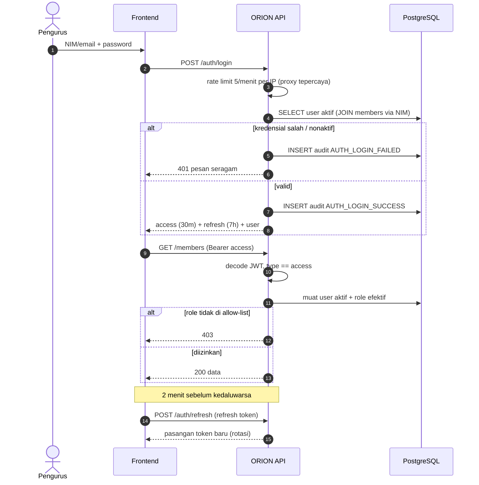

---

## 2. Pendaftaran dan seleksi calon anggota [ADA-BACKEND]

**Aktor:** Calon anggota, PSDM/Ketua/Wakil (seleksi), Pengurus lain (baca). **Kebutuhan:** FR-REG-01..04, FR-SEL-01..05.
**Narasi:** calon mengisi formulir selama intake OPEN; server menegakkan deadline (WIB) secara *fail-closed*. Pengurus meninjau; approve membuat anggota dengan Member ID berikutnya untuk tahun intake.

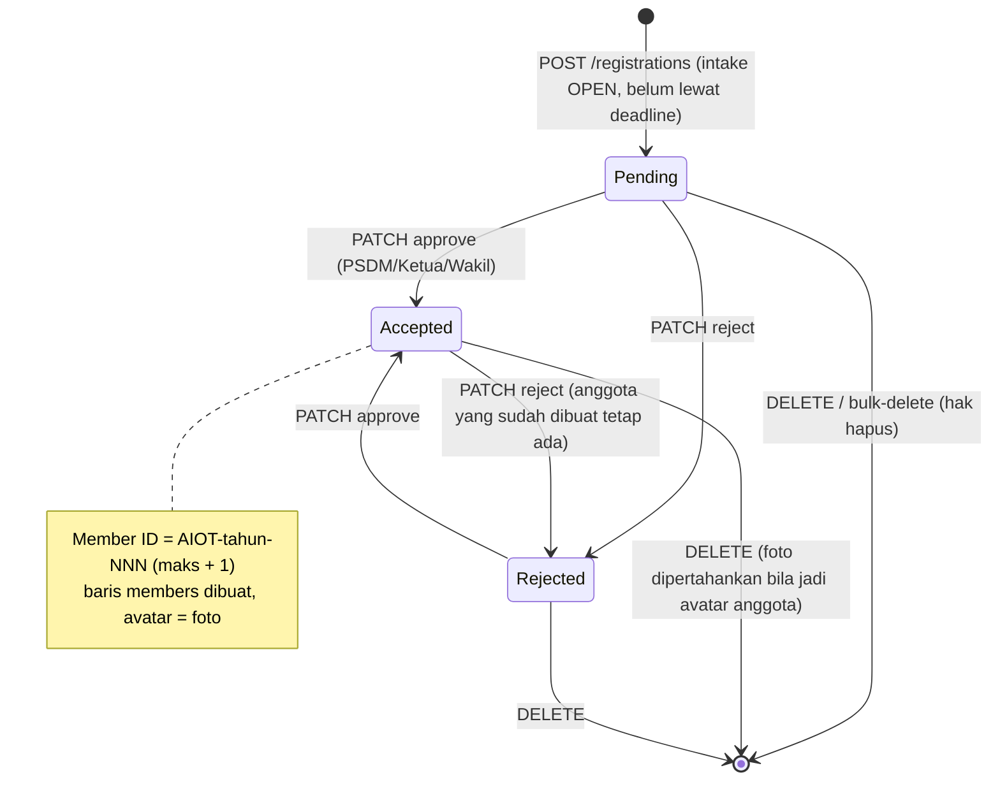

Catatan: transisi `Rejected → Accepted` dan `Accepted → Rejected` diizinkan kode saat ini; aturan bisnisnya perlu dikonfirmasi pengurus.

---

## 3. Unggah berkas: staging dan promosi [ADA-BACKEND]

**Aktor:** Pengguna (calon/pengurus), ORION API, Disk, PostgreSQL, Task pembersih. **Kebutuhan:** FR-FILE-01..03.

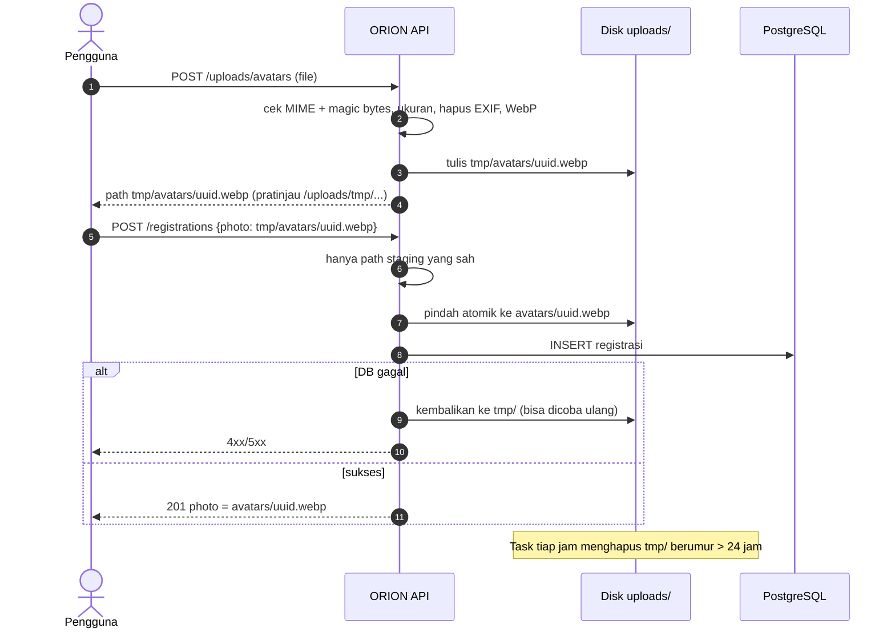

---

## 4. Peminjaman dan pengembalian inventaris [USULAN]

**Aktor:** Peminjam (anggota), Petugas inventaris (Akademik Riset/Ketua/Wakil), Sistem. **Kebutuhan:** FR-INV-03..07.
**Narasi:** petugas mencatat peminjaman atas nama anggota; stok berkurang secara atomik saat serah terima. Pengembalian mencatat kondisi; unit rusak dipindah ke stok rusak. Keterlambatan dihitung dari tenggat, bukan status tersimpan.

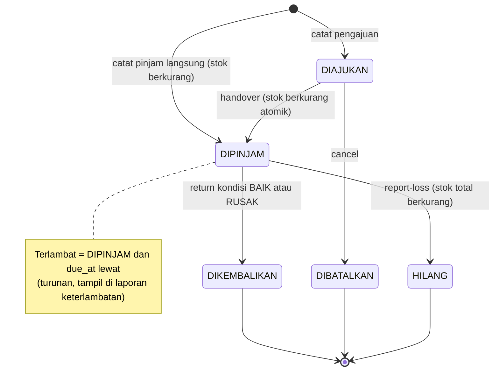

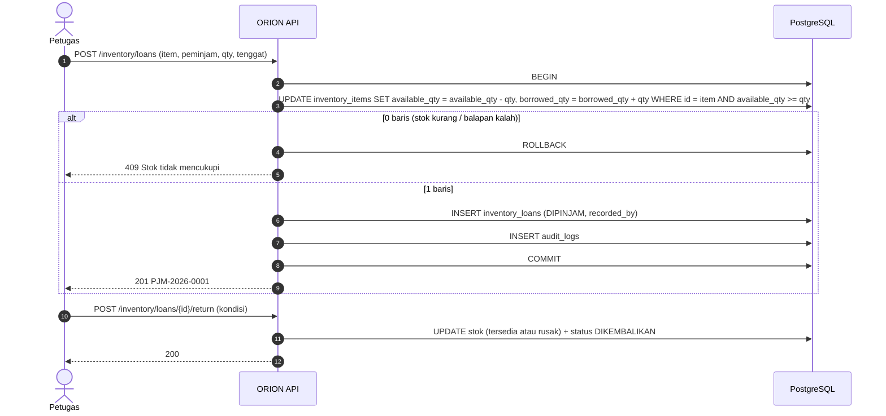

---

## 5. Pencatatan dua ledger [USULAN]

**Aktor:** Bendahara, Sistem. **Kebutuhan:** FR-FIN-03..05.
**Narasi:** Bendahara mencatat **satu** transaksi; sistem menyusun entri double-entry. Entri pada akun kas membentuk *ledger arus kas*; entri pada akun kategori membentuk *ledger pemasukan-pengeluaran*. Koreksi dilakukan dengan transaksi pembalik.

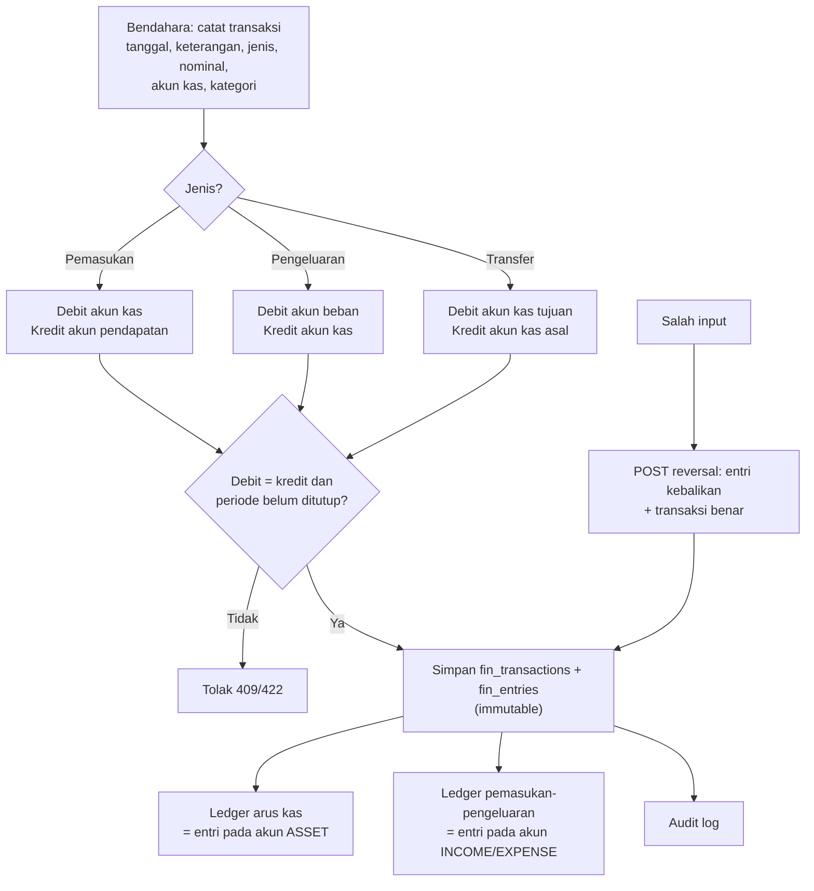

---

## 6. Iuran, pembayaran, dan rekonsiliasi [USULAN] / [PERLU-DISKUSI]

**Aktor:** Bendahara, Anggota, Payment gateway (Opsi B), Sistem. **Kebutuhan:** FR-FIN-08..11.

### 6.1 Opsi A — pelunasan manual [USULAN]

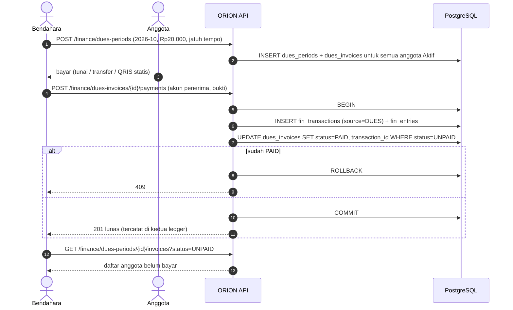

### 6.2 Opsi B — QRIS dinamis + webhook [PERLU-DISKUSI]

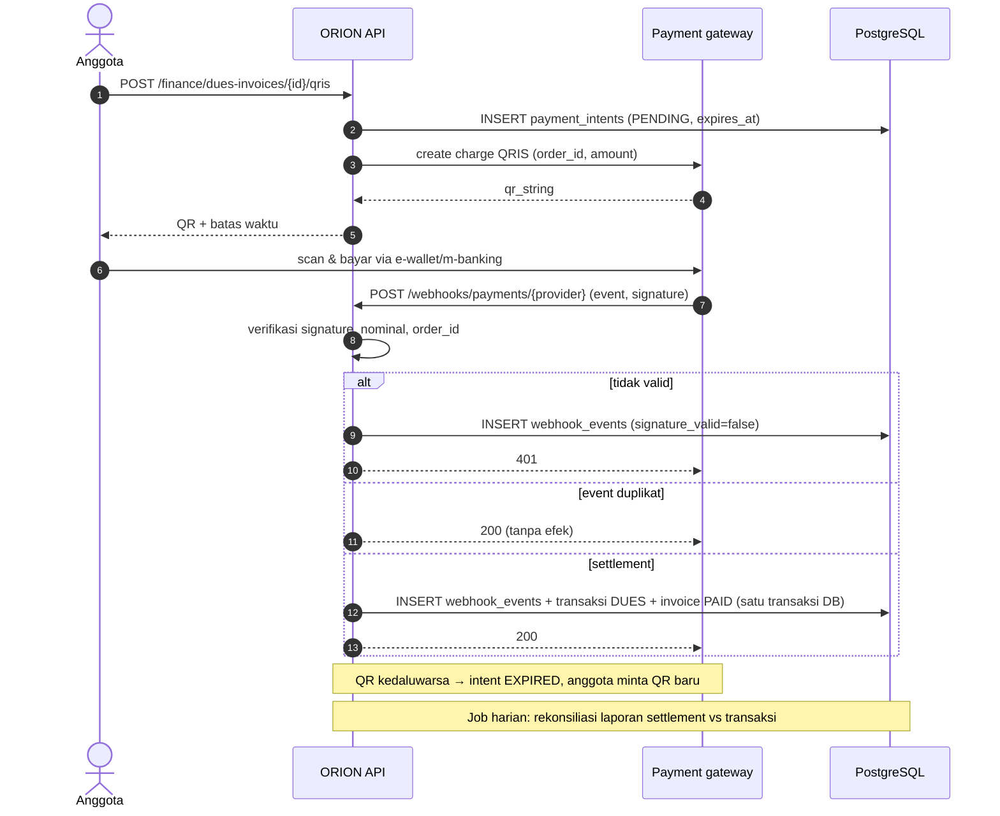

### 6.3 Pengingat [PERLU-DISKUSI]

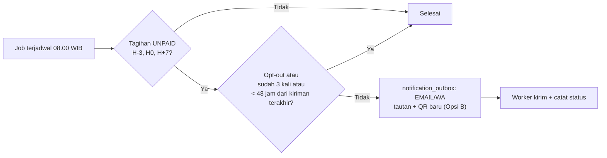

---

## 7. Surat keluar: pembuatan sampai terbit [USULAN] / [PERLU-DISKUSI]

**Aktor:** Pembuat (Sekretaris/pengurus), Peninjau (Sekretaris), Pengesah (Ketua/Wakil), Sistem. **Kebutuhan:** FR-ARC-05..09, FR-ARC-11.
**Narasi:** surat dibuat sebagai draf dari template per jenis; pratinjau PDF dibuat server. Versi penuh melewati tinjauan dan persetujuan; versi minimal langsung terbit. **Nomor hanya diberikan saat TERBIT**, dalam transaksi yang mengunci baris counter, sehingga tidak ada nomor ganda dan draf yang batal tidak "memakan" nomor.

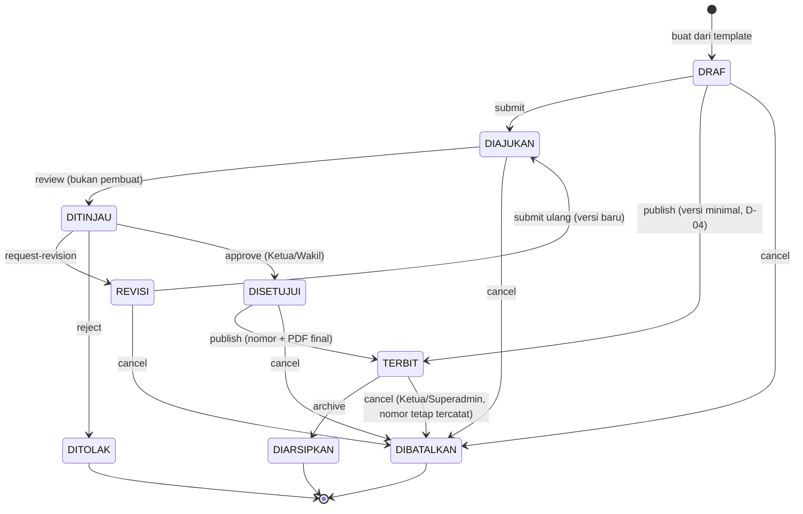

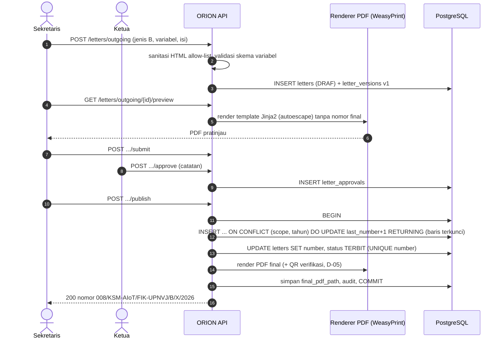

---

## 8. Pencatatan surat masuk [USULAN]

**Aktor:** Sekretaris, Penerima disposisi. **Kebutuhan:** FR-ARC-04, FR-ARC-10.

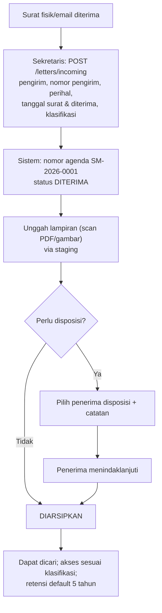

---

## 9. Pembuatan laporan otomatis [USULAN]

**Aktor:** Bendahara/Ketua, Worker laporan. **Kebutuhan:** FR-FIN-12, FR-ARC-09.
**Narasi:** laporan diminta secara asinkron; worker mengambil data dari ledger, iuran, dan tabel pengurus (penandatangan), membuat PDF (WeasyPrint) atau XLSX (openpyxl), dan menyimpan hash data sumber sebagai *snapshot*.

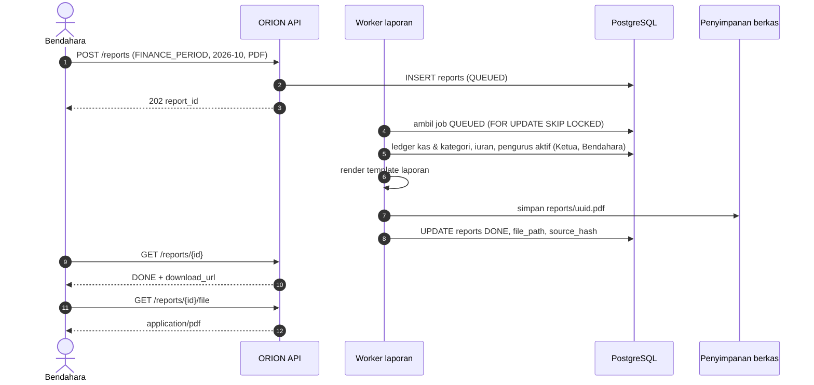

---

## 10. Riwayat revisi

| Versi | Tanggal | Penulis | Perubahan |
|---|---|---|---|
| 1.0 | 2026-09-29 | Tim Pengembang (dibantu asisten AI) | Dokumen awal: 9 alur (3 aktual, 6 usulan) dengan diagram Mermaid |
